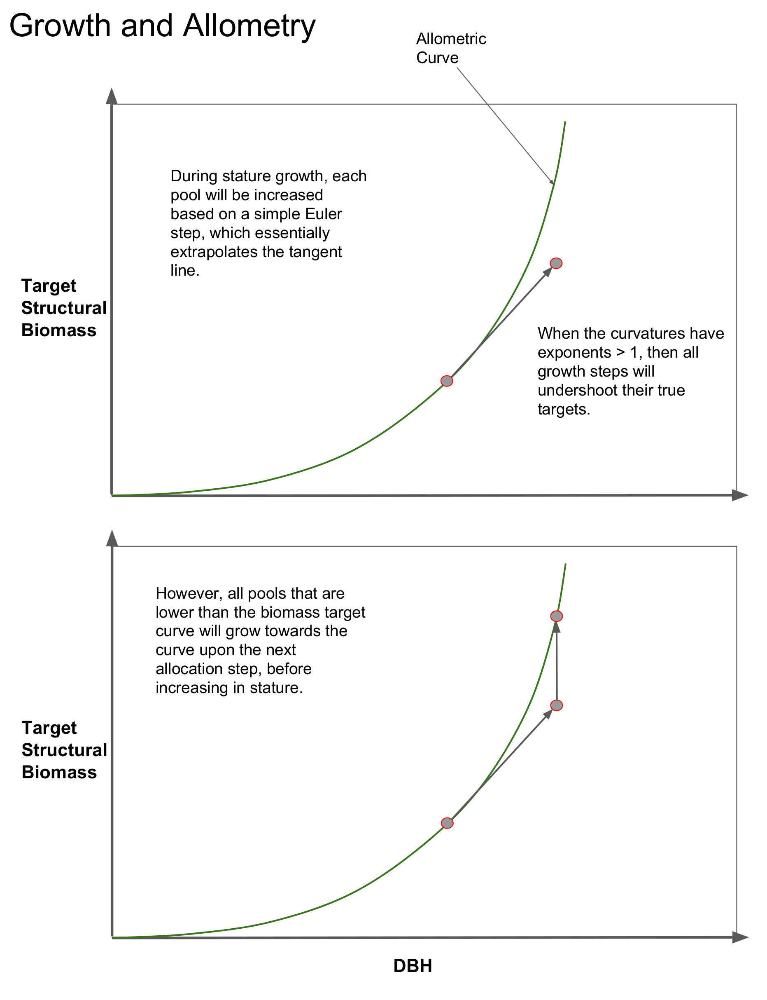
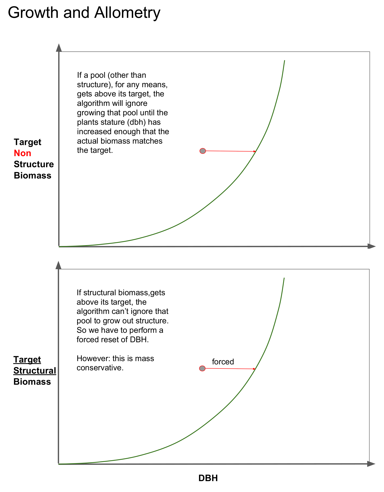
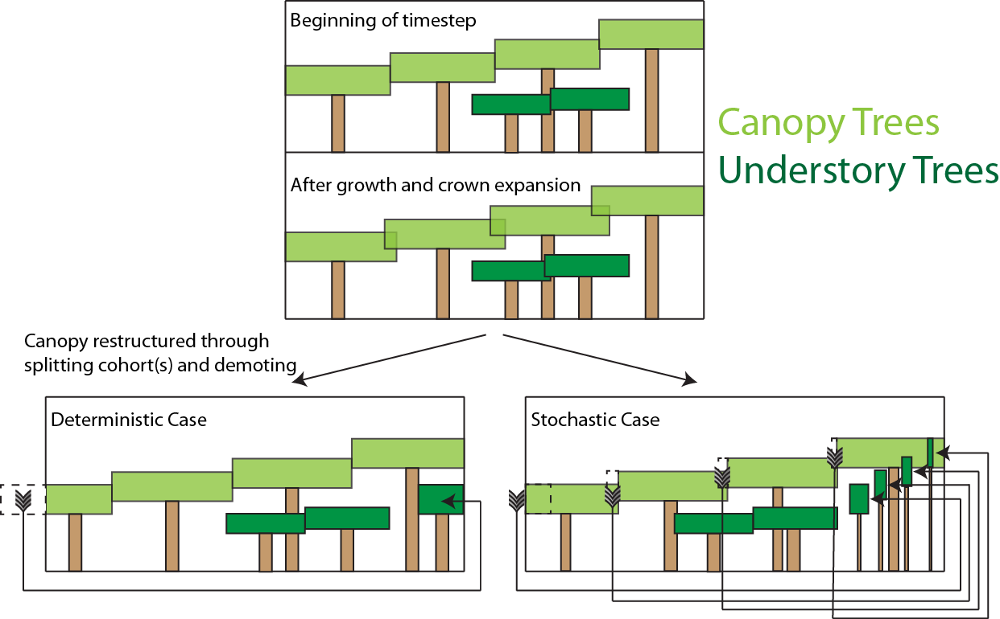
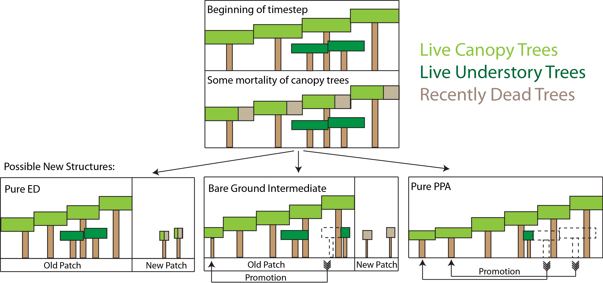
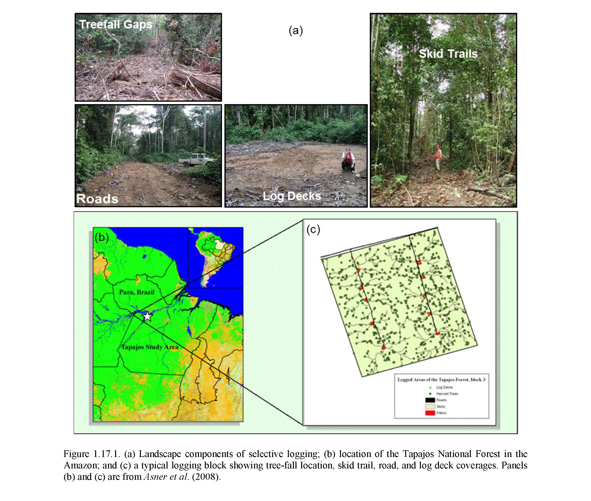
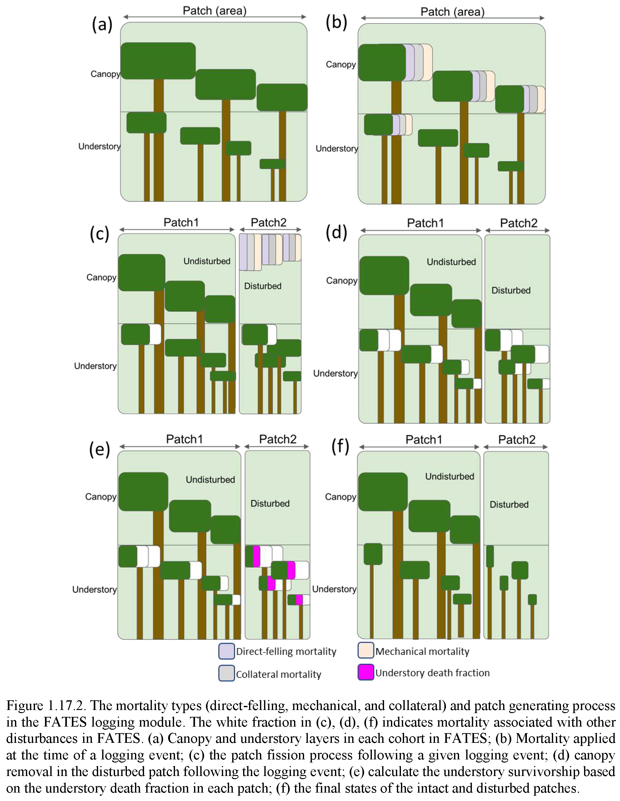
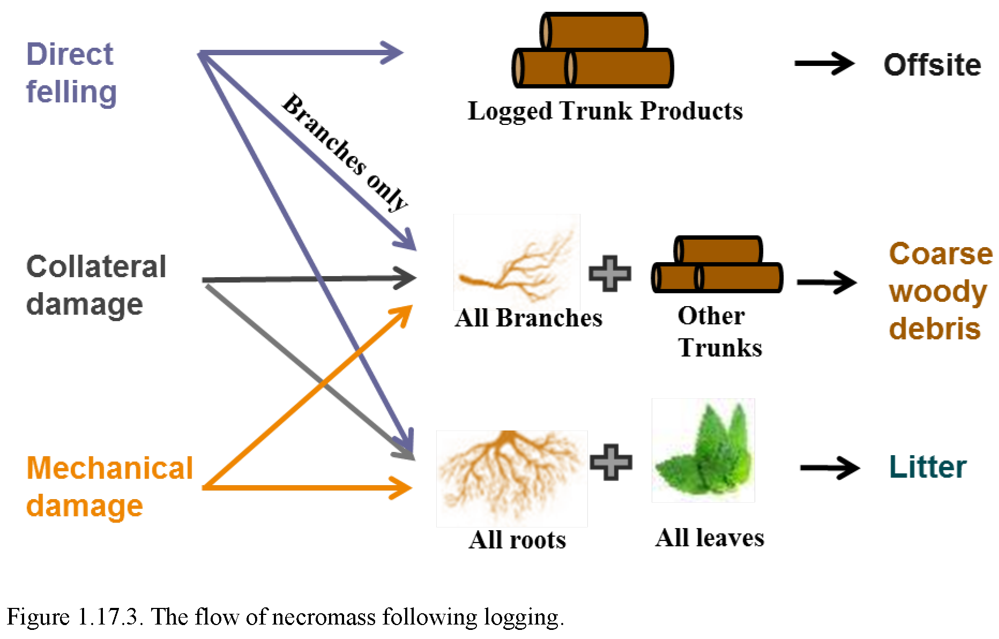
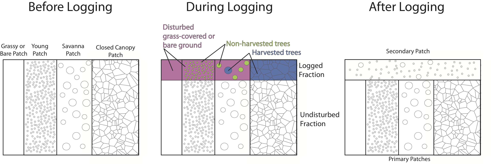

.. _rst_FATES:

Technical Documentation for FATES
===================================

FATES is the "Functionally Assembled Terrestrial Ecosystem Simulator". It is an external module which can run within a given "Host Land Model" (HLM). Currently (November 2017) implementations are supported in both the Community Land Model of the Community Terrestrial Systems Model (CLM-CTSM) and in the Energy Exascale Earth Systems Model (E3SM) Land Model (ELM).

FATES was derived from the CLM Ecosystem Demography model (CLM(ED)), which was documented in:

Fisher, R. A., Muszala, S., Verteinstein, M., Lawrence, P., Xu, C., McDowell, N. G., Knox, R. G., Koven, C., Holm, J., Rogers, B. M., Spessa, A., Lawrence, D., and Bonan, G.: Taking off the training wheels: the properties of a dynamic vegetation model without climate envelopes, CLM4.5(ED), Geosci. Model Dev., 8, 3593-3619, https://doi.org/10.5194/gmd-8-3593-2015, 2015.

and this technical note was first published as an appendix to that paper. 

https://pdfs.semanticscholar.org/396c/b9f172cb681421ed78325a2237bfb428eece.pdf

Authors of FATES code and technical documentation. 
^^^^^^^^^^^^^^^^^^^^^^^^^^^^^^^^^^^^^^^^^^^^^^^^^^

Rosie A. Fisher :sup:`1,2`, Ryan G. Knox :sup:`3`, Charles D. Koven :sup:`3`, Gregory Lemieux :sup:`3`, Chonggang Xu :sup:`4`, Brad Christofferson :sup:`5`, Jacquelyn Shuman  :sup:`1`,  Maoyi Huang :sup:`6`, Erik Kluzek :sup:`1`, Benjamin Andre :sup:`1`, Jessica F. Needham :sup:`3`, Jennifer Holm :sup:`3`, Marlies Kovenock  :sup:`7`, Abigail L. S. Swann :sup:`7`, Stefan Muszala :sup:`1`, Shawn P. Serbin :sup:`8`, Qianyu Li :sup:`8`, Mariana Verteinstein :sup:`1`, Anthony P. Walker :sup:`11`, Alan di Vittorio :sup:`3`, Yilin Fang :sup:`9`, Yi Xu :sup:`6`, Junyan Ding :sup:`12`, Shijie Shu :sup:`3`

:sup:`1` Climate and Global Dynamics Division, National Center for Atmospheric Research, Boulder, CO, USA

:sup:`2` Centre Européen de Recherche et de Formation Avancée en Calcul Scientifique, Toulouse, France

:sup:`3` Climate and Ecosystem Sciences Division, Lawrence Berkeley National Laboratory, Berkeley, CA, USA

:sup:`4` Earth and Environmental Sciences Division, Los Alamos National Laboratory, Los Alamos, NM, USA

:sup:`5` Department of Biology, University of Texas, Rio Grande Valley, Edinburg, TX, USA

:sup:`6` Atmospheric Sciences and Global Change Division, Pacific Northwest National Laboratory, Richland, WA, USA

:sup:`7` Department of Biology, University of Washington, Seattle, WA, USA

:sup:`8` Environmental and Climate Sciences Department, Brookhaven National Laboratory, Upton, NY, USA

:sup:`9` Energy and Environment Directorate, Pacific Northwest National Laboratory, Richland, WA, USA

:sup:`10` Jet Propulsion Laboratory, Pasadena, CA, USA

:sup:`11` Climate Change Science Institute, Environmental Sciences Division, Oak Ridge National Laboratory, Oak Ridge, TN, USA

:sup:`12` Earth & Biological Sciences, Pacific Northwest National Laboratory, Richland, WA, USA

Introduction
^^^^^^^^^^^^^^^^^^^

The Ecosystem Demography ('ED'), concept within FATES is derived from the work of :ref:`Moorcroft et al. (2001)<mc_2001>`

and is a cohort model of vegetation competition and co-existence, allowing a representation of the biosphere which accounts for the division of the land surface into successional stages, and for competition for light between height structured cohorts of representative trees of various plant functional types. 

The implementation of the Ecosystem Demography
concept within FATES links the surface flux and canopy physiology concepts in the CLM/ELM
with numerous additional developments necessary to accommodate the new
model also documented here. These include a version of the SPITFIRE
(Spread and InTensity of Fire) model of :ref:`Thonicke et al. (2010)<thonickeetal2010>`, and an adoption of the concept of
`Perfect Plasticity Approximation` approach of
:ref:`Purves et al. 2008<purves2008>`, :ref:`Lichstein et al. 2011<lichstein2011>` and :ref:`Weng et al. 2014<weng2014>`, in accounting
for the spatial arrangement of crowns. Novel algorithms accounting for
the fragmentation of coarse woody debris into chemical litter streams,
for the physiological optimisation of canopy thickness, for the
accumulation of seeds in the seed bank, for multi-layer multi-PFT
radiation transfer, for drought-deciduous and cold-deciduous phenology,
for carbon storage allocation, and for tree mortality under carbon
stress, are also included and presented here.

Numerous other implementations of the
Ecosystem Demography concept exist (See :ref:`Fisher et al. (2018)<Fisheretal2018>` for a review of these) Therefore, to avoid confusion between the
concept of 'Ecosystem Demography' and the implementation of this concept
in different models, the CLM(ED) implementation described by :ref:`Fisher et al. (2015)<Fisheretal2015>` will hereafter be called 'FATES' (the Functionally Assembled Terrestrial Ecosystem Simulator).

The representation of ecosystem heterogeneity in FATES
^^^^^^^^^^^^^^^^^^^^^^^^^^^^^^^^^^^^^^^^^^^^^^^^^^^^^^

The terrestrial surface of the Earth is heterogeneous for many reasons, driven
by variations in climate, edaphic history, ecological variability,
geological forcing and human interventions. Land surface models
represent this variability first by introducing a grid structure to the
land surface, allowing different atmospheric forcings to operate in each
grid cell, and subsequently by representing 'sub-grid' variability in
the surface properties. In the CLM, the land surface is divided into
numerous 'landunits' corresponding to the underlying condition of the
surface (e.g. soils, ice, lakes, bare ground) and then 'columns'
referring to elements of the surface that share below ground resources
(water & nutrients). Within the soil landunit, for example, there are
separate columns for crops, and for natural vegetation, as these are
assumed to use separate resource pools. The FATES model at present
only operates on the naturally vegetated column. The soil column is
sub-divided into numerous tiles, that correspond to statistical
fractions of the potentially vegetated land area. In the CLM 4.5 (and
all previous versions of the model), sub-grid tiling operates on the
basis of plant functional types (PFTs). That is, each piece of land is
assumed to be occupied by only one plant functional type, with multiple
PFT-specific tiles sharing a common soil water and nutrient pool. This
PFT-based tiling structure is the standard method used by most land
surface models deployed in climate prediction.

The introduction of the Ecosystem Demography concept introduces
significant alterations to the representation of the land surface in the
CLM. In FATES, the tiling structure represents the disturbance
history of the ecosystem. Thus, some fraction of the land surface is
characterized as 'recently disturbed', some fraction has escaped
disturbance for a long time, and other areas will have intermediate
disturbances. Thus the ED concept essentially discretizes the trajectory
of succession from disturbed ground to 'mature' ecosystems. Within
FATES, each "disturbance history class" is referred to as a ‘patch’.
The word "patch"  has many possible interpretations, so it is important
to note that: **there is no spatial location associated with the concept
of a 'patch' . It refers to a fraction of the potential vegetated area
consisting of all parts of the ecosystem with similar disturbance
history.**

The 'patch' organizational structure in CLM thus replaces the previous
'PFT' structure in the organization heirarchy. The original hierarchical
land surface organizational structure of CLM as described in
:ref:`Oleson et al. 2013<olesonetal2013>` may be depicted as:

.. math::

   \mathbf{gridcell} \left\{
   \begin{array}{cc} 
   \mathbf{landunit} &   \\ 
   \mathbf{landunit} &\left\{ 
   \begin{array}{ll} 
   \mathbf{column}&\\
   \mathbf{column}&\left\{ 
   \begin{array}{ll} 
   \mathbf{pft}&\\
   \mathbf{pft}&\\
   \mathbf{pft}&\\
   \end{array}\right.\\ 
   \mathbf{column}&\\
   \end{array}\right.\\ 
   \mathbf{landunit} &   \\
   \end{array}\right.

and the new structure is altered to the following:

.. math::

   \mathbf{gridcell} \left\{
   \begin{array}{cc} 
   \mathbf{landunit} &   \\ 
   \mathbf{landunit} &\left\{ 
   \begin{array}{ll} 
   \mathbf{column}&\\
   \mathbf{column}&\left\{ 
   \begin{array}{ll} 
   \mathbf{patch}&\\
   \mathbf{patch}&\\
   \mathbf{patch}&\\
   \end{array}\right.\\ 
   \mathbf{column}&\\
   \end{array}\right.\\ 
   \mathbf{landunit} &   \\
   \end{array}\right.

Thus, each gridcell becomes a matrix of 'patches' that are
conceptualized by their 'age since disturbance' in years. This is the
equivalent of grouping together all those areas of a gridcell that are
'canopy gaps', into a single entity, and all those areas that are
'mature forest' into a single entity.

Cohortized representation of tree populations
---------------------------------------------

Each common-disturbance-history patch is a notional ecosystem that might
in reality contain numerous individual plants which vary in their
physiological attributes, in height and in spatial position. One way of
addressing this heterogeneity is to simulate a forest of specific
individuals, and to monitor their behavior through time. This is the
approach taken by "gap" and individual-based models 
(:ref:`Smith et al. 2001<smith2001>`, :ref:`Sato et al. 2007<sato2007>`, :ref:`Uriarte et al. 2009<uriarte2009>`, :ref:`Fyllas et al. 2014 <fyllas2014>`). The
depiction of individuals typically implies that the outcome of the model
is stochastic. This is because we lack the necessary detailed knowledge
to simulate the individual plant's fates. Thus gap models imply both
stochastic locations and mortality of plants. Thus, (with a genuinely
random seed) each model outcome is different, and an ensemble of model
runs is required to generate an average representative solution. Because
the random death of large individual trees can cause significant
deviations from the mean trajectory for a small plot (a typical
simulated plot size is 30m x 30 m) the number of runs required to
minimize these deviations is large and computationally expensive. For
this reason, models that resolve individual trees typically use a
physiological timestep of one day or longer (e.g.  :ref:`Smith et al. 2001<smith2001>`, :ref:`Xiaidong et al. 2005 <xiaodong2005>`, :ref:`Sato et al. 2007<sato2007>`

The approach introduced by the Ecosystem Demography model
:ref:`Moorcroft et al. 2001<mc_2001>` is to group the hypothetical population
of plants into "cohorts". In the notional ecosystem, after the
land-surface is divided into common-disturbance-history patches, the
population in each patch is divided first into plant functional types
(the standard approach to representing plant diversity in large scale
vegetation models), and then each plant type is represented as numerous
height classes. Importantly, **for each PFT/height class bin, we model
*one* representative individual plant, which tracks the average
properties of this `cohort` of individual plants.** Thus, each
common-disturbance-history patch is typically occupied by a set of
cohorts of different plant functional types, and different height
classes within those plant functional types. Each cohort is associated
with a number of identical trees, :math:`n_{coh}` (where :math:`{coh}`
denotes the identification or index number for a given cohort)..

The complete hierarchy of elements in FATES is therefore now
described as follows:

.. math::

   \mathbf{gridcell}\left\{
   \begin{array}{cc} 
   \mathbf{landunit} &   \\ 
   \mathbf{landunit} &\left\{ 
   \begin{array}{ll} 
   \mathbf{column}&\\
   \mathbf{column}&\left\{ 
   \begin{array}{ll} 
   \mathbf{patch}&\\
   \mathbf{patch}&\left\{ 
   \begin{array}{ll} 
   \mathbf{cohort}&\\
   \mathbf{cohort}&\\
   \mathbf{cohort}&\\
   \end{array}\right.\\ 
   \mathbf{patch}&\\
   \end{array}\right.\\ 
   \mathbf{column}&\\
   \end{array}\right.\\ 
   \mathbf{landunit} &   \\
   \end{array}\right.

Discretization of cohorts and patches
-------------------------------------

Newly disturbed land and newly recruited seedlings can in theory be
generated at each new model timestep as the result of germination and
disturbance processes. If the new patches and cohorts established at
*every* timestep were tracked by the model structure, the computational
load would of course be extremely high (and thus equivalent to an
individual-based approach). A signature feature of the ED model is the
system by which `functionally equivalent` patches and cohorts are fused
into single model entities to save memory and computational time.

This functionality requires that criteria are established for the
meaning of `functional equivalence`, which are by necessity slightly
subjective, as they represent ways of abstracting reality into a more
tractable mathematical representation. As an example of this, for
height-structured cohorts, we calculate the relativized differences in
height (:math:`h_{coh}`, m) between two cohorts of the same pft,
:math:`p` and :math:`q` as

.. math:: d_{hite,p,q} = \frac{\mathrm{abs}(h_{p-}h_{q})}{\frac{1}{2}(h_{p}+h_{q})}

If :math:`d_{hite,p,q}` is smaller than some threshold :math:`t_{ch}`,
and they are of the same plant functional type, the two cohorts are
considered equivalent and merged to form a third cohort :math:`r`, with
the properties of cohort :math:`p` and :math:`q` averaged such that they
conserve mass. The model parameter :math:`t_{ch}` can be adjusted to
adjust the trade-off between simulation accuracy and computational load.
There is no theoretical optimal value for this threshold but it may be
altered to have finer or coarser model resolutions as needed.

Similarly, for common-disturbance-history patches, we again assign
a threshold criteria, which is then compared to the difference between
patches :math:`m` and :math:`n`, and if the difference is less than some
threshold value (:math:`t_{p}`) then patches are merged together,
otherwise they are kept separate. However, in contrast with
height-structured cohorts, where the meaning of the difference criteria
is relatively clear, how the landscape should be divided into
common-disturbance-history units is less clear. Several alternative
criteria are possible, including Leaf Area Index, total biomass and
total stem basal area.

In this implementation of FATES we assess the amount of
above-ground biomass in each PFT/plant diameter bin. Biomass is first
grouped into fixed diameter bins for each PFT (:math:`ft`) and a
significant difference in any bin will cause patches to remain
separated. This means that if two patches have similar total biomass,
but differ in the distribution of that biomass between diameter classes
or plant types, they remain as separate entities. Thus

.. math:: B_{profile,m,dc,ft} = \sum_{d_{c,min}}^{d_{c,max}} (B_{ag,coh}n_{coh})

:math:`B_{profile,m,dc,ft}` is the binned above-ground biomass profile
for patch :math:`m`,\ :math:`d_{c}` is the diameter class.
:math:`d_{c,min}` and :math:`d_{c,max}` are the lower and upper
boundaries for the :math:`d_{c}` diameter class. :math:`B_{ag,coh}` and
:math:`n_{coh}` depict the biomass (KgC m\ :sup:`-2`) and the number
of individuals of each cohort respectively. A difference matrix between
patches :math:`m` and :math:`n` is thus calculated as

.. math:: d_{biomass,mn,dc,ft} = \frac{\rm{abs}\it(B_{profile,m,hc,ft}-B_{profile,n,hc,ft})}{\frac{1}{2}(B_{profile,m,hc,ft}+B_{profile,n,hc,ft})}

If all the values of :math:`d_{biomass,mn,hc,ft}` are smaller than the
threshold, :math:`t_{p}`, then the patches :math:`m` and :math:`n` are
fused together to form a new patch :math:`o`.

To increase computational efficiency and to simplify the coding
structure of the model, the maximum number of patches is capped at
:math:`P_{no,max}`. To force the fusion of patches down to this number,
the simulation begins with a relatively sensitive discretization of
patches (:math:`t_{p}` = 0.2) but if the patch number exceeds the
maximum, the fusion routine is repeated iteratively until the two most
similar patches reach their fusion threshold. This approach maintains an
even discretization along the biomass gradient, in contrast to, for
example, simply fusing the oldest or youngest patches together.

The area of the new patch (:math:`A_{patch,o}`, m\ :math:`^{2}`)
is the sum of the area of the two existing patches,

.. math:: A_{patch,o}  = A_{patch,n}  + A_{patch,m}

and the cohorts ‘belonging’ to patches :math:`m` and :math:`n` now
co-occupy patch :math:`o`. The state properties of :math:`m` and
:math:`n` (litter, seed pools, etc. ) are also averaged in accordance
with mass conservation .

Linked Lists: the general code structure of FATES
---------------------------------------------------

The number of patches in each natural vegetation column and the
number of cohorts in any given patch are variable through time because
they are re-calculated for each daily timestep of the model. The more
complex an ecosystem, the larger the number of patches and cohorts. For
a slowly growing ecosystem, where maximum cohort size achieved between
disturbance intervals is low, the number of cohorts is also low. For
fast-growing ecosystems where many plant types are viable and maximum
heights are large, more cohorts are required to represent the ecosystem
with adequate complexity.

In terms of variable structure, the creation of an array whose size
could accommodate every possible cohort would mean defining the maximum
potential number of cohorts for every potential patch, which would
result in very large amounts of wasted allocated memory, on account of
the heterogeneity in the number of cohorts between complex and simple
ecosystems (n.b. this does still happen for some variables at restart
timesteps). To resolve this, the cohort structure in FATES model
does not use an array system for internal calculations. Instead it uses
a system of *linked lists* where each cohort structure is linked to the
cohorts larger than and smaller than itself using a system of pointers.
The shortest cohort in each patch has a ‘shorter’ pointer that points to
the *null* value, and the tallest cohort has a ‘taller’ pointer that
points to the null value. 

Instead of iterating along a vector indexed by :math:`coh`, the code
structures typically begin at the tallest cohort in a given patch, and
iterate until a null pointer is encountered. 

Using this structure, it is therefore possible to have an unbounded upper limit on cohort number, and also to easily alter the ordering of  cohorts if, for example, a cohort of one functional type begins to  grow faster than a competitor of another functional type, and the cohort list can easily be re-ordered by altering the pointer structure. Each cohort has `pointers` indicating to which patch and gridcell it belongs. The patch system is analogous to the cohort system, except that patches are ordered in terms of their relative age, with pointers to older and younger patches where cp\ :math:`_1` is the oldest:

Indices used in FATES
-----------------------

Some of the indices used in FATES are similar to those used in the
standard CLM4.5 model; column (:math:`c`), land unit(\ :math:`l`), grid
cell(\ :math:`g`) and soil layer (:math:`j`). On account of the
additional complexity of the new representation of plant function,
several additional indices are introduced that describe the
discritization of plant type, fuel type, litter type, plant height,
canopy identity, leaf vertical structure and fuel moisture
characteristics. To provide a reference with which to interpret the
equations that follow, they are listed here.

.. raw:: latex

   \bigskip

.. raw:: latex

   \captionof{table}{Table of subscripts used in this document  }

+------------------+------------------------+
| Parameter Symbol | Parameter Name         |
+==================+========================+
| *ft*             | Plant Functional Type  |
+------------------+------------------------+
| *fc*             | Fuel Class             |
+------------------+------------------------+
| *lsc*            | Litter Size Class      |
+------------------+------------------------+
| *coh*            | Cohort Index           |
+------------------+------------------------+
| *patch*          | Patch Index            |
+------------------+------------------------+
| *cl*             | Canopy Layer           |
+------------------+------------------------+
| *z*              | Leaf Layer             |
+------------------+------------------------+
| *mc*             | Moisture Class         |
+------------------+------------------------+
| *o*              | Plant Organ Index      |
+------------------+------------------------+
| *s*              | Nutrient Species Index |
+------------------+------------------------+

.. raw:: latex

   \bigskip 

Cohort State Variables
----------------------

The unit of allometry in the ED model is the cohort. Each cohort
represents a group of plants with similar functional types and heights
that occupy portions of column with similar disturbance histories. The
state variables of each cohort therefore consist of several pieces of
information that fully describe the growth status of the plant and its
position in the ecosystem structure, and from which the model can be
restarted. The state variables of a cohort are as follows:

.. raw:: latex

   \bigskip

.. raw:: latex

   \captionof{table}{State Variables of  `cohort' sructure}

+-----------------+-----------------+-----------------+-----------------+
| Quantity        | Variable name   | Units           | Notes           |
+=================+=================+=================+=================+
| Plant           | :math:`{\it{ft} | integer         |                 |
| Functional Type | _{coh}}`        |                 |                 |
+-----------------+-----------------+-----------------+-----------------+
| Number of       | :math:`n_{coh}` | n ha\ :sup:`-2` |                 |
| Individuals     |                 |                 |                 |
|                 |                 |                 |                 |
+-----------------+-----------------+-----------------+-----------------+
| Height          | :math:`h_{coh}` | m               |                 |
+-----------------+-----------------+-----------------+-----------------+
| Diameter        | :math:`\it{dbh_ | cm              |                 |
|                 | {coh}}`         |                 |                 |
+-----------------+-----------------+-----------------+-----------------+
| Carbon Mass     | :math:`{C_{(o   |                 | leaf, fine-root |
|                 | ,coh)}}`        | Kg plant\       | sapwood,        |
|                 |                 | :sup:`-1`       | storage,        |
|                 |                 |                 | structural,     |
|                 |                 |                 | reproductive    |
+-----------------+-----------------+-----------------+-----------------+
| Nutrient Mass   | :math:`{N_{(o   |                 | Optional        |
|                 | ,s,coh)}}`      | Kg plant\       | depending on    |
|                 |                 | :sup:`-1`       | hypothesis.     |
|                 |                 |                 | See PARTEH      |
|                 |                 |                 | documentation.  |
+-----------------+-----------------+-----------------+-----------------+
| Leaf memory     | :math:`{l_{memo |                 | Leaf mass when  |
|                 | ry,coh}}`       | Kg plant\       | leaves are      |
|                 |                 | :sup:`-1`       | dropped         |
+-----------------+-----------------+-----------------+-----------------+
| Phenological    | :math:`{S_{phen | integer         | 1=leaves off.   |
| Status          | ,coh}}`         |                 | 2=leaves on     |
+-----------------+-----------------+-----------------+-----------------+
| Canopy Layer    | :math:`cl_{coh  | integer         | 1=top canopy    |
| Index           | }`              |                 | >1=understory   |
+-----------------+-----------------+-----------------+-----------------+
| Canopy trimming | :math:`C_{trim, | fraction        | 1.0=max leaf    |
|                 | coh}`           |                 | area            |
+-----------------+-----------------+-----------------+-----------------+
| Patch Index     | :math:`{p_{coh} | integer         | To which patch  |
|                 | }`              |                 | does this       |
|                 |                 |                 | cohort belong?  |
+-----------------+-----------------+-----------------+-----------------+

Patch State Variables
---------------------

A patch, as discuss earlier, is a fraction of the landscape which
contains ecosystems with similar structure and disturbance history. A
patch has no spatial location. The state variables, which are
‘ecosystem’ rather than ‘tree’ scale properties, from which the model
can be restarted, are as follows

.. raw:: latex

   \bigskip

.. raw:: latex

   \captionof{table}{State variables of `patch' structure}

+-------------+-------------+-------------+-------------+
| Quantity    | Variable    | Units       | Indexed By  |
|             | name        |             |             |
+=============+=============+=============+=============+
| Area        | :math:`\it{ | m\ :sup:`2` |             |
|             | A_{patch}}` |             |             |
+-------------+-------------+-------------+-------------+
| Age         | :math:`age_ | years       |             |
|             | {patch}`    |             |             |
+-------------+-------------+-------------+-------------+
| Seed        | :math:`seed_| KgC m\      | :math:`ft`  |
|             | {patch}`    | :sup:`-2`   |             |
|             |             |             |             |
+-------------+-------------+-------------+-------------+
| Leaf Litter | :math:`l_{l | KgC m\      | :math:`ft`  |
|             | itter,patch | :sup:`-2`   |             |
|             | }`          |             |             |
+-------------+-------------+-------------+-------------+
| Root Litter | :math:`r_{l | KgC m\      | :math:`ft`  |
|             | itter,patch | :sup:`-2`   |             |
|             | }`          |             |             |
+-------------+-------------+-------------+-------------+
| AG Coarse   | :math:`{CWD}| KgC m\      | Size Class  |
| Woody       | _{A         | :sup:`-2`   | (lsc)       |
| Debris      | G,patch}`   |             |             |
+-------------+-------------+-------------+-------------+
| BG Coarse   | :math:`{CWD}| KgC m\      | Size Class  |
| Woody       | _{B         | :sup:`-2`   | (lsc)       |
| Debris      | G,patch}`   |             |             |
+-------------+-------------+-------------+-------------+
| Canopy      | :math:`S_{c |             | Canopy      |
| Spread      | ,patch}`    |             | Layer       |
+-------------+-------------+-------------+-------------+
| Column      | :math:`{l_{ | integer     |             |
| Index       | patch}}`    |             |             |
+-------------+-------------+-------------+-------------+

Model Structure
---------------

Code concerned with the Ecosystem Demography model interfaces with the
CLM model in four ways: i) During initialization, ii) During the
calculation of surface processes (albedo, radiation absorption, canopy
fluxes) each model time step (typically half-hourly), iii) During the
main invokation of the ED model code at the end of each day. Daily
cohort-level NPP is used to grow plants and alter the cohort structures,
disturbance processes (fire and mortality) operate to alter the patch
structures, and all fragmenting carbon pool dynamics are calculated. iv)
during restart reading and writing. The net assimilation (NPP) fluxes
attributed to each cohort are accumulated throughout each daily cycle
and passed into the ED code as the major driver of vegetation dynamics.

Initialization of vegetation from bare ground
^^^^^^^^^^^^^^^^^^^^^^^^^^^^^^^^^^^^^^^^^^^^^

If the model is restarted from a bare ground state (as opposed to a
pre-existing vegetation state), the state variables above are
initialized as follows. First, the number of plants per PFT is allocated
according to the initial seeding density (:math:`S_{init}`, individuals
per m\ :math:`^{2}`) and the area of the patch :math:`A_{patch}`, which
in the first timestep is the same as the area of the notional ecosystem
:math:`A_{tot}`. The model has no meaningful spatial dimension, but we
assign a notional area such that the values of ‘:math:`n_{coh}`’ can be
attributed. The default value of :math:`A_{tot}` is one hectare (10,000
m\ :sub:`2`), but the model will behave identically irrepective of
the value of this parameter.

.. math:: n_{coh,0} = S_{init}A_{patch}

Each cohort is initialized at the minimum canopy height
:math:`h_{min,ft}`, which is specified as a parameter for each plant
functional type and denotes the smallest size of plant which is tracked
by the model. Smaller plants are not considered, and their emergence
from the recruitment processes is unresolved and therefore implicitly
parameterized in the seedling establishment model.

The diameter of each cohort is then specified according to the height-diameter allometry function associated with the PFT of interest, see :ref:`allometry_table`. The biomass pools for the newly recruited plant are then determined from the allometry equations that define the target (idealized) sizes for each pool.

.. _model_init_params_coldstart:

.. raw:: latex

   \captionof{table}{(INCOMPLETE) List of the parameters that define the intialization of new plants during a "cold-start" simulation.}

+-----------------+-----------------+-----------------+-----------------+
| Parameter       | Parameter Name  | Units           | Default Value   |
| Symbol          |                 |                 |                 |
+=================+=================+=================+=================+
| :math:`h_{min}` | Minimum plant   | m               | 1.5             |
|                 | height          |                 |                 |
+-----------------+-----------------+-----------------+-----------------+
| :math:`S_{init}`| Initial         | Individuals     |                 |
|                 | Planting        | m\ :sup:`-2`    |                 |
|                 | density         |                 |                 |
+-----------------+-----------------+-----------------+-----------------+

.. _parteh_section:

Allocation and Reactive Transport (PARTEH)
^^^^^^^^^^^^^^^^^^^^^^^^^^^^^^^^^^^^^^^^^^

The **Plant Allocation** and **Reactive Transport Extensible Hypotheses (PARTEH)** is a suite of modules that handle the processes of allocation, transport and reactions (i.e. thos processes related to movement and change, yet perhaps not the genesis) of various arbitrary species (carbon, nutrients, toxins, etc) within the various organs of live vegetation.  In FATES, these processes are resolved per unit plant, for each cohort.

.. toctree::
   :maxdepth: 1

   parteh/overview_domain.rst
   parteh/hypotheses.rst
   

.. _allometry_section:

Allometry and Growth Along Allometric Curves
^^^^^^^^^^^^^^^^^^^^^^^^^^^^^^^^^^^^^^^^^^^^

In the previous section,  :ref:`parteh_section`, we covered the equations that describe how growth is implemented, as well the order of operations and logic of that forumlation.  In this section, we will discuss the various allometric functions that generate the relative rates of change, as well as the target biomass quantities :math:`\grave{X}`.

"Forced" Growth Along Allometric Curves
---------------------------------------

Growth specified by current PARTEH hypotheses follow along the allometric curves.  A hypothetical example of a cohorts integration along such a curve is provided in the top panel of the diagram below. It is assumed that when a plant grows in stature, the structural biomass matches the target structural biomass for its size (DBH).  This is represented by the grey dot sitting on the allometry line for structural biomass.

**A state of being "on allometry" is consistent with the cohort (grey dot) existing on the allometric curve.**

It is expected, and it is represented in the model, that due to either continuous or event based turnover, that biomass pools are continually depleted, thus pulling the grey dot straight down, away from the allometry line.  Recall from the PARTEH description, that the first step in the growth algorithm is to use available carbon to replace these lost biomass pools (without increasing dbh) so that it is "on allometry". 

Also, all numerical integration has some amount of truncation error (step error). When FATES conducts the stature growth integration step, it typically uses Euler integration, because it is fast and simple.  As a result, all biomass pools are projected along the tangent of the allometric curves from where they started.  When the curvature parameters that govern these relationships are greater than 1, this results in continual "undershooting" of the actual target quantity.  This is not a liability, firstly because growth is forced to be mass conservative.  And secondly, to re-iterate the explanation above, upon the next growth step the algorithm will spend carbon to first get the pools back "on allometry", before it projects along the tangent again.  This is represented in the lower panel.

However, we also have to accomodate for cases where the actual amount of biomass in the cohort's pools are larger than the target sizes dictated by the cohort's diameter.  This can be visualized by the cohort residing somewhere above the line.  This can happen for two reasons, 1) cohort fusion or 2) growth along allometric curves with curvature parameters (exponents) less than 1.

For woody plants, if a non-structural biomass pool is greater than the target pool size, the solution is simple.  That pool is flagged to be ignored during the stature growth step, and eventually the cohort's dbh will increase such that the target size exceeds its actual size again.  This is visualized in the top panel of the diagram below.

There is a caveat here.  The diameter must be "tied" to one of the biomass pools.  And for woody plants, we choose structural carbon.  And thus, we cannot flag to ignore structural carbon during stature growth since it is inextricably linked to diameter.  Therefore, cohorts that have structural biomass that is greater than the target biomass dictated by its diameter, will have their DBH forceably increased (without increasing any biomass) until the allometric target matches the actual biomass.  See the lower panel in the diagram below.

Note, the explanation above was explained for woody plants, which tie diameter to structural biomass.  For non-woody plants, such as grasses, we tie leaf biomass to diameter instead.

Allometric Relationships
------------------------

.. _FatesAllometryMod.F90: https://github.com/NGEET/fates/blob/master/biogeochem/FatesAllometryMod.F90

FATES-PARTEH (in its base hypotheses) uses allometry to dictate the target biomass quantities of structure, sapwood, leaf, fine-root, reproduction and storage. Further, FATES also uses allometric relationships to define a cohort's height and crown area.  All of these target quantities are tied to diameter. Biomass pools may also be functionally dependent on other biomass pools, as long as a cyclical relationship is not generated, and can ultimately be related to diameter or other external factors.  For instance, target root biomass is typically defined as proportional to leaf biomass.  Target leaf biomass is dependent on height and a canopy trimming function, while crown area and above ground biomass are each also dependent on height.

The FATES code is written in a way that offers flexibility in how these relationships are cast.  Each of these forumulations uses one or more user defined constant parameters, but it also allows for completely different functional forms. All of FATES allometric relationships can be found in the file FatesAllometryMod.F90_.  

Important note. Most allometry relationships from field research define total above ground biomass (AGB) as their estimated quantity instead of structural biomass.  In FATES, since AGB is not a state-variable, it must be derived from the portions of several state variables.  However, we make a simplification in FATES, and assume that the allometric relationships for AGB only contain structural wood and sapwood, and do not contain leaves, storage or reproductive tissues.  Diagnostics on AGB will include all terms.  Thus the allometric target for AGB contains the state targets and the fraction of above ground biomass (pft constant parameter) :math:`f_{a}`.

.. math::
   :label: allom_agb_eq

   \grave{C}_{(AGB)} &= (\grave{C}_{(structure)} + \grave{C}_{(sapwood)}) * f_{agb}

Note that the diameter to height relationships all use an effective diameter, :math:`d_*`.  This is the minimum between the actual plant diameter, and the PFT specific parameter that specifies the diameter at which maximum height occurs :math:`d_{hmax}`.

.. math::
   :label: allom_dbh_maxh

   d_* = \text{min}(d,d_{hmax})

The following table details the different allometric relationships that governs growth and stature, and the optional relationships and parameters associated with those relationships.  

.. _allometry_table:

.. table:: Table of Allometric Functions
   :align: center

   +---------------------------------------------------------+------------------------------------------------------------------------------------------+
   | Reference                                               | Function                                                                                 |
   +=========================================================+==========================================================================================+
   | **Diameter to Height**                                                                                                                             |
   +---------------------------------------------------------+------------------------------------------------------------------------------------------+
   | Power Function                                          | :math:`h = p_1 \cdot d_*^{p_2}`                                                          |
   +---------------------------------------------------------+------------------------------------------------------------------------------------------+
   | :Ref:`Obrien et al (1995)<Obrienetal1995>`              | :math:`h = 10^{(log10(d_*) \cdot p_1+p_2)}`                                              |
   +---------------------------------------------------------+------------------------------------------------------------------------------------------+
   | :ref:`Poorter et al (2006)<Poorteretal2006>`            | :math:`h = p_1 \cdot (1 - e^{p_2 \cdot d_*^{p_3}})`                                      |
   +---------------------------------------------------------+------------------------------------------------------------------------------------------+
   | :ref:`Martinez Cano et al (2019)<MartinezCanoetal2019>` | :math:`h = (p_1 \cdot d_*^{p_2}) / (p_3+ d_*^{p_2})`                                     |
   +---------------------------------------------------------+------------------------------------------------------------------------------------------+
   |                                                                                                                                                    |
   +---------------------------------------------------------+------------------------------------------------------------------------------------------+
   | **Target Above Ground Biomass**                                                                                                                    |
   +---------------------------------------------------------+------------------------------------------------------------------------------------------+
   | :ref:`Saldarriaga et al. (1998)<Saldarriaga1988>`       | :math:`\grave{C}_{agb} = f_{agb} \cdot p_1 \cdot h^{p_2} \cdot d^{p_3} \cdot \rho^{p_4}` |
   +---------------------------------------------------------+------------------------------------------------------------------------------------------+
   | 2 Parameter power function                              | :math:`\grave{C}_{agb} = p_1/\text{c2b} \cdot d^{p_2}`                                   |
   +---------------------------------------------------------+------------------------------------------------------------------------------------------+
   | :ref:`Chave et al. (2014)<Chaveetal2014>`               | :math:`\grave{C}_{agb} = p_1/\text{c2b} \cdot (\rho \cdot d^{2} \cdot h)^{p_2}`          |
   +---------------------------------------------------------+------------------------------------------------------------------------------------------+
   +---------------------------------------------------------+------------------------------------------------------------------------------------------+
   | Target Leaf Biomass  (TBD)                                                                                                                         |
   +---------------------------------------------------------+------------------------------------------------------------------------------------------+
   +---------------------------------------------------------+------------------------------------------------------------------------------------------+
   | Target Sapwood Biomass    (TBD)                                                                                                                    |
   +---------------------------------------------------------+------------------------------------------------------------------------------------------+
   +---------------------------------------------------------+------------------------------------------------------------------------------------------+
   | Target Fine-root Biomass    (TBD)                                                                                                                  |
   +---------------------------------------------------------+------------------------------------------------------------------------------------------+
   +---------------------------------------------------------+------------------------------------------------------------------------------------------+
   | Target Storage Biomass    (TBD)                                                                                                                    |
   +---------------------------------------------------------+------------------------------------------------------------------------------------------+

*List of allometric relationships, their functional forms, and relevant parameters.*

Canopy Structure and the Perfect Plasticity Approximation
^^^^^^^^^^^^^^^^^^^^^^^^^^^^^^^^^^^^^^^^^^^^^^^^^^^^^^^^^

During initialization and every subsequent daily ED timestep, the canopy
structure model is called to determine how the leaf area of the
different cohorts is arranged relative to the incoming radiation, which
will then be used to drive the radiation and photosynthesis
calculations. This task requires that some assumptions are made about 1)
the shape and depth of the canopy within which the plant leaves are
arranged and 2) how the leaves of different cohorts are arranged
relative to each other. This set of assumptions are critical to model
performance in ED-like cohort based models, since they determine how
light resources are partitioned between competing plants of varying
heights, which has a very significant impact on how vegetation
distribution emerges from competition
:ref:`Fisher et al. 2010<Fisheretal2010>`.

The standard ED1.0 model makes a simple 'flat disk' assumption, that the
leaf area of each cohort is spread in an homogenous layer at one exact
height across entire the ground area represented by each patch. FATES has diverged from this representation due to (at least) two problematic emergent properties that we identified as generating unrealistic behaviours espetially for large-area patches.

1. Over-estimation of light competition . The vertical stacking of
cohorts which have all their leaf area at the same nominal height means
that when one cohort is only very slightly taller than it’s competitor,
it is completely shaded by it. This means that any small advantage in
terms of height growth translates into a large advantage in terms of
light competition, even at the seedling stage. This property of the
model artificially exaggerates the process of light competition. In
reality, trees do not compete for light until their canopies begin to
overlap and canopy closure is approached.

2. Unrealistic over-crowding. The 'flat-disk' assumption has no
consideration of the spatial extent of tree crowns. Therefore it has no
control on the packing density of plants in the model. Given a mismatch
between production and mortality, entirely unrealistic tree densities
are thus possible for some combinations of recruitment, growth and
mortality rates.

To account for the filling of space in three dimensions using the
one-dimensional representation of the canopy employed by CLM, we
implement a new scheme derived from that of
:ref:`Purves et al. 2008<purves2008>`. Their argument follows the development
of an individual-based variant of the SORTIE model, called SHELL, which
allows the location of individual plant crowns to be highly flexible in
space. Ultimately, the solutions of this model possess an emergent
property whereby the crowns of the plants simply fill all of the
available space in the canopy before forming a distinct understorey.

Purves et al. developed a model that uses this feature, called the
‘perfect plasticity approximation’, which assumes the plants are able to
perfectly fill all of the available canopy space. That is, at canopy
closure, all of the available horizontal space is filled, with
negligible gaps, owing to lateral tree growth and the ability of tree
canopies to grow into the available gaps (this is of course, an
over-simplified but potential useful ecosystem property). The ‘perfect
plasticity approximation’ (PPA) implies that the community of trees is
subdivided into discrete canopy layers, and by extension, each cohort
represented by FATES model is assigned a canopy layer status flag,
:math:`C_L`. In this version, we set the maximum number of canopy layers
at 2 for simplicity, although is possible to have a larger number of
layers in theory. :math:`C_{L,coh}` = 1 means that all the trees of
cohort :math:`coh` are in the upper canopy (overstory), and
:math:`C_{L,coh}` = 2 means that all the trees of cohort :math:`coh` are
in the understorey.

In this model, all the trees in the canopy experience full light on
their uppermost leaf layer, and all trees in the understorey experience
the same light (full sunlight attenuated by the average LAI of the upper
canopy) on their uppermost leaves, as described in the radiation
transfer section (more nuanced versions of this approach may be
investigated in future model versions). The canopy is assumed to be
cylindrical, the lower layers of which experience self-shading by the
upper layers.

To determine whether a second canopy layer is required, the model needs
to know the spatial extent of tree crowns. Crown area,
:math:`A_{crown}`, m\ :sup:`2`, is defined as

.. math:: A_{crown,coh}  =  S_{c,patch,cl}.dbh_{coh}^{(p_{e,leaf}-p_{e,leaf-crown})}

where :math:`A_{crown,coh}` is the crown area of a single tree canopy
(m\ :sup:`2`) and :math:`S_{c,patch,cl}` is the ‘canopy spread’
parameter (unitless) of this canopy layer, which is assigned as a
function of canopy space filling, discussed below. :math:`S_{c,patch,cl}` is effectively
a normalisation constant in the power law describing the relationship of crown area 
to dbh. However, this is not constant but varies by the canopy areae to ground area fraction.  
In contrast to
:ref:`Purves et al. 2008<purves2008>` , by default we use an exponent, identical to that
for leaf biomass, :math:`p_{e,leaf}`, not 2.0, such that tree leaf area index does
not change as a function of diameter. The option is also available to modify
the exponent using the difference parameter, :math:`p_{e,leaf-crown}`.

To determine whether the canopy is closed, we calculate the total canopy
area as:

.. math:: A_{canopy} = \sum_{coh=1}^{nc,patch}{A_{crown,coh}.n_{coh}}

where :math:`nc_{patch}` is the number of cohorts in a given patch. If
the area of all crowns :math:`A_{canopy}` (m\ :sup:`2`) is larger
than the total ground area of a patch (:math:`A_{patch}`), which
typically happens at the end of the day, after growth and updated crown
allometry is resolved in the model, then some
fraction of each cohort is demoted to the understorey.

Under these circumstances, the `extra` crown area :math:`A_{loss}`
(i.e., :math:`A_{canopy}` - :math:`A_p`) is moved into the understorey.
For each cohort already in the canopy, we determine a fraction of trees
that are moved from the canopy (:math:`L_c`) to the understorey.
:math:`L_c` is calculated as :ref:`Fisher et al. 2010<Fisheretal2010>`

.. math:: L_{c}= \frac{A_{loss,patch} w_{coh}}{\sum_{coh=1}^{nc,patch}{w_{coh}}} ,

where :math:`w_{coh}` is a weighting of each cohort.  There are two possible ways of calculating this weighting coefficient.  The first, as described in :ref:`Fisher et al. 2010<Fisheretal2010>`, is to probabilistically weight cohorts based on their height :math:`h` (m) and the competitive exclusion coefficient
:math:`C_{e}`

.. math:: w_{coh}=h_{coh} C_{e}.

The higher the value of :math:`C_e` the greater the impact of tree
diameter on the probability of a given tree obtaining a position in the
canopy layer. That is, for high :math:`C_e` values, competition is
highly deterministic. The smaller the value of :math:`C_e`, the greater
the influence of random factors on the competitive exclusion process,
and the higher the probability that slower growing trees will get into
the canopy. Appropriate values of :math:`C_e` are poorly constrained but
alter the outcome of competitive processes.

The second way of weighting the cohorts is a more determinstic method based on a strict rank-ordering of the cohorts by height, where all cohorts shorter than that cohorts whose cumulative (from the tallest cohort) rank-ordered crown area equals the area of the patch area are demoted to the lower canopy layer. This is derived from the original PPA algorithm described in :ref:`Purves et al. 2008<purves2008>`.

The process by which trees are moved between canopy layers is complex
because 1) the crown area predicted for a cohort to lose may be larger
than the total crown area of the cohort, which requires iterative
solutions, and 2) on some occasions (e.g. after fire, or if the parameter which sets the disturbed area as a function of the fractional crown area of canopy tree mortality is less than one), the canopy may
open up and require ‘promotion’ of cohorts from the understorey, and 3)
canopy area may change due to the variations of canopy spread values (:math:`S_{c,patch,cl}`, see the section below for details) when
fractions of cohorts are demoted or promoted. Further details can be
found in the code references in the footnote.

Horizontal Canopy Spread
-------------------------

:ref:`Purves et al. 2008<purves2008>` estimated the ratio between canopy and
stem diameter :math:`c_{p}` as 0.1 m cm\ :sup:`-1` for canopy trees
in North American forests, but this estimate was made on trees in closed
canopies, whose shape is subject to space competition from other
individuals. Sapling trees have no constraints in their horizontal
spatial structure, and as such, are more likely to display their leaves
to full sunlight. Also, prior to canopy closure, light interception by
leaves on the sides of the canopy is also higher than it would be in a
closed canopy forest. If the ‘canopy spread’ parameter is constant for
all trees, then we simulate high levels of self-shading for plants in
unclosed canopies, which is arguably unrealistic and can lower the
productivity of trees in areas of unclosed canopy (e.g. low productivity
areas of boreal or semi-arid regions where LAI and canopy cover might
naturally be low). We here interpret the degree of canopy spread,
:math:`S_{c}` as a function of how much tree crowns interfere with each
other in space, or the total canopy area :math:`A_{canopy}`. However
:math:`A_{canopy}` itself is a function of :math:`S_{c}`, leading to a
circularity. :math:`S_{c}` is thus solved iteratively through time.

Each daily model step, :math:`A_{canopy}` and the fraction of the
gridcell occupied by tree crowns in the top canopy layer
is calculated (based on :math:`S_{c}` from the previous timestep): 

(:math:`A_{f,1}` = :math:`A_{canopy,1}`/:math:`A_{site}`)

If :math:`A_{f,1}` is greater than a threshold value :math:`A_{t}`,
:math:`S_{c}` is increased by a small increment :math:`i`, where :math:`i
= i_p \left\{ S_{c,\rm{max}} - S_{c,\rm{min}} \right\}` (see bleow for definitions).    
The threshold :math:`A_{t}` is, hypothetically, the canopy fraction at which light
competition begins to impact on tree growth. This is less than 1.0 owing
to the non-perfect spatial spacing of tree canopies. If :math:`A_{f,1}`
is greater than :math:`A_{t}`, then :math:`S_{c}` is reduced by an
increment :math:`i`, to reduce the spatial extent of the canopy, thus.

.. math::

   S_{c,t+1} = \left\{ \begin{array}{ll}
   S_{c,t} + i& \textrm{for $A_{f,cl} < A_{t}$}\\
   &\\
   S_{c,t} - i& \textrm{for $A_{f,cl} > A_{t}$}\\
   \end{array} \right.

The values of :math:`S_{c}` are bounded to upper and lower limits. The
lower limit corresponds to the observed canopy spread parameter for
canopy trees :math:`S_{c,min}` and the upper limit corresponds to the
largest canopy extent :math:`S_{c,max}`

.. math::

   S_{c} = \left\{ \begin{array}{ll}
   S_{c,min}& \textrm{for } S_{c}< S_{c,\rm{min}}\\
   &\\
   S_{c,max}& \textrm{for } S_{c} > S_{c,\rm{max}}\\
   \end{array} \right.

This iterative scheme requires two additional parameters (:math:`i_p` and
:math:`A_{t}`). :math:`i_p` takes a value between 0 and 1 and affects the 
speed with which canopy spread, :math:`S_c` changes.
However, the model is relatively insensitive to the choice of either
:math:`i_p` or :math:`A_{t}`.

Definition of Leaf and Stem Area Profile
----------------------------------------

Within each patch, the model defines and tracks cohorts of multiple
plant functional types that exist either in the canopy or understorey.
Light on the top leaf surface of each cohort in the canopy is the same,
and the rate of decay through the canopy is also the same for each PFT.
Therefore, we accumulate all the cohorts of a given PFT together for the
sake of the radiation and photosynthesis calculations (to avoid separate
calculations for every cohort).

Therefore, the leaf area index for each patch is defined as a
three-dimensional array :math:`\mathit{lai}_{cl,ft,z}` where :math:`C_l`

is the canopy layer, :math:`ft` is the functional type and :math:`z` is
the leaf layer within each canopy. This three-dimensional structure is
the basis of the radiation and photosynthetic models. In addition to a
leaf area profile matrix, we also define, for each patch, the area which
is covered by leaves at each layer as :math:`\mathit{carea}_{cl,ft,z}`.

Each plant cohort is already defined as a member of a single canopy
layer and functional type. This means that to generate the
:math:`x_{cl,ft,z}` matrix, it only remains to divide the leaf area of
each cohort into leaf layers. First, we determine how many leaf layers
are occupied by a single cohort, by calculating the ‘tree LAI’ as the
total leaf area of each cohort divided by its crown area (both in
m\ :sup:`2`)

.. math:: \mathit{tree}_{lai,coh} = \frac{C_{leaf,coh}\cdot\mathrm{sla}_{ft}}{A_{crown,coh}}

where :math:`\mathrm{sla}_{ft}` is the specific leaf area in
m\ :sup:`2` KgC\ :sup:`-1` and :math:`C_{leaf}` is in KgC per plant.

Stem area index (SAI) is ratio of the total area of all woody stems on a
plant to the area of ground covered by the plant. During winter in
deciduous areas, the extra absorption by woody stems can have a
significant impact on the surface energy budget. However, in previous
`big leaf` versions of the CLM, computing the circumstances under which
stem area was visible in the absence of leaves was difficult and the
algorithm was largely heuristic as a result. Given the multi-layer
canopy introduced for FATES, we can determine the leaves in the higher
canopy layers will likely shade stem area in the lower layers when
leaves are on, and therefore stem area index can be calculated as a
function of woody biomass directly.

Literature on stem area index is particularly poor, as it’s estimation
is complex and not particularly amenable to the use of, for example,
assumptions of random distribution in space that are typically used to
calculate leaf area from light interception.
:ref:`Kucharik et al. 1998<kucharik1998>` estimated that SAI visible from an
LAI2000 sensor was around 0.5 m\ :sup:`2` m\ :sup:`-2`. Low et al. 2001
estimate that the wood area index for Ponderosa Pine forest is
0.27-0.33. The existing CLM(CN) algorithm sets the minimum SAI at 0.25
to match MODIS observations, but then allows SAI to rise as a function
of the LAI lost, meaning than in some places, predicted SAI can reach
value of 8 or more. Clearly, greater scientific input on this quantity
is badly needed. Here we determine that SAI is a linear function of
woody biomass, to at very least provide a mechanistic link between the
existence of wood and radiation absorbed by it. The non-linearity
between how much woody area exists and how much radiation is absorbed is
provided by the radiation absorption algorithm. Specifically, the SAI of
an individual cohort (:math:`\mathrm{tree}_{sai,coh}`, m\ :sup:`2`
m\ :sup:`-2`) is calculated as follows,

.. math:: \mathrm{tree}_{sai,coh} = k_{sai}\cdot C_{struc,coh} ,

where :math:`k_{sai}` is the coefficient linking structural biomass to
SAI. The number of occupied leaf layers for cohort :math:`coh`
(:math:`n_{z,coh}`) is then equal to the rounded up integer value of the
tree SAI (:math:`{tree}_{sai,coh}`) and LAI (:math:`{tree}_{lai,coh}`)
divided by the layer thickness (i.e., the resolution of the canopy layer
model, in units of vegetation index (:math:`lai`\ +\ :math:`sai`) with a
default value of 1.0, :math:`\delta _{vai}` ),

.. math:: n_{z,coh} = {\frac{\mathrm{tree}_{lai,coh}+\mathrm{tree}_{sai,coh}}{\delta_{vai}}}.

The fraction of each layer that is leaf (as opposed to stem) can then be
calculated as

.. math:: f_{leaf,coh} = \frac{\mathrm{tree}_{lai,coh}}{\mathrm{tree}_{sai,coh}+\mathrm{tree}_{lai,coh}}.

Finally, the leaf area in each leaf layer pertaining to this cohort is
thus

.. math::

   \mathit{lai}_{z,coh}  = \left\{ \begin{array}{ll}
    \delta_{vai} \cdot f_{leaf,coh} \frac{A_{canopy,coh}}{A_{canopy,patch}}& \textrm{for $i=1,..., i=n_{z,coh}-1$}\\
   &\\
    \delta_{vai} \cdot f_{leaf,coh} \frac{A_{canopy,coh}}{A_{canopy,patch}}\cdot r_{vai}& \textrm{for $i=n_{z,coh}$}\\
   \end{array} \right.

and the stem area index is

.. math::

   \mathit{sai}_{z,coh}  = \left\{ \begin{array}{ll}
    \delta_{vai} \cdot (1-f_{leaf,coh})\frac{A_{canopy,coh}}{A_{canopy,patch}}& \textrm{for $i=1,..., i=n_{z,coh}-1$}\\
   &\\
    \delta_{vai} \cdot (1-f_{leaf,coh}) \frac{A_{canopy,coh}}{A_{canopy,patch}}\cdot r_{vai}& \textrm{for $i=n_{z,coh}$}\\
   \end{array} \right.

where :math:`r_{vai}` is the remainder of the canopy that is below the
last full leaf layer

.. math:: r_{vai} =(\mathrm{tree}_{lai,coh} + \mathrm{tree}_{sai,coh}) - (\delta _{vai} \cdot (n_{z,coh} -1)).

:math:`A_{canopy,patch}` is the total canopy area occupied by plants in
a given patch (m:math:`^{2}`) and is calculated as follows,

.. math:: A_{canopy,patch} = \textrm{min}\left( \sum_{coh=1}^{coh = ncoh}A_{canopy,coh}, A_{patch}  \right).

The canopy is conceived as a cylinder, although this assumption could be
altered given sufficient evidence that canopy shape was an important
determinant of competitive outcomes, and the area of ground covered by
each leaf layer is the same through the cohort canopy. With the
calculated SAI and LAI, we are able to calculate the complete canopy
profile. Specifically, the relative canopy area for the cohort
:math:`{coh}` is calculated as

.. math:: \mathit{area}_{1:nz,coh}  =  \frac{A_{crown,coh}}{A_{canopy,patch}}.

The total occupied canopy area for each canopy layer (:math:`cl`), plant
functional type (:math:`ft`) and leaf layer (:math:`z`) bin is thus

.. math::
  
   \mathit{c}_{area,cl,ft,z} = \sum_{coh=1}^{coh=ncoh} area_{1:nz,coh} 

where :math:`ft_{coh}=ft`  and  :math:`cl_{coh} = cl.`

All of these quantities are summed across cohorts to give the complete
leaf and stem area profiles,

.. math::

   \mathit{lai} _{cl,ft,z} = \sum_{coh=1}^{coh=ncoh} \mathit{lai}_{z,coh}  

.. math::

   \mathit{sai}_{cl,ft,z} = \sum_{coh=1}^{coh=ncoh} \mathit{sai}_{z,coh}  
   

Burial of leaf area by snow
---------------------------

The calculations above all pertain to the total leaf and stem area
indices which charecterize the vegetation structure. In addition, the
model must know when the vegetation is covered by snow, and by how much,
so that the albedo and energy balance calculations can be adjusted
accordingly. Therefore, we calculated a ‘total’ and ‘exposed’
:math:`lai` and :math:`sai` profile using a representation of the bottom
and top canopy heights, and the depth of the average snow pack. For each
leaf layer :math:`z` of each cohort, we calculate an ‘exposed fraction
:math:`f_{exp,z}` via consideration of the top and bottom heights of
that layer :math:`h_{top,z}` and :math:`h_{bot,z}` (m),

.. math::

   \begin{array}{ll}
   h_{top,z} = h_{coh} - h_{coh}\cdot f_{crown,ft}\cdot\frac{z}{n_{z,coh}}& \\
   &\\
   h_{bot,z} = h_{coh} - h_{coh}\cdot f_{crown,ft}\cdot\frac{z+1}{n_{z,coh}}&\\
   \end{array}

where :math:`f_{crown,ft}` is the plant functional type (:math:`ft`)
specific fraction of the cohort height that is occupied by the crown.
Specifically, the ‘exposed fraction :math:`f_{exp,z}` is calculated as
follows,

.. math::

   f_{exp,z}\left\{ \begin{array}{ll}
   = 1.0 &  h_{bot,z}> d_{snow}\\
   &\\
   = \frac{d_{snow} -h_{bot,z}}{h_{top,z}-h_{bot,z}}  & h_{top,z}> d_{snow}, h_{bot,z}< d_{snow}\\
   &\\
   = 0.0 & h_{top,z}< d_{snow}\\
   \end{array} \right.

The resulting exposed (:math:`elai, esai`) and total
(:math:`tlai, tsai`) leaf and stem area indicies are calculated as

.. math::

   \begin{array}{ll}
   \mathit{elai} _{cl,ft,z} &= \mathit{lai} _{cl,ft,z} \cdot f_{exp,z}\\
   \mathit{esai} _{cl,ft,z} &= \mathit{sai} _{cl,ft,z} \cdot f_{exp,z}\\
   \mathit{tlai} _{cl,ft,z} &= \mathit{lai} _{cl,ft,z}\\
   \mathit{tsai} _{cl,ft,z} &= \mathit{sai} _{cl,ft,z} \
   \end{array} ,

and are used in the radiation interception and photosynthesis algorithms
described later.

+----------------------+-------------+---------------+-------------+-------------+
| Parameter            | Parameter   | Units         | Notes       | Indexed by  |
| Symbol               | Name        |               |             |             |
+======================+=============+===============+=============+=============+
| :math:`\delta_{vai}` | Thickness   | m\ :sup:`2`   |             |             |
|                      | of single   | m\ :sup:`-2`  |             |             |
|                      | canopy      |               |             |             |
|                      | layer       |               |             |             |
+----------------------+-------------+---------------+-------------+-------------+
| :math:`C_e`          | Competitive | none          |             |             |
|                      | Exclusion   |               |             |             |
|                      | Parameter   |               |             |             |
+----------------------+-------------+---------------+-------------+-------------+
| :math:`c_{p          | Minimum     | m\ :sup:`2`   |             |             |
| ,min}`               | canopy      | cm\ :sup:`-1` |             |             |
|                      | spread      |               |             |             |
|                      |             |               |             |             |
+----------------------+-------------+---------------+-------------+-------------+
| :math:`c_{p          | Competitive | m\ :sup:`2`   |             |             |
| ,max}`               | Exclusion   | cm\ :sup:`-1` |             |             |
|                      | Parameter   |               |             |             |
|                      |             |               |             |             |
+----------------------+-------------+---------------+-------------+-------------+
| :math:`i`            | Incremental | m\ :sup:`2`   |             |             |
|                      | change in   | cm\ :sup:`-1` |             |             |
|                      | :math:`c_p` | y\ :sup:`-1`  |             |             |
|                      |             |               |             |             |
|                      |             |               |             |             |
|                      |             |               |             |             |
+----------------------+-------------+---------------+-------------+-------------+
| :math:`A_t`          | Threshold   | none          |             |             |
|                      | canopy      |               |             |             |
|                      | closure     |               |             |             |
+----------------------+-------------+---------------+-------------+-------------+
| :math:`f_{c          | Crown       | none          |             | :math:`ft`  |
| rown,ft}`            | fraction    |               |             |             |
+----------------------+-------------+---------------+-------------+-------------+
| :math:`k_{sai}`      | Stem area   | m\ :sup:`2`   |             |             |
|                      | per unit    | KgC\ :sup:`-1`|             |             |
|                      | woody       |               |             |             |
|                      | biomass     |               |             |             |
+----------------------+-------------+---------------+-------------+-------------+

Radiation Transfer
^^^^^^^^^^^^^^^^^^^

Fundamental Radiation Transfer Theory
-------------------------------------

The first interaction of the land surface with the properties of
vegetation concerns the partitioning of energy into that which is
absorbed by vegetation, reflected back into the atmosphere, and absorbed
by the ground surface. Older versions of the CLM have utilized a
"two-stream" approximation
:ref:`Sellers 1985<sellers1985>`, :ref:`Sellers et al. 1986<sellers1996>` that provided an
empirical solution for the radiation partitioning of a multi-layer
canopy for two streams, of diffuse and direct light. However,
implementation of the Ecosystem Demography model requires a) the
adoption of an explicit multiple layer canopy b) the implementation of a
multiple plant type canopy and c) the distinction of canopy and
under-storey layers, in-between which the radiation streams are fully
mixed. The radiation mixing between canopy layers is necessary as the
position of different plants in the under-storey is not defined
spatially or relative to the canopy trees above. In this new scheme, we
thus implemented a one-dimensional scheme that traces the absorption,
transmittance and reflectance of each canopy layer and the soil,
iterating the upwards and downwards passes of radiation through the
canopy until a pre-defined accuracy tolerance is reached. This approach
is based on the work of :ref:`Norman 1979<norman1979>`.

Here we describe the basic theory of the radiation transfer model for
the case of a single homogenous canopy, and in the next section we
discuss how this is applied to the multi layer multi PFT canopy in the
FATES implementation. The code considers the fractions of a single
unit of incoming direct and a single unit of incoming diffuse light,
that are absorbed at each layer of the canopy for a given solar angle
(:math:`\alpha_{s}`, radians). Direct radiation is extinguished through
the canopy according to the coefficient :math:`k_{dir}` that is
calculated from the incoming solar angle and the dimensionless leaf
angle distribution parameter (:math:`\chi`) as

.. math:: k_{dir} = g_{dir} / \sin(\alpha_s)\\

where

.. math:: g_{dir} = \phi_1 + \phi_2 \cdot \sin(\alpha_s)\\

and

.. math::

   \begin{array} {l}
   \phi_1 = 0.5 - 0.633\chi_{l} - 0.33\chi_l ^2\\
   \phi_2 =0.877 (1 - 2\phi_1)\\

   \end{array}

The leaf angle distribution is a descriptor of how leaf surfaces are
arranged in space. Values approaching 1.0 indicate that (on average) the
majority of leaves are horizontally arranged with respect to the ground.
Values approaching -1.0 indicate that leaves are mostly vertically
arranged, and a value of 0.0 denotes a canopy where leaf angle is random
(a ‘spherical’ distribution).

According to Beer’s Law, the fraction of light that is transferred
through a single layer of vegetation (leaves or stems) of thickness
:math:`\delta_{vai}`, without being intercepted by any surface, is

.. math:: \mathit{tr}_{dir} = e^{-k_{dir}  \delta_{vai}}

and the incident direct radiation transmitted to each layer of the
canopy (:math:`dir_{tr,z}`) is thus calculated from the cumulative leaf
area ( :math:`L_{above}` ) shading each layer (:math:`z`):

.. math:: \mathit{dir}_{tr,z} = e^{-k_{dir}  L_{above,z}}

The fraction of the leaves :math:`f_{sun}` that are exposed to direct
light is also calculated from the decay coefficient :math:`k_{dir}`.

.. math::

   \begin{array}{l}
   f_{sun,z} = e^{-k_{dir}  L_{above,z}}\\
    \rm{and} 
   \\ f_{shade,z} = 1-f_{sun,z}
   \end{array}

where :math:`f_{shade,z}` is the fraction of leaves that are shaded
from direct radiation and only receive diffuse light.

Diffuse radiation, by definition, enters the canopy from a spectrum of
potential incident directions, therefore the un-intercepted transfer
(:math:`tr_{dif}`) through a leaf layer of thickness :math:`\delta_l` is
calculated as the mean of the transfer rate from each of 9 different
incident light directions (:math:`\alpha_{s}`) between 0 and 180 degrees
to the horizontal.

.. math:: \mathit{tr}_{dif} = \frac{1}{9} \sum\limits_{\alpha_s=5\pi/180}^{\alpha_s=85\pi/180} e^{-k_{dir,l} \delta_{vai}} \\ \\

.. math:: tr_{dif}= \frac{1}{9} \pi \sum_{\alpha s=0}^{ \pi / 2}  \frac{e^{-gdir} \alpha_s}{\delta_{vai} \cdot \rm{sin}(\alpha_s) \rm{sin}(\alpha_s) \rm{cos}(\alpha_s)}

The fraction (1-:math:`tr_{dif}`) of the diffuse radiation is
intercepted by leaves as it passes through each leaf layer. Of this,
some fraction is reflected by the leaf surfaces and some is transmitted
through. The fractions of diffuse radiation reflected from
(:math:`\mathit{refl}_{dif}`) and transmitted though
(:math:`\mathit{tran}_{dif}`) each layer of leaves are thus,
respectively

.. math::

   \begin{array}{l}
   \mathit{refl_{dif}} = (1 - tr_{dif})  \rho_{l,ft}\\
   \mathit{tran}_{dif} = (1 - tr_{dif})  \tau_{l,ft} + tr_{dif}
   \end{array}

where :math:`\rho_{l,ft}` and :math:`\tau_{l,ft}` are the fractions of
incident light reflected and transmitted by individual leaf surfaces.

Once we know the fractions of light that are transmitted and reflected
by each leaf layer, we begin the process of distributing light through
the canopy. Starting with the first leaf layer (:math:`z`\ =1), where
the incident downwards diffuse radiation (:math:`\mathit{dif}_{down}`)
is 1.0, we work downwards for :math:`n_z` layers, calculating the
radiation in the next layer down (:math:`z+1`) as:

.. math:: \mathit{dif}_{down,z+1} = \frac{\mathit{dif}_{down,z} \mathit{tran}_{dif} }    {1 - \mathit{r}_{z+1}  \mathit{refl}_{dif}}

Here, :math:`\mathit{dif}_{down,z} \mathit{tran}_{dif}` calculates the
fraction of incoming energy transmitted downwards onto layer
:math:`z+1`. This flux is then increased by the additional radiation
:math:`r_z` that is reflected upwards from further down in the canopy to
layer :math:`z`, and then is reflected back downwards according to the
reflected fraction :math:`\mathit{refl_{dif}}`. The more radiation in
:math:`\mathit{r}_{z+1}  \mathit{refl}_{dif}`, the smaller the
denominator and the larger the downwards flux. :math:`r` is also
calculated sequentially, starting this time at the soil surface layer
(where :math:`z = n_z+1`)

.. math:: r_{nz+1} = alb_s

where :math:`alb_s` is the soil albedo characteristic. The upwards
reflected fraction :math:`r_z` for each leaf layer, moving upwards, is
then :ref:`Norman 1979<norman1979>`

.. math:: r_z  = \frac{r_{z+1}  \times \mathit{tran}_{dif}  ^{2} }{ (1 - r_{z+1}  \mathit{refl_{dif}}) + \mathit{refl_{dif}}}.

The corresponding upwards diffuse radiation flux is therefore the
fraction of downwards radiation that is incident on a particular layer,
multiplied by the fraction that is reflected from all the lower layers:

.. math:: \mathit{dif}_{up,z} = r_z \mathit{dif}_{down,z+1}

Now we have initial conditions for the upwards and downwards diffuse
fluxes, these must be modified to account for the fact that, on
interception with leaves, direct radiation is transformed into diffuse
radiation. In addition, the initial solutions to the upwards and
downwards radiation only allow a single ‘bounce’ of radiation through
the canopy, so some radiation which might be intercepted by leaves
higher up is potentially lost. Therefore, the solution to this model is
iterative. The iterative solution has upwards and a downwards components
that calculate the upwards and downwards fluxes of total radiation at
each leaf layer (:math:`rad_{dn, z}` and :math:`rad_{up, z}`) . The
downwards component begins at the top canopy layer (:math:`z=1`). Here
we define the incoming solar diffuse and direct radiation
(:math:`\it{solar}_{dir}` and :math:`\it{solar}_{dir}` respectively).

.. math::

   \begin{array}{l}
    \mathit{dif}_{dn,1} =  \it{solar}_{dif} \\
   \mathit{rad}_{dn, z+1} = \mathit{dif}_{dn,z} \cdot  \mathit{tran}_{dif}  +\mathit{dif}_{up,z+1}   \cdot  \mathit{refl}_{dif}   + \mathit{solar}_{dir}  \cdot  dir_{tr,z}  (1- tr_{dir})  \tau_l.
   \end{array}

The first term of the right-hand side deals with the diffuse radiation
transmitted downwards, the second with the diffuse radiation travelling
upwards, and the third with the direct radiation incoming at each layer
(:math:`dir_{tr,z}`) that is intercepted by leaves
(:math:`1-  tr_{dir}`) and then transmitted through through the leaf
matrix as diffuse radiation (:math:`\tau_l`). At the bottom of the
canopy, the light reflected off the soil surface is calculated as

.. math:: rad _{up, nz} =  \rm{\it{dif}}_{down,z}  \cdot  salb_{dif} +\it{solar}_{dir} \cdot dir_{tr,z} salb_{dir}.

The upwards propagation of the reflected radiation is then

.. math:: rad_{up, z} = \mathit{dif}_{up,z+1} \cdot  \mathit{tran}_{dif}  +\mathit{dif}_{dn,z}   \cdot  \mathit{refl}_{dif}   + \it{solar}_{dir}  \cdot  dir_{tr,z}  (1- tr_{dir})  \rho_l.

Here the first two terms deal with the diffuse downwards and upwards
fluxes, as before, and the third deals direct beam light that is
intercepted by leaves and reflected upwards. These upwards and downwards
fluxes are computed for multiple iterations, and at each iteration,
:math:`rad_{up, z}` and :math:`rad_{down, z}` are compared to their
values in the previous iteration. The iteration scheme stops once the
differences between iterations for all layers is below a predefined
tolerance factor, (set here at :math:`10^{-4}`). Subsequently, the
fractions of absorbed direct (:math:`abs_{dir,z}`) and diffuse
(:math:`abs_{dif,z}`) radiation for each leaf layer then

.. math:: abs_{dir,z} = \it{solar}_{dir}   \cdot dir_{tr,z} \cdot (1- tr_{dir}) \cdot (1 - \rho_l-\tau_l)

.. math:: abs_{dif,z} = (\mathit{dif}_{dn,z} +  \mathit{dif}_{up,z+1} ) \cdot (1 - tr_{dif}) \cdot (1 - \rho_l-\tau_l).

and, the radiation energy absorbed by the soil for the diffuse and
direct streams is is calculated as

.. math:: \it{abs}_{soil} = \mathit{dif}_{down,nz+1} \cdot (1 -  salb_{dif}) +\it{solar}_{dir}   \cdot dir_{tr,nz+1} \cdot (1-  salb_{dir}).

Canopy level albedo is denoted as the upwards flux from the top leaf
layer

.. math:: \it{alb}_{canopy}=  \frac{\mathit{dif}_{up,z+1}  }{  \it{solar}_{dir} + \it{solar}_{dif}}

and the division of absorbed energy into sunlit and shaded leaf
fractions, (required by the photosynthesis calculations), is

.. math:: abs_{sha,z} = abs_{dif,z} \cdot f_{sha}

.. math:: abs_{sun,z} =  abs_{dif,z} \cdot f_{sun}+ abs_{dir,z}

Resolution of radiation transfer theory within the FATES canopy structure
-------------------------------------------------------------------------

The radiation transfer theory above, was described with reference to a
single canopy of one plant functional type, for the sake of clarity of
explanation. The FATES model, however, calculates radiative and
photosynthetic fluxes for a more complex hierarchical structure within
each patch/time-since-disturbance class, as described in the leaf area
profile section. Firstly, we denote two or more canopy layers (denoted
:math:`cl`). The concept of a ‘canopy layer’ refers to the idea that
plants are organized into discrete over and under-stories, as predicted
by the Perfect Plasticity Approximation
(:ref:`Purves et al. 2008<purves2008>`, :ref:`Fisher et al. 2010<Fisheretal2010>`). Within each canopy layer
there potentially exist multiple cohorts of different plant functional
types and heights. Within each canopy layer, :math:`cl`, and functional
type, :math:`ft`, the model resolves numerous leaf layers :math:`z`,
and, for some processes, notably photosynthesis, each leaf layer is
split into a fraction of sun and shade leaves, :math:`f_{sun}` and
:math:`f_{sha}`, respectively.

The radiation scheme described in Section is solved explicitly for this
structure, for both the visible and near-infrared wavebands, according
to the following assumptions.

-  A *canopy layer* (:math:`cl`) refers literally to the vertical layer
   within the canopy this cohort resides in. The top canopy layer
   has index 1. A closed canopy forest will therefore by definition
   have at least two layers, and perhaps more.

-  A *leaf layer* (:math:`z`) refers to the discretization of the LAI
   within the canopy of a given plant functional type.

-  All PFTs in the same canopy layer have the same solar radiation
   incident on the top layer of the canopy

-  Light is transmitted through the canopy of each plant functional type independently

-  Between canopy layers, the light streams from different plant
   functional types are mixed, such that the (undefined) spatial
   location of plants in lower canopy layers does not impact the amount
   of light received.

-  Where understorey layers fill less area than the overstorey layers,
   radiation is directly transferred to the soil surface.

-  All these calculations pertain to a single patch, so we omit the
   `patch` subscript for simplicity in the following discussion.

Within this framework, the majority of the terms in the radiative
transfer scheme are calculated with indices of :math:`cl`,
:math:`\it{ft}` and :math:`z`. In the following text, we revisit the
simplified version of the radiation model described above, and explain
how it is modified to account for the more complex canopy structure used
by FATES.

Firstly, the light penetration functions, :math:`k_{dir}` and
:math:`g_{dir}` are described as functions of :math:`\it{ft}`, because
the leaf angle distribution, :math:`\chi_l`, is a pft-specific
parameter. Thus, the diffuse irradiance transfer rate, :math:`tr_{dif}`
is also :math:`\it{ft}` specific because :math:`g_{dir}`, on which it
depends, is a function of :math:`\chi_l`.

The amount of direct light reaching each leaf layer is a function of the
leaves existing above the layer in question. If a leaf layer ‘:math:`z`’
is in the top canopy layer (the over-storey), it is only shaded by
leaves of the same PFT so :math:`k_{dir}` is unchanged from equation. If
there is more than one canopy layer (:math:`cl_{max}>1`), then the
amount of direct light reaching the top leaf surfaces of the
second/lower layer is the weighted average of the light attenuated by
all the parallel tree canopies in the canopy layer above, thus.

.. math:: dir_{tr(cl,:,1)} =\sum_{ft=1}^{npft}{(dir_{tr(cl,ft,z_{max})} \cdot c_{area(cl-1,ft,z_{max})})}

where :math:`\it{pft}_{wt}` is the areal fraction of each canopy layer
occupied by each functional type and :math:`z_{max}` is the index of the
bottom canopy layer of each pft in each canopy layer (the subscripts

:math:`cl` and :math:`ft` are implied but omitted from all
:math:`z_{max}` references to avoid additional complications)

Similarly, the sunlit fraction for a leaf layer ‘:math:`z`’ in the
second canopy layer (where :math:`cl > 1`) is

.. math:: f_{sun(cl,ft,z)} = W_{sun(cl)} \cdot e^{k_{dir(ft,laic,z)}}

where :math:`W_{sun,cl}` is the weighted average sunlit fraction in the
bottom layer of a given canopy layer.

.. math:: W_{sun(cl)} = \sum_{ft=1}^{npft}{(f_{sun(cl-1,ft,zmax)} \cdot  c_{area(cl-1,ft,zmax)})}

Following through the sequence of equations for the simple single pft
and canopy layer approach above, the :math:`\mathit{refl}_{dif}` and
:math:`\mathit{tran}_{dif}` fluxes are also indexed by :math:`cl`,
:math:`\it{ft}`, and :math:`z`. The diffuse radiation reflectance ratio
:math:`r_z` is also calculated in a manner that homogenizes fluxes
between canopy layers. For the canopy layer nearest the soil
(:math:`cl` = :math:`cl_{max}`). For the top canopy layer
(:math:`cl`\ =1), a weighted average reflectance from the lower layers
is used as the baseline, in lieu of the soil albedo. Thus:

.. math:: r_{z(cl,:,1)} =  \sum_{ft=1}^{npft}{(r_{z(cl-1,ft,1)}   \it{pft}_{wt(cl-1,ft,1)})}

For the iterative flux resolution, the upwards and downwards fluxes are
also averaged between canopy layers, thus where :math:`cl>1`

.. math:: rad_{dn(cl,ft,1)} = \sum_{ft=1}^{npft}{(rad_{dn(cl-1,ft,zmax)} \cdot  \it{pft}_{wt(cl-1,ft,zmax)})}

and where :math:`cl` =1, and :math:`cl_{max}>1`

.. math:: rad_{up(cl,ft,zmax)} = \sum_{ft=1}^{npft}{(rad_{up(cl+1,ft,1)} \cdot  \it{pft}_{wt(cl+1,ft,1)})}

The remaining terms in the radiation calculations are all also indexed
by :math:`cl`, :math:`ft` and :math:`z` so that the fraction of
absorbed radiation outputs are termed :math:`abs_{dir(cl,ft,z)}` and
:math:`abs_{dif(cl,ft,z)}`. The sunlit and shaded absorption rates are
therefore

.. math:: abs_{sha(cl,ft,z)} = abs_{dif(cl,ft,z)}\cdot f_{sha(cl,ft,z)}

and

.. math:: abs_{sun(cl,ft,z)} =  abs_{dif(cl,ft,z)} \cdot f_{sun(cl,ft,z)}+ abs_{dir(cl,ft,z)}

The albedo of the mixed pft canopy is calculated as the weighted average
of the upwards radiation from the top leaf layer of each pft where
:math:`cl`\ =1:

.. math:: \it{alb}_{canopy}=  \sum_{ft=1}^{npft}{\frac{\mathit{dif}_{up(1,ft,1)}    \it{pft}_{wt(1,ft,1)}} {\it{solar}_{dir} + \it{solar}_{dif}}}

The radiation absorbed by the soil after passing through through
under-storey vegetation is:

.. math:: \it{abs}_{soil}=  \sum_{ft=1}^{npft}{ \it{pft}_{wt(1,ft,1)}( \mathit{dif}_{down(nz+1)} (1 -  salb_{dif}) +\it{solar}_{dir}   dir_{tr(nz+1)}  (1-  salb_{dir}))}

to which is added the diffuse flux coming directly from the upper
canopy and hitting no understorey vegetation.

.. math:: \it{abs}_{soil}=  \it{abs}_{soil}+dif_{dn(2,1)}  (1-  \sum_{ft=1}^{npft}{\it{pft}_{wt(1,ft,1)}})  (1 -  salb_{dif})

and the direct flux coming directly from the upper canopy and hitting
no understorey vegetation.

.. math:: \it{abs}_{soil}=  \it{abs}_{soil}+\it{solar}_{dir} dir_{tr(2,1)}(1-  \sum_{ft=1}^{npft}{\it{pft}_{wt(1,ft,1)}})  (1 -  salb_{dir})

These changes to the radiation code are designed to be structurally
flexible, and the scheme may be collapsed down to only include on canopy
layer, functional type and pft for testing if necessary.

.. raw:: latex

   \captionof{table}{Parameters needed for radiation transfer model. }

+-----------------+-----------------+-----------------+-----------------+
| Parameter       | Parameter Name  | Units           | indexed by      |
| Symbol          |                 |                 |                 |
+=================+=================+=================+=================+
| :math:`\chi`    | Leaf angle      | none            | *ft*            |
|                 | distribution    |                 |                 |
|                 | parameter       |                 |                 |
+-----------------+-----------------+-----------------+-----------------+
| :math:`\rho_l`  | Fraction of     | none            | *ft*            |
|                 | light reflected |                 |                 |
|                 | by leaf surface |                 |                 |
+-----------------+-----------------+-----------------+-----------------+
| :math:`\tau_l`  | Fraction of     | none            | *ft*            |
|                 | light           |                 |                 |
|                 | transmitted by  |                 |                 |
|                 | leaf surface    |                 |                 |
+-----------------+-----------------+-----------------+-----------------+
| :math:`alb_s`   | Fraction of     | none            | direct vs       |
|                 | light reflected |                 | diffuse         |
|                 | by soil         |                 |                 |
+-----------------+-----------------+-----------------+-----------------+

.. raw:: latex

   \bigskip 

Photosynthesis
^^^^^^^^^^^^^^^^^^^^

Fundamental photosynthetic physiology theory
--------------------------------------------

In this section we describe the physiological basis of the
photosynthesis model before describing its application to the FATES
canopy structure. This description in this section is largely repeated
from the Oleson et al. CLM4.5 technical note but included here for
comparison with its implementation in FATES. Photosynthesis in C3
plants is based on the model of :ref:`Farquhar 1980<Farquharetal1980>` as
modified by :ref:`Collatz et al. (1991)<Collatzetal1991>`. Photosynthetic assimilation
in C4 plants is based on the model of :ref:`Collatz et al. (1991)<Collatzetal1991>`.
In both models, leaf photosynthesis, :math:`\textrm{gpp}`
(:math:`\mu`\ mol CO\ :math:`_2` m\ :math:`^{-2}` s\ :math:`^{-1}`) is
calculated as the minimum of three potentially limiting fluxes,
described below:

.. math:: \textrm{gpp} = \rm{min}(w_{j}, w_{c},w_{p}).

The RuBP carboxylase (Rubisco) limited rate of carboxylation
:math:`w_{c}` (:math:`\mu`\ mol CO\ :math:`_{2}` m\ :math:`^{-2}`
s\ :math:`^{-1}`) is determined as

.. math::

   w_{c}=  \left\{ \begin{array}{ll}
   \frac{V_{c,max}(c_{i} - \Gamma_*)}{ci+K_{c}(1+o_{i}/K_{o})} & \textrm{for $C_{3}$ plants}\\
   &\\
   V_{c,max}& \textrm{for $C_{4}$ plants}\\
   \end{array} \right.
   c_{i}-\Gamma_*\ge 0

where :math:`c_{i}` is the internal leaf CO\ :math:`_{2}` partial
pressure (Pa) and :math:`o_i (0.209P_{atm}`) is the O\ :math:`_{2}`
partial pressure (Pa). :math:`K_{c}` and :math:`K_{o}` are the
Michaelis-Menten constants (Pa) for CO\ :math:`_{2}` and
O\ :math:`_{2}`. These vary with vegetation temperature :math:`T_v`
(:math:`^{o}`\ C) according to an Arrhenious function described in
:ref:`Oleson et al. 2013<olesonetal2013>`. :math:`V_{c,max}` is the leaf layer
photosynthetic capacity (:math:`\mu` mol CO\ :math:`_2` m\ :math:`^{-2}`
s\ :math:`^{-1}`).

The maximum rate of carboxylation allowed by the capacity to regenerate
RuBP (i.e., the light-limited rate) :math:`w_{j}` (:math:`\mu`\ mol
CO\ :math:`_2` m\ :math:`^{-2}` s\ :math:`^{-1}`) is

.. math::

   w_j=  \left\{ \begin{array}{ll}
   \frac{J(c_i - \Gamma_*)}{4ci+8\Gamma_*} & \textrm{for C$_3$ plants}\\
   &\\
   4.6\phi\alpha & \textrm{for C$_4$ plants}\\
   \end{array} \right.
   c_i-\Gamma_*\ge 0

To find :math:`J`, the electron transport rate (:math:`\mu` mol
CO\ :math:`_2` m\ :math:`^{-2}` s\ :math:`^{-1}`), we solve the
following quadratic term and take its smaller root,

.. math:: \Theta_{psII}J^{2}-(I_{psII} +J_{max})J+I_{psII}J_{max} =0

where :math:`J_{max}` is the maximum potential rate of electron
transport (:math:`\mu`\ mol m\ :math:`_{-2}` s\ :math:`^{-1}`),
:math:`I_{PSII}` is the is the light utilized in electron transport by
photosystem II (:math:`\mu`\ mol m\ :math:`_{-2}` s\ :math:`^{-1}`) and
:math:`\Theta_{PSII}` is is curvature parameter. :math:`I_{PSII}` is
determined as

.. math:: I_{PSII} =0.5 \Phi_{PSII}(4.6\phi)

where :math:`\phi` is the absorbed photosynthetically active radiation
(Wm:math:`^{-2}`) for either sunlit or shaded leaves (:math:`abs_{sun}`
and :math:`abs_{sha}`). :math:`\phi` is converted to photosynthetic
photon flux assuming 4.6 :math:`\mu`\ mol photons per joule. Parameter
values are :math:`\Phi_{PSII}` = 0.7 for C3 and :math:`\Phi_{PSII}` =
0.85 for C4 plants.

The export limited rate of carboxylation for C3 plants and the PEP
carboxylase limited rate of carboxylation for C4 plants :math:`w_e`
(also in :math:`\mu`\ mol CO\ :math:`_2` m\ :math:`^{-2}`
s\ :math:`^{-1}`) is

.. math::

   w_e=  \left\{ \begin{array}{ll}
   3 T_{p,0} & \textrm{for $C_3$ plants}\\
   &\\
   k_{p} \frac{c_i}{P_{atm}}& \textrm{for $C_4$ plants}.\\
   \end{array} \right.

:math:`T_{p}` is the triose-phosphate limited rate of photosynthesis,
which is equal to :math:`0.167 V_{c,max0}`. :math:`k_{p}` is the initial
slope of C4 CO\ :math:`_{2}` response curve. The Michaelis-Menten
constants :math:`K_{c}` and :math:`K_{o}` are modeled as follows,

.. math:: K_{c} = K_{c,25}(a_{kc})^{\frac{T_v-25}{10}},

.. math:: K_{o} = K_{o,25}(a_{ko})^{\frac{T_v-25}{10}},

where :math:`K_{c,25}` = 30.0 and :math:`K_{o,25}` = 30000.0 are values
(Pa) at 25 :math:`^{o}`\ C, and :math:`a_{kc}` = 2.1 and :math:`a_{ko}`
=1.2 are the relative changes in :math:`K_{c,25}` and :math:`K_{o,25}`
respectively, for a 10\ :math:`^{o}`\ C change in temperature. The
CO\ :math:`_{2}` compensation point :math:`\Gamma_{*}` (Pa) is

.. math:: \Gamma_* = \frac{1}{2} \frac{K_c}{K_o}0.21o_i

where the term 0.21 represents the ratio of maximum rates of oxygenation
to carboxylation, which is virtually constant with temperature
:ref:`Farquhar, 1980<Farquharetal1980>`.

Resolution of the photosynthesis theory within the FATES canopy structure.
--------------------------------------------------------------------------

The photosynthesis scheme is modified from the CLM4.5 model to give
estimates of photosynthesis, respiration and stomatal conductance for a
three dimenstional matrix indexed by canopy level (:math:`C_l`), plant
functional type (:math:`ft`) and leaf layer (:math:`z`). We conduct the
photosynthesis calculations at each layer for both sunlit and shaded
leaves. Thus, the model also generates estimates of :math:`w_{c},w_{j}`
and :math:`w_{e}` indexed in the same three dimensional matrix. In this
implementation, some properties (stomatal conductance parameters,
top-of-canopy photosynthetic capacity) vary with plant functional type,
and some vary with both functional type and canopy depth (absorbed
photosynthetically active radiation, nitrogen-based variation in
photosynthetic properties). The remaining drivers of photosynthesis
(:math:`P_{atm}`, :math:`K_c`, :math:`o_i`, :math:`K_o`, temperature,
atmospheric CO\ :math:`_2`) remain the same throughout the canopy. The
rate of gross photosynthesis (:math:`gpp_{cl,ft,z}`)is the smoothed
minimum of the three potentially limiting processes (carboxylation,
electron transport, export limitation), but calculated independently for
each leaf layer:

.. math:: \textrm{gpp}_{cl,ft,z} = \rm{min}(w_{c,cl,ft,z},w_{j,cl,ft,z},w_{e,cl,ft,z}).

For :math:`w_{c,cl,ft,z},`, we use

.. math::

   w_{c,cl,ft,z}=  \left\{ \begin{array}{ll}
   \frac{V_{c,max,cl,ft,z}(c_{i,cl,ft,z}- \Gamma_*)}{c_{i,cl,ft,z}+K_c(1+o_i/K_o)} & \textrm{for $C_3$ plants}\\
   &\\
   V_{c,max,cl,ft,z}& \textrm{for $C_4$ plants}\\
   \end{array} \right.
   c_{i,cl,ft,z}-\Gamma_*\ge 0

where :math:`V_{c,max}` now varies with PFT, canopy depth and layer
(see below). Internal leaf :math:`CO_{2}` (:math:`c_{i,cl,ft,z})` is
tracked seperately for each leaf layer. For the light limited rate
:math:`w_j`, we use

.. math::

   w_j=  \left\{ \begin{array}{ll}
   \frac{J(c_i - \Gamma_*)4.6\phi\alpha}{4ci+8\Gamma_*} & \textrm{for C$_3$ plants}\\
   &\\
   4.6\phi\alpha & \textrm{for C$_4$ plants}\\
   \end{array} \right.

where :math:`J` is calculated as above but based on the absorbed
photosynthetically active radiation( :math:`\phi_{cl,ft,z}`) for either
sunlit or shaded leaves in Wm\ :math:`^{-2}`. Specifically,

.. math::

   \phi_{cl,ft,z}=  \left\{ \begin{array}{ll}
   abs_{sun,cl,ft,z}& \textrm{for sunlit leaves}\\
   &\\
   abs_{sha,cl,ft,z}& \textrm{for shaded leaves}\\
   \end{array} \right.

The export limited rate of carboxylation for C3 plants and the PEP
carboxylase limited rate of carboxylation for C4 plants :math:`w_c`
(also in :math:`\mu`\ mol CO\ :math:`_2` m\ :math:`^{-2}`
s\ :math:`^{-1}`) is calculated in a similar fashion,

.. math::

   w_{e,cl,ft,z}=  \left\{ \begin{array}{ll}
   0.5V_{c,max,cl,ft,z} & \textrm{for $C_3$ plants}\\
   &\\
   4000 V_{c,max,cl,ft,z} \frac{c_{i,cl,ft,z}}{P_{atm}}& \textrm{for $C_4$ plants}.\\
   \end{array} \right.

Variation in plant physiology with canopy depth
-----------------------------------------------

Both :math:`V_{c,max}` and :math:`J_{max}` vary with vertical depth in
the canopy on account of the well-documented reduction in canopy
nitrogen through the leaf profile, see :ref:`Bonan et al. 2012<bonanetal2012>` for
details). Thus, both :math:`V_{c,max}` and :math:`J_{max}` are indexed
by by :math:`C_l`, :math:`ft` and :math:`z` according to the nitrogen
decay coefficient :math:`K_n` and the amount of vegetation area shading
each leaf layer :math:`V_{above}`,

.. math::

   \begin{array}{ll}
   V_{c,max,cl,ft,z} & = V_{c,max0,ft} e^{-K_{n,ft}V_{above,cl,ft,z}},\\
   J_{max,cl,ft,z} & = J_{max0,ft} e^{-K_{n,ft}V_{above,cl,ft,z}},\\
   \end{array}

where :math:`V_{c,max,0}` and :math:`J_{max,0}` are the top-of-canopy
photosynthetic rates. :math:`V_{above}` is the sum of exposed leaf area
index (:math:`\textrm{elai}_{cl,ft,z}`) and the exposed stem area index
(:math:`\textrm{esai}_{cl,ft,z}`)( m\ :math:`^{2}` m\ :math:`^{-2}` ).
Namely,

.. math:: V_{cl,ft,z} = \textrm{elai}_{cl,ft,z} + \textrm{esai}_{cl,ft,z}.

The vegetation index shading a particular leaf layer in the top canopy
layer is equal to

.. math::

   \begin{array}{ll}
   V_{above,cl,ft,z}= \sum_{1}^{z} V_{cl,ft,z} & \textrm{for $cl= 1$. }
   \end{array}

For lower canopy layers, the weighted average vegetation index of the
canopy layer above (:math:`V_{canopy}`) is added to this within-canopy
shading. Thus,

.. math::

   \begin{array}{ll}
   V_{above,cl,ft,z}=  \sum_{1}^{z}  V_{cl,ft,z} + V_{canopy,cl-1} & \textrm{for $cl >1$, }\\
   \end{array}

where :math:`V_{canopy}` is calculated as

.. math:: V_{canopy,cl} =  \sum_{ft=1}^{\emph{npft}} {\sum_{z=1}^{nz(ft)} (V_{cl,ft,z} \cdot  \it{pft}_{wt,cl,ft,1}).}

:math:`K_{n}` is the coefficient of nitrogen decay with canopy depth.
The value of this parameter is taken from the work of
:ref:`Lloyd et al. 2010<Lloydetal2010>` who determined, from 204 vertical profiles
of leaf traits, that the decay rate of N through canopies of tropical
rainforests was a function of the :math:`V_{cmax}` at the top of the
canopy. They obtain the following term to predict :math:`K_{n}`,

.. math:: K_{n,ft} = e^{0.00963 V_{c,max0,ft} - 2.43},

where :math:`V_{cmax}` is again in :math:`\mu`\ mol CO\ :math:`_2`
m\ :math:`^{-2}` s\ :math:`^{-1}`.

Water Stress on gas exchange
----------------------------

The top of canopy leaf photosynthetic capacity, :math:`V_{c,max0}`, is
also adjusted for the availability of water to plants as

.. math:: V_{c,max0,25} = V_{c,max0,25}  \beta_{sw},

where the adjusting factor :math:`\beta_{sw}` ranges from one when the
soil is wet to zero when the soil is dry. It depends on the soil water
potential of each soil layer, the root distribution of the plant
functional type, and a plant-dependent response to soil water stress,

.. math:: \beta_{sw} = \sum_{j=1}^{nj}w_{j}r_{j},

where :math:`w_{j}` is a plant wilting factor for layer :math:`j` and
:math:`r_{j}` is the fraction of roots in layer :math:`j`.The plant
wilting factor :math:`w_{j}` is

.. math::

   w_{j}=  \left\{ \begin{array}{ll}
   \frac{\psi_c-\psi_{j}}{\psi_c - \psi_o} (\frac{\theta_{sat,j} - \theta_{ice,j}}{\theta_{sat,j}})& \textrm{for $T_i >$-2C}\\
   &\\
   0 & \textrm{for $T_{j} \ge$-2C}\\
   \end{array} \right.

where :math:`\psi_{i}` is the soil water matric potential (mm) and
:math:`\psi_{c}` and :math:`\psi_{o}` are the soil water potential (mm)
when stomata are fully closed or fully open, respectively. The term in
brackets scales :math:`w_{i}` the ratio of the effective porosity (after
accounting for the ice fraction) relative to the total porosity.
:math:`w_{i}` = 0 when the temperature of the soil layer (:math:`T_{i}`
) is below some threshold (-2:math:`^{o}`\ C) or when there is no liquid
water in the soil layer (:math:`\theta_{liq,i} \le 0`). For more details
on the calculation of soil matric potential, see the CLM4.5 technical
note.

Variation of water stress and water uptake within tiles
~~~~~~~~~~~~~~~~~~~~~~~~~~~~~~~~~~~~~~~~~~~~~~~~~~~~~~~

The remaining drivers of the photosynthesis model remain constant
(atmospheric CO\ :math:`_2` and O\ :math:`^2` and canopy temperature)
throughout the canopy, except for the water stress index
:math:`\beta_{sw}`. :math:`\beta_{sw}` must be indexed by :math:`ft`,
because plants of differing functional types have the capacity to have
varying root depth, and thus access different soil moisture profile and
experience differing stress functions. Thus, the water stress function
applied to gas exchange calculation is now calculated as

.. math:: \beta_{sw,ft} = \sum_{j=1}^{nj}w_{j,ft} r_{j,ft},

where :math:`w_{j}` is the water stress at each soil layer :math:`j`
and :math:`r_{j,ft}` is the root fraction of each PFT’s root mass in
layer :math:`j`. Note that this alteration of the :math:`\beta_{sw}`
parameter also necessitates recalculation of the vertical water
extraction profiles. In the original model, the fraction of extraction
from each layer (:math:`r_{e,j,patch}`) is the product of a single root
distribution, because each patch only has one plant functional type. In
FATES, we need to calculate a new weighted patch effective rooting
depth profile :math:`r_{e,j,patch}` as the weighted average of the
functional-type level stress functions and their relative contributions
to canopy conductance. Thus for each layer :math:`j`, the extraction
fraction is summed over all PFTs as

.. math:: r_{e,j,patch} =  \sum_{ft=1}^{ft=npft} \frac{w_{j,ft}}{\sum_{j=1}^{=nj} w_{j,ft} }\frac{G_{s,ft}}{G_{s,canopy}},

where :math:`nj` is the number of soil layers, :math:`G_{s,canopy}`\ is
the total canopy (see section 9 for details) and :math:`G_{s,ft}` is the
canopy conductance for plant functional type :math:`ft`,

.. math:: G_{s,ft}= \sum_{1}w_{ncoh,ft} {gs_{can,coh} n_{coh} }.

Aggregation of assimilated carbon into cohorts
----------------------------------------------

The derivation of photosynthetic rates per leaf layer, as above, give us
the estimated rate of assimilation for a unit area of leaf at a given
point in the canopy in :math:`\mu`\ mol CO\ :math:`_2` m\ :math:`^{-2}`
s\ :math:`_{-1}`. To allow the integration of these rates into fluxes
per individual tree, or cohort of trees (gCO:math:`_2`
tree\ :math:`^{-1}` s\ :math:`^{-1}`), they must be multiplied by the
amount of leaf area placed in each layer by each cohort. Each cohort is
described by a single functional type, :math:`ft` and canopy layer
:math:`C_l` flag, so the problem is constrained to integrating these
fluxes through the vertical profile (:math:`z`).

We fist make a weighted average of photosynthesis rates from sun
(:math:`\textrm{gpp}_{sun}`, :math:`\mu`\ mol CO\ :math:`_2`
m\ :math:`^{-2}` s\ :math:`^{-1}`) and shade leaves (
:math:`\textrm{gpp}_{shade}`, :math:`\mu`\ mol CO\ :math:`_2`
m\ :math:`^{-2}` s\ :math:`^{-1}`) as

.. math:: \textrm{gpp}_{cl,ft,z} =\textrm{gpp}_{sun,cl,ft,z} f_{sun,cl,ft,z}+ \textrm{gpp}_{sha,cl,ft,z}(1-f_{sun,cl,ft,z}).

The assimilation per leaf layer is then accumulated across all the leaf
layers in a given cohort (*coh*) to give the cohort-specific gross
primary productivity (:math:`\mathit{GPP}_{coh}`),

.. math:: \textit{GPP}_{coh} = 12\times 10^{-9}\sum_{z=1}^{nz(coh)}gpp_{cl,ft,z} A_{crown,coh} \textrm{elai}_{cl,ft,z}

The :math:`\textrm{elai}_{l,cl,ft,z}` is the exposed leaf area which is
present in each leaf layer in m\ :math:`^{2}` m\ :math:`^{-2}`. (For all
the leaf layers that are completely occupied by a cohort, this is the
same as the leaf fraction of :math:`\delta_{vai}`). The fluxes are
converted from :math:`\mu`\ mol into mol and then multiplied by 12 (the
molecular weight of carbon) to give units for GPP\ :math:`_{coh}` of KgC
cohort\ :math:`^{-1}` s\ :math:`^{-1}`. These are integrated for each
timestep to give KgC cohort\ :math:`^{-1}` day\ :math:`^{-1}`

.. raw:: latex

   \captionof{table}{Parameters needed for photosynthesis model.}

+-----------------+-----------------+-----------------+-----------------+
| Parameter       | Parameter Name  | Units           | indexed by      |
| Symbol          |                 |                 |                 |
+=================+=================+=================+=================+
| :math:`V_{c,max | Maximum         | :math:`\mu` mol | *ft*            |
| 0}`             | carboxylation   | CO :math:`_2`   |                 |
|                 | capacity        | m :math:`^{-2}` |                 |
|                 |                 | s :math:`^{-1}` |                 |
+-----------------+-----------------+-----------------+-----------------+
| :math:`r_b`     | Base Rate of    | gC              |                 |
|                 | Respiration     | gN\ :math:`^{-1 |                 |
|                 |                 | } s^{-1}`)      |                 |
+-----------------+-----------------+-----------------+-----------------+
| :math:`q_{10}`  | Temp. Response  |                 |                 |
|                 | of stem and     |                 |                 |
|                 | root            |                 |                 |
|                 | respiration     |                 |                 |
+-----------------+-----------------+-----------------+-----------------+
| :math:`R_{cn,le | CN ratio of     | gC/gN           | *ft*            |
| af,ft}`         | leaf matter     |                 |                 |
+-----------------+-----------------+-----------------+-----------------+
| :math:`R_{cn,ro | CN ratio of     | gC/gN           | *ft*            |
| ot,ft}`         | root matter     |                 |                 |
+-----------------+-----------------+-----------------+-----------------+
| :math:`f_{gr}`  | Growth          | none            |                 |
|                 | Respiration     |                 |                 |
|                 | Fraction        |                 |                 |
+-----------------+-----------------+-----------------+-----------------+
| :math:`\psi_c`  | Water content   | Pa              | *ft*            |
|                 | when stomata    |                 |                 |
|                 | close           |                 |                 |
+-----------------+-----------------+-----------------+-----------------+
| :math:`\psi_o`  | Water content   | Pa              | *ft*            |
|                 | above which     |                 |                 |
|                 | stomata are     |                 |                 |
|                 | open            |                 |                 |
+-----------------+-----------------+-----------------+-----------------+

.. raw:: latex

   \bigskip 

Plant respiration
^^^^^^^^^^^^^^^^^^

Plant respiration per individual :math:`R_{plant,coh}` (KgC individual
:math:`^{-1}` s\ :math:`^{-1}`) is the sum of two terms, growth and
maintenance respiration :math:`R_{g,coh}` and :math:`R_{m,coh}`

.. math:: R_{plant} = R_{g,coh}+ R_{m,coh}

Maintenance respiration is the sum of the respiration terms from four
different plant tissues, leaf, :math:`R_{m,leaf,coh}`, fine root
:math:`R_{m,froot,coh}`, coarse root :math:`R_{m,croot,coh}`\ and stem
:math:`R_{m,stem,coh}`, all also in (KgC individual :math:`^{-1}`
s\ :math:`^{-1}`) .

.. math:: R_{m,coh} = R_{m,leaf,coh}+ R_{m,froot,coh}+R_{m,croot,coh}+R_{m,stem,coh}

To calculate canopy leaf respiration, which varies through we canopy, we
first determine the top-of-canopy leaf respiration rate
(:math:`r_{m,leaf,ft,0}`, gC s\ :math:`^{-1}` m\ :math:`^{-2}`) is
calculated from a base rate of respiration per unit leaf nitrogen
derived from :ref:`Ryan et al. 1991<ryan1991>`. The base rate for leaf
respiration (:math:`r_{b}`) is 2.525 gC/gN s\ :math:`^{-1}`,

.. math:: r_{m,leaf,ft,0} = r_{b} N_{a,ft}(1.5^{(25-20)/10})

where :math:`r_b` is the base rate of metabolism (2.525 x
10\ :math:`^6` gC/gN s\ :math:`^{-1}`. This base rate is adjusted
assuming a Q\ :math:`_{10}` of 1.5 to scale from the baseline of 20C to
the CLM default base rate temperature of 25C. For use in the
calculations of net photosynthesis and stomatal conductance, leaf
respiration is converted from gC s\ :math:`^{-1}` m\ :math:`^{-2}`, into
:math:`\mu`\ mol CO\ :math:`_2` m\ :math:`^{-2}` s\ :math:`^{-1}`
(:math:`/12\cdot 10^{-6}`).

This top-of-canopy flux is scaled to account for variation in
:math:`N_a` through the vertical canopy, in the same manner as the
:math:`V_{c,max}` values are scaled using :math:`V_{above}`.

.. math:: r_{leaf,cl,ft,z}  = r_{m,leaf,ft,0} e^{-K_{n,ft}V_{above,cl,ft,z}}\beta_{ft}f(t)

Leaf respiration is also adjusted such that it is reduced by drought
stress, :math:`\beta_{ft}`, and canopy temperature, :math:`f(t_{veg})`.
For details of the temperature functions affecting leaf respiration see
the CLM4 technical note, Section 8, Equations 8.13 and 8.14. The
adjusted leaf level fluxes are scaled to individual-level (gC individual
:math:`^{-1}` s\ :math:`^{-1}`) in the same fashion as the
:math:`\rm{GPP}_{coh}` calculations

.. math:: \rm{R}_{m,leaf,coh} = 12\times 10^{-9}\sum_{z=1}^{nz(coh)}r_{leaf,cl,ft,z} A_{crown} \textrm{elai}_{cl,ft,z}

The stem and the coarse-root respiration terms are derived using the
same base rate of respiration per unit of tissue Nitrogen.

.. math:: R_{m,croot,coh} =  10^{-3}r_b t_c \beta_{ft} N_{\rm{livecroot,coh}}

.. math:: R_{m,stem,coh} =   10^{-3}r_b t_c \beta_{ft} N_{\rm{stem,coh}}

Here, :math:`t_c` is a temperature relationship based on a
:math:`q_{10}` value of 1.5, where :math:`t_v` is the vegetation
temperature. We use a base rate of 20 here as, again, this is the
baseline temperature used by :ref:`Ryan et al. 1991<ryan1991>`. The
10\ :math:`^{-3}` converts from gC invididual\ :math:`^{-1}`
s\ :math:`^{-1}` to KgC invididual\ :math:`^{-1}` s\ :math:`^{-1}`

.. math:: t_c=q_{10}^{(t_{v} - 20)/10}

The tissue N contents for live sapwood are derived from the leaf CN
ratios, and for fine roots from the root CN ratio as:

.. math:: N_{\rm{stem,coh}}  = \frac{B_{\rm{sapwood,coh}}}{ R_{cn,leaf,ft}}

and

.. math:: N_{\rm{livecroot,coh}}  = \frac{ B_{\rm{root,coh}}w_{frac,ft}}{R_{cn,root,ft}}

where :math:`B_{\rm{sapwood,coh}}` and :math:`B_{\rm{root,coh}}` are
the biomass pools of sapwood and live root biomass respectively (KgC
individual) and :math:`w_{frac,ft}` is the fraction of coarse root
tissue in the root pool (0.5 for woody plants, 0.0 for grasses and
crops). We assume here that stem CN ratio is the same as the leaf C:N
ratio, for simplicity. The final maintenance respiration term is derived
from the fine root respiration, which accounts for gradients of
temperature in the soil profile and thus calculated for each soil layer
:math:`j` as follows:

.. math:: R_{m,froot,j } = \frac{(1 - w_{frac,ft})B_{\rm{root,coh}}b_r\beta_{ft}}{10^3R_{cn,leaf,ft}}   \sum_{j=1}^{nj}t_{c,soi,j} r_{i,ft,j}

:math:`t_{c,soi}` is a function of soil temperature in layer :math:`j`
that has the same form as that for stem respiration, but uses vertically
resolved soil temperature instead of canopy temperature. In the CLM4.5,
only coarse and not fine root respriation varies as a function of soil
depth, and we maintain this assumption here, although it may be altered
in later versions.

The source of maintenance respiration is the plant's carbon storage
pool, which is updated daily.  For plants that are in long-term
negative carbon balance, FATES assumes a tradoff between reduced
maintenance respiration expenditures and increased carbon-starvation
mortality (see section 'Plant Mortality'). This reduction of
maintenance respiration during carbon starvation is consistent with
observations of trees under acute carbon stress (Sevanto et al.,
2014). Because the physiologic basis and form of this process is
poorly constrained, we use heuristic functions here to define these
processes. First, we define a target carbon storage pool (:math:`\grave{C}_{store,coh}`):

.. math:: \grave{C}_{store,coh} = r_{store} \grave{C}_{leaf,coh}

where :math:`r_{store}` is a pft-specific parameter that linearly relates the target
storage pool to the target leaf biomass :math:`\grave{C}_{leaf,coh}`. If a given plant
is unable to achieve its target carbon storage because of having a
negative NPP at any given time, then its actual storage pool
:math:`C_{store,coh}` will drop below the target storage pool :math:`\grave{C}_{store,coh}`. Then FATES
sets the fractional rate of maintenance respiration (R) on the ratio of :math:`C_{store,coh}` to :math:`\grave{C}_{leaf,coh}`:

.. math:: R = \left\{ \begin{array}{ll}
   (1-q^{(C_{store,coh}/\grave{C}_{leaf,coh})})/(1-q)& C_{store,coh}<\grave{C}_{leaf,coh}\\
   &\\
   1& C_{store,coh} >= \grave{C}_{leaf,coh}\\
   \end{array} \right.

   
where :math:`q` is a parameter that governs the curvature of the
respiration reduction function. This parameter is specific to a given
PFT. 
   
The growth respiration, :math:`R_{g,coh}` is a fixed
fraction :math:`f_{gr}` of the carbon remaining after maintenance
respiration has occurred.

.. math:: R_{g,coh}=\textrm{max}(0,GPP_{g,coh} - \it R\rm_{m,coh})f_{gr}

.. raw:: latex

   \captionof{table}{Parameters needed for plant respiration model.  }

+-----------------+-----------------+-----------------+-----------------+
| Parameter       | Parameter Name  | Units           | indexed by      |
| Symbol          |                 |                 |                 |
+=================+=================+=================+=================+
| :math:`-K_{n,ft | Rate of         | none            |                 |
| }`              | reduction of N  |                 |                 |
|                 | through the     |                 |                 |
|                 | canopy          |                 |                 |
+-----------------+-----------------+-----------------+-----------------+
| :math:`r_b`     | Base Rate of    | gC              |                 |
|                 | Respiration     | gN\ :math:`^{-1 |                 |
|                 |                 | } s^{-1}`)      |                 |
+-----------------+-----------------+-----------------+-----------------+
| :math:`q_{10}`  | Temp. Response  |                 |                 |
|                 | of stem and     |                 |                 |
|                 | root            |                 |                 |
|                 | respiration     |                 |                 |
+-----------------+-----------------+-----------------+-----------------+
| :math:`R_{cn,le | CN ratio of     | gC/gN           | *ft*            |
| af,ft}`         | leaf matter     |                 |                 |
+-----------------+-----------------+-----------------+-----------------+
| :math:`R_{cn,ro | CN ratio of     | gC/gN           | *ft*            |
| ot,ft}`         | root matter     |                 |                 |
+-----------------+-----------------+-----------------+-----------------+
| :math:`f_{gr}`  | Growth          | none            | *ft*            |
|                 | Respiration     |                 |                 |
|                 | Fraction        |                 |                 |
+-----------------+-----------------+-----------------+-----------------+
| :math:`q`       | Low-Storage     | none            | *ft*            |
|                 | Maintenance     |                 |                 |
|                 | Respiration     |                 |                 |
|                 | Reduction Param.|                 |                 |
+-----------------+-----------------+-----------------+-----------------+

.. raw:: latex

   \bigskip 

Stomatal Conductance
^^^^^^^^^^^^^^^^^^^^

Fundamental stomatal conductance theory
---------------------------------------

Within FATES, leaf-level stomatal conductance is representated by two main
approaches. The first calculates stomatal conductance 
(1/resistance) using the Ball-Berry model as implemented in
CLM4.5 (http://www.cesm.ucar.edu/models/cesm1.2/clm/CLM45_Tech_Note.pdf) and
described by :ref:`Collatz et al. (1991)<Collatzetal1991>` and 
:ref:`Sellers et al. 1996<sellers1996>`. The model relates stomatal conductance 
(i.e., the inverse of resistance) to net leaf photosynthesis, scaled by the 
relative humidity at the leaf surfaceand the CO\ :math:`_2` concentration at the 
leaf surface. The primary difference between the CLM implementation and that used by
:ref:`Collatz et al. (1991)<Collatzetal1991>` and :ref:`Sellers et al. (1996)<sellers1996>` is
that they used net photosynthesis (i.e., leaf photosynthesis minus leaf
respiration) instead of gross photosynthesis. As implemented here,
stomatal conductance equals the minimum conductance (:math:`b`) when
gross photosynthesis (:math:`A`) is zero. Leaf stomatal conductance is

.. math:: \frac{1}{r_{s}} = m_{ft} \frac{A}{c_s}\frac{e_s}{e_i}P_{atm}+b_{ft} \beta_{sw}

where :math:`r_{s}` is leaf stomatal resistance (s m\ :math:`^2` leaf area
:math:`\mu`\ mol :math:`H_{2}O^{-1}`), :math:`b_{ft}` in units of 
:math:`\mu`\ mol :math:`H_{2}O` m\ :math:`^{-2}` leaf area s\ :math:`^{-1}` is a plant functional
type dependent parameter equivalent to :math:`g_{0}` in the Ball-Berry
model literature. This parameter is also scaled by the water stress
index :math:`\beta_{sw}`. Similarly, :math:`m_{ft}` is the slope of the
relationship (i.e. stomatal slope, or the :math:`g_{1}` term in the stomatal literature) 
between stomatal conductance and the stomatal index, comprised of the leaf assimilation 
rate, :math:`A` (:math:`\mu`\ mol CO\ :math:`_2` m\ :math:`^{-2}` leaf area s\ :math:`^{-1}`), 
:math:`c_s` is the CO\ :math:`_2` partial pressure at
the leaf surface (Pa), :math:`e_s` is the vapor pressure at the leaf
surface (Pa), :math:`e_i` is the saturation vapor pressure (Pa) inside
the leaf at the vegetation temperature :math:`T_{v}` (K), and :math:`b_{ft}` 
is the conductace (:math:`\mu`\ mol\ :math:`H_{2}O` m\ :math:`^{-2}` leaf area s\ :math:`^{-1}`)
when :math:`A` = 0.

The second (default) representation of stomatal conductance in FATES follows 
the Unified Stomatal Optimization (USO) theory, otherwise known as
the Medlyn model of stomatal conductance (:ref:`Medlyn et al. 2011<Medlynetal2011>`). 
The Medlyn model calculates stomatal conductance (i.e., the inverse of resistance) based 
on net leaf photosynthesis, the vapor pressure deficit, and the CO2 concentration at the 
leaf surface. Leaf stomatal resistance is calculated as:

.. math:: \frac{1}{r_{s}} = g_{s} = b_{ft} \beta_{sw}+1.6(1+\frac{m_{ft}}{\sqrt{D_{s}}})\frac{A_{n}}{C_{s}/{P_{atm}}}

.. raw:: latex

   \captionof{table}{Variables use in the Medlyn equation}

+-------------------+--------------------------+------------------------+------------+
| Parameter Symbol  | Parameter Name           | Units                  | indexed by |
+===================+==========================+========================+============+
| :math:`r_{s}`     | Leaf stomatal resistance | s m\ :math:`^{2}` leaf |            |
|                   |                          | area :math:`\mu`\ mol  |            |
|                   |                          | :math:`H_{2}O^{-1}`    |            |
+-------------------+--------------------------+------------------------+------------+
| :math:`g_{s}`     | Leaf stomatal conductance| :math:`\mu`\mol        |            |
|                   |                          | :math:`H_{2}O`         |            |
|                   |                          | m\ :math:`^{2}` leaf   |            |
|                   |                          | area s\ :math:`^{-1}`  |            |
+-------------------+--------------------------+------------------------+------------+
| :math:`b_{ft}`    | Minimum stomatal         | :math:`\mu`\mol        |*ft*        |
|                   | conductance or the       | :math:`H_{2}O`         |            |
|                   | cuticular conductance    | m\ :math:`^{2}` leaf   |            |
|                   |                          | area s\ :math:`^{-1}`  |            |
+-------------------+--------------------------+------------------------+------------+
| :math:`\beta_{sw}`| Soil water stress factor | none                   |            |
+-------------------+--------------------------+------------------------+------------+
| :math:`D_{s}`     | Vapor pressure deficit at| kPa                    |            |
|                   | the leaf surface         |                        |            |
+-------------------+--------------------------+------------------------+------------+
| :math:`m_{ft}`    | Stomatal slope           | kPa\                   |            |
|                   |                          | :math:`^{0.5}`         |*ft*        |
+-------------------+--------------------------+------------------------+------------+
| :math:`A_{n}`     | Leaf net photosynthesis  | :math:`\mu`\mol        |            |
|                   |                          | :math:`CO_{2}` m\      |            |
|                   |                          | :math:`^{-2}` leaf     |            |
|                   |                          | area s\ :math:`^{-1}`  |            |
+-------------------+--------------------------+------------------------+------------+
| :math:`C_{s}`     | :math:`CO_{2}` partial   | Pa                     |            |
|                   | pressure at the leaf     |                        |            |
|                   | surface                  |                        |            |
+-------------------+--------------------------+------------------------+------------+
| :math:`P_{atm}`   | Atmospheric pressure     | Pa                     |            |
+-------------------+--------------------------+------------------------+------------+

In both models leaf resistance is converted from units of s m\ :math:`^2 \mu`\
mol\ :math:`H_{2}O^{-1}` to s m\ :math:`^{-1}` as: 1 s m\ :math:`^{-1}` =
:math:`1\times 10^{-9}`\ R\ :math:`_{\rm{gas}} \theta_{\rm{atm}}P_{\rm{atm}}`
(:math:`\mu`\ mol\ :math:`^{-1}` m\ :math:`^{2}` s), where
R\ :math:`_{gas}` is the universal gas constant (J K\ :math:`^{-1}`
kmol\ :math:`^{-1}`) and :math:`\theta_{atm}` is the atmospheric
potential temperature (K).

Both :math:`b_{ft}` and :math:`m_{ft}` are PFT-specific parameters. The default
values for the Ball-Berry and Medlyn stomatal conductance model representations
are provide below:

.. raw:: latex

   \captionof{table}{Variables use in the Medlyn equation}

+-----------------------------+-------------------------------------+--------------------------------------------+
| PFT Name                    | Ball-Berry :math:`m_{ft}` (unitless)| Medlyn :math:`m_{ft}` (kPa\ :math:`^{0.5}`)|
+=============================+=====================================+============================================+
| Broadleaf evergreen tropical| 8                                   | 4.1                                        |
| tree                        |                                     |                                            |
+-----------------------------+-------------------------------------+--------------------------------------------+
| Needleleaf evergreen        | 8                                   | 2.3                                        |
| extratropical tree          |                                     |                                            |
+-----------------------------+-------------------------------------+--------------------------------------------+
| Needleleaf colddecid        | 8                                   | 2.3                                        |
| extratropical tree          |                                     |                                            |
+-----------------------------+-------------------------------------+--------------------------------------------+
| Broadleaf evergreen         | 8                                   | 4.1                                        |
| extratropical tree          |                                     |                                            |
+-----------------------------+-------------------------------------+--------------------------------------------+
| Broadleaf hydrodecid        | 8                                   | 4.4                                        |
| tropical tree               |                                     |                                            |
+-----------------------------+-------------------------------------+--------------------------------------------+
| Broadleaf colddecid         | 8                                   | 4.4                                        |
| extratropical tree          |                                     |                                            |
+-----------------------------+-------------------------------------+--------------------------------------------+
| Broadleaf evergreen         | 8                                   | 4.7                                        |
| extratropical shrub         |                                     |                                            |
+-----------------------------+-------------------------------------+--------------------------------------------+
| Broadleaf hydrodecid        | 8                                   | 4.7                                        |
| extratropical shrub         |                                     |                                            |
+-----------------------------+-------------------------------------+--------------------------------------------+
| Broadleaf colddecid         | 8                                   | 4.7                                        |
| extratropical shrub         |                                     |                                            |
+-----------------------------+-------------------------------------+--------------------------------------------+
| Arctic :math:`C_{3}`        | 8                                   | 2.2                                        |
| grass                       |                                     |                                            |
+-----------------------------+-------------------------------------+--------------------------------------------+
| Cool :math:`C_{3}`          | 8                                   | 5.3                                        |
| grass                       |                                     |                                            |
+-----------------------------+-------------------------------------+--------------------------------------------+
| :math:`C_{4}`               | 8                                   | 1.6                                        |
| grass                       |                                     |                                            |
+-----------------------------+-------------------------------------+--------------------------------------------+

For both the Ball-Berry and Medlyn stomatal models the default :math:`b_{ft}` is 
1000 for all PFTs.

Numerical implementation of the Medlyn stomatal conductance model
-----------------------------------------------------------------------
Photosynthesis is calculated assuming there is negligible capacity to store :math:`CO_{2}` 
and water vapor at the leaf surface so that：

.. math:: A_{n} = \frac{c_{a}-c_{i}}{(1.4r_{b}+1.6r_{s})P_{atm}} = \frac{c_{a}-c_{s}}{1.4r_{b}P_{atm}} = \frac{c_{s}-c_{i}}{1.6r_{s}P_{atm}}

The terms 1.4 and 1.6 are the ratios of diffusivity of :math:`CO_{2}` to :math:`H_{2}O` for the leaf 
boundary layer resistance and stomatal resistance. The transpiration fluxes are related as:

.. math:: \frac{e_{a}-e_{i}}{r_{b}+r_{s}} = \frac{e_{a}-e_{s}}{r_{b}} = \frac{e_{s}-e_{i}}{r_{s}}

.. math:: e_{a} = \frac{P_{atm}q_{s}}{0.622}

+-------------------+-----------------------------+------------------+------------+
| Parameter Symbol  | Parameter Name              | Units            | indexed by |
+===================+=============================+==================+============+
| :math:`c_{a}`     | Atmospheric :math:`CO_{2}`  |                  |            |
|                   | pressure                    | Pa               |            |
+-------------------+-----------------------------+------------------+------------+
| :math:`c_{i}`     | Internal leaf :math:`CO_{2}`| Pa               |            |
|                   | partial pressure            |                  |            |
+-------------------+-----------------------------+------------------+------------+
| :math:`r_{b}`     | Leaf boundary layer         | s m\ :math:`^2`  |            |
|                   | resistance                  | leaf area        |            |
|                   |                             | :math:`\mu`\ mol |            |
|                   |                             | :math:`H_{2}O`\  |            |
|                   |                             | :math:`^{-1}`    |            |
|                   |                             |                  |            |
+-------------------+-----------------------------+------------------+------------+
| :math:`e_{a}`     | Vapor pressure of air       | Pa               |            |
+-------------------+-----------------------------+------------------+------------+
| :math:`e_{i}`     | Saturation vapor pressure   | Pa               |            |
+-------------------+-----------------------------+------------------+------------+
| :math:`e_{s}`     | Vapor pressure at the leaf  | Pa               |            |
|                   | surface                     |                  |            |
+-------------------+-----------------------------+------------------+------------+
| :math:`q_{s}`     | Specific humidity of canopy | kg kg            |            |
|                   | air                         | :math:`^{-1}`    |            |
+-------------------+-----------------------------+------------------+------------+

In the Medlyn model, an initial guess of :math:`c_{i}` is obtained assuming the ratio between 
:math:`c_{i}` and :math:`c_{a}` (0.7 for :math:`C_{3}` plants and 0.4 for :math:`C_{4}` plants) 
to calculate :math:`A_n` based on :ref:`Farquhar 1980<Farquharetal1980>`. Solving for :math:`c_{s}`:

.. math:: c_{s} = c_{a}-1.4r_{b}P_{atm}A_{n}

:math:`e_{s}` can be represented as:

.. math:: e_{s} = \frac{e_{a}r_{s}+e_{i}r_{b}}{r_{b}+r_{s}}

Where :math:`e_{i}` is a function of temperature

Substitution of :math:`e_{s}` following :math:`D_{s} = e_{i}-e_{s}` gives an expression for stomatal resistance
(:math:`r_{s}`) as a function of photosynthesis (:math:`A_{n}`), given here in terms of conductance with :math:`g_{s} =
\frac{1}{r_{s}}` and :math:`g_{b} =\frac{1}{r_{b}}`

.. math:: (g_{s})^{2} +  bg_{s} + c = 0

where

.. math:: b = -[2(b_{ft} \times \beta_{sw}+d)+\frac{(m_{ft})^{2}d^{2}}{g_{b}D_{a}}]

.. math:: c = (b_{ft} \times \beta_{sw})^{2}+[2g_{0} \times \beta_{sw}+d(1-\frac{{m_{ft}}^{2}}{D_{a}})]d

and

.. math:: d = \frac{1.6A_{n}}{c_{s}/P_{atm}}

.. math:: D_{a} = \frac{e_{i}-e_{a}}{1000}

Stomatal conductance is the larger of the two roots that satisfies the quadratic equation. 
Values for :math:`c_{i}` are given by:

.. math:: c_{i} = c_{a} - (1.4r_{b}+1.6r_{s})P_{atm}A_{n}

The equations for :math:`c_{i} , c_{s} , r_{s}`, and :math:`A_{n}` are solved iteratively until :math:`c_{i}` converges. 
Iteration will be exited if convergence criteria is met or if at least five iterations are completed.

Resolution of stomatal conductance theory in the FATES canopy structure
-----------------------------------------------------------------------

The stomatal conductance is calculated, as with photosynthesis, for each
canopy, PFT and leaf layer. The HLM code requires a single canopy
conductance estimate to be generated from the multi-layer multi-PFT
array. In previous iterations of the HLM, sun and shade-leaf specific
values have been reported and then averaged by their respective leaf
areas. In this version, the total canopy condutance
:math:`G_{s,canopy}`, is calculated as the sum of the cohort-level
conductance values.

.. math:: G_{s,canopy} =  \sum{ \frac{gs_{can,coh} n_{coh} }{A_{patch}}}

Cohort conductance is the sum of the inverse of the leaf resistances at
each canopy layer (:math:`r_{s,z}` ) multipled by the area of each
cohort.

.. math:: gs_{can,coh} =\sum_{z=1}^{z=nv,coh}{\frac{ A_{crown,coh}}{r_{s,cl,ft,z}+r_{b}}}

.. raw:: latex

   \bigskip 

   
Control of Leaf Area Index
^^^^^^^^^^^^^^^^^^^^^^^^^^

The leaf area :math:`A_{leaf}` (m\ :math:`^{2}`) of each cohort is
calculated from leaf biomass :math:`C_{leaf,coh}` (kgC
individual\ :math:`^{-1}`) and specific leaf area (SLA, m\ :math:`^2` kg
C\ :math:`^{-1}`). Leaf biomass :math:`C_{leaf,coh}` is controlled by the 
processes of phenology, allocation and turnover, described in detail in the 
PARTEH submodule.

.. math:: A_{leaf,coh} = C_{leaf,coh} \cdot SLA_{ft}

However, using this model, where leaf area and crown area are both
functions of diameter, the leaf area index of each tree in a closed
canopy forest is always the same (where :math:`S_{c,patch}` =
:math:`S_{c,min}` , irrespective of the growth conditions. To allow
greater plasticity in tree canopy structure, and for tree leaf area
index to adapt to prevailing conditions, we implemented a methodology
for removing those leaves in the canopy that exist in negative carbon
balance. That is, their total annual assimilation rate is insufficient
to pay for the turnover and maintenance costs associated with their
supportive root and stem tissue, plus the costs of growing the leaf. The
tissue turnover maintenance cost (KgC m\ :math:`^{-2} y^{-1}` of leaf is
the total maintenance demand divided by the leaf area:

.. math:: L_{cost,coh} = \frac{t_{md,coh}} {C_{leaf,coh} \cdot \textrm{SLA}}

The net uptake for each leaf layer :math:`U_{net,z}` in (KgC
m\ :math:`^{-2}` year\ :math:`^{-1}`) is

.. math:: U_{net,coh,z} = g_{coh,z}-r_{m,leaf,coh,z}

where :math:`g_{z}` is the GPP of each layer of leaves in each tree (KgC
m\ :math:`^{-2}` year\ :math:`^{-1}`), :math:`r_{m,leaf,z}` is the rate
of leaf dark respiration (also KgC m\ :math:`^{-2}`
year\ :math:`^{-1}`). We use an iterative scheme to define the cohort
specific canopy trimming fraction :math:`C_{trim,coh}`, on an annual
time-step, where

.. math:: C_{leaf,coh} =   C_{trim} \times 0.0419  dbh_{coh}^{1.56} d_w^{0.55}

If the annual maintenance cost of the bottom layer of leaves (KgC m-2
year-1) is less than then the canopy is trimmed by an increment :math:`\iota_l`\ (0.01), which is applied until the end of  next calander year. Because this is an optimality model, there is an
issue of the timescale over which net assimilation is evaluated, the
timescale of response, and the plasticity of plants to respond to these
pressures. These properties should be investigated further in future
efforts.

.. math::

   C_{trim,y+1}  = \left\{ \begin{array}{ll}
   \rm{max}(C_{trim,y}-\iota_l,1.0)&\rm{for} (L_{cost,coh} > U_{net,coh,nz})\\
   &\\
   \rm{min}(C_{trim,y}+\iota_l,L_{trim,min})&\rm{for} (L_{cost,coh} < U_{net,coh,nz})\\
   \end{array} \right.

We impose an arbitrary minimum value on the scope of canopy trimming of
:math:`L_{trim,min}` (0.5). If plants are able simply to drop all of
their canopy in times of stress, with no consequences, then tree
mortality from carbon starvation is much less likely to occur because of
the greatly reduced maintenance and turnover requirements.

.. raw:: latex

   \bigskip

.. raw:: latex

   \captionof{table}{Parameters needed for leaf area control model.  }

+-----------------+-----------------+-----------------+-----------------+
| Parameter       | Parameter Name  | Units           | indexed by      |
| Symbol          |                 |                 |                 |
+=================+=================+=================+=================+
| :math:`\iota_l` | Fraction by     | none            |                 |
|                 | which leaf mass |                 |                 |
|                 | is reduced next |                 |                 |
|                 | year            |                 |                 |
+-----------------+-----------------+-----------------+-----------------+
| :math:`L_{trim, | Minimum         | none            |                 |
| min}`           | fraction to     |                 |                 |
|                 | which leaf mass |                 |                 |
|                 | can be reduced  |                 |                 |
+-----------------+-----------------+-----------------+-----------------+

.. raw:: latex

   \bigskip 

Phenology
^^^^^^^^^^^^^^^^^^^^

Cold Deciduous Phenology
------------------------

Cold Leaf-out timing
~~~~~~~~~~~~~~~~~~~~

The phenology model of :ref:`Botta et al. 2000<botta2000>` is used in
FATES to determine the leaf-on timing. The Botta et al. model was
verified against satellite data and is one of the only globally verified
and published models of leaf-out phenology. This model differs from the
phenology model in the CLM4.5. The model simulates leaf-on date as a
function of the number of growing degree days (GDD), defined by the sum
of mean daily temperatures (:math:`T_{day}` :math:`^{o}`\ C) above a
given threshold :math:`T_{g}` (0 :math:`^{o}`\ C).

.. math:: GDD=\sum \textrm{max}(T_{day}-T_{g},0)

Budburst occurs when :math:`GDD` exceeds a threshold
(:math:`GDD_{crit}`). The threshold is modulated by the number of
chilling days experienced (NCD) where the mean daily temperature falls
below a threshold determined by `Botta et al. 2000<botta2000>` as
5\ :math:`^{o}`\ C. A greater number of chilling days means that fewer
growing degree days are required before budburst:

.. math:: GDD_{crit}=a+be^{c.NCD}

where a = -68, b= 638 and c=-0.01 `Botta et al. 2000<botta2000>`. In the
Northern Hemisphere, counting of degree days begins on 1st January, and
of chilling days on 1st November. The calendar opposite of these dates
is used for points in the Southern Hemisphere.

If the growing degree days exceed the critical threshold, leaf-on is
triggered by a change in the gridcell phenology status flag
:math:`S_{phen,grid}` where ‘2’ indicates that leaves should come on and
‘1’ indicates that they should fall.

.. math::

   \begin{array}{ll}
   S_{phen,grid} = 2
   &\textrm{ if } S_{phen,grid} = 1\textrm{ and } GDD_{grid} \ge GDD_{crit} \\
   \end{array}

Cold Leaf-off timing
~~~~~~~~~~~~~~~~~~~~

The leaf-off model is taken from the Sheffield Dynamic Vegetation Model
(SDGVM) and is similar to that for LPJ
:ref:`Sitch et al. 2003<sitch2003>` and IBIS
:ref:`Foley et al. 1996<Foley1996>` models. The average daily
temperatures of the previous 10 day period are stored. Senescence is
triggered when the number of days with an average temperature below
7.5\ :math:`^{o}` (:math:`n_{colddays}`) rises above a threshold values
:math:`n_{crit,cold}`, set at 5 days.

.. math::

   \begin{array}{ll}
   S_{phen,grid} = 1
   &\textrm{ if } S_{phen,grid} = 2\textrm{ and } n_{colddays} \ge n_{crit,cold} \\
   \end{array}

Global implementation modifications
~~~~~~~~~~~~~~~~~~~~~~~~~~~~~~~~~~~

Because of the global implementation of the cold-deciduous phenology
scheme, adjustments must be made to account for the possibility of
cold-deciduous plants experiencing situations where no chilling period
triggering leaf-off ever happens. If left unaccounted for, these leaves
will last indefinitely, resulting in highly unrealistic behaviour.
Therefore, we implement two additional rules. Firstly, if the number of
days since the last senescence event was triggered is larger than 364,
then leaf-off is triggered on that day. Secondly, if no chilling days
have occured during the winter accumulation period, then leaf-on is not
triggered. This means that in effect, where there are no cold periods,
leaves will fall off and not come back on, meaning that cold-deciduous
plants can only grow in places where there is a cold season.

Further to this rule, we introduce a ‘buffer’ time periods after leaf-on
of 30 days, so that cold-snap periods in the spring cannot trigger a
leaf senescence. The 30 day limit is an arbitrary limit. In addition, we
constrain growing degree day accumulation to the second half of the year
(Jult onwards in the Northern hemisphere, or Jan-June in the Southern)
and only allow GDD accumulation while the leaves are off.

Drought-deciduous Phenology: TBD
-------------------------------- 

In the current version of the model, a drought deciduous algorithm
exists, but is not yet operational, due to issue detected in the existing
CN and soil moisture modules, which also affect the behaviour of the
native ED drought deciduous model. This is a priority to address before
the science tag is released.

Carbon Dynamics of deciduous plants
----------------------------------- 

In the present version, leaf expansion and senescence happen over the
course of a single day. This is clearly not an empirically robust
representation of leaf behaviour, whereby leaf expansion occurs over a
period of 10-14 days, and senescence over a similar period. This will be
incorporated in later versions. When the cold or drought phenological
status of the gridcell status changes (:math:`S_{phen,grid}`) from ‘2’
to ‘1’, and the leaves are still on (:math:`S_{phen,coh}` =2 ), the leaf
biomass at this timestep is ’remembered’ by the model state variable
:math:`l_{memory,coh}`. This provides a ‘target’ biomass for leaf onset
at the beginning of the next growing season (it is a target, since
depletion of stored carbon in the off season may render achieving the
target impossible).

.. math:: l_{memory,coh} = C_{leaf,coh}

Leaf carbon is then added to the leaf litter flux :math:`l_{leaf,coh}`
(KgC individual\ :math:`^{-1}`)

.. math:: l_{leaf,coh} = C_{leaf,coh}

The alive biomass is depleted by the quantity of leaf mass lost, and the
leaf biomass is set to zero

.. math:: C_{alive,coh} = C_{alive,coh} - C_{leaf,coh}

.. math:: C_{leaf,coh} = 0

Finally, the status :math:`S_{phen,coh}` is set to 1, indicating that
the leaves have fallen off.

For bud burst, or leaf-on, the same occurs in reverse. If the leaves are
off (:math:`S_{phen,coh}`\ =1) and the phenological status triggers
budburst (:math:`S_{phen,grid}`\ =2) then the leaf mass is set the
maximum of the leaf memory and the available store

.. math:: C_{leaf,coh} =  \textrm{max}\left(l_{memory,coh}, C_{store,coh}\right.)

this amount of carbon is removed from the store

.. math:: C_{store,coh} = C_{store,coh}  - C_{leaf,coh}

and the new leaf biomass is added to the alive pool

.. math:: C_{alive,coh} = C_{alive,coh}  + C_{leaf,coh}

Lastly, the leaf memory variable is set to zero and the phenological
status of the cohort back to ‘2’. No parameters are currently required
for this carbon accounting scheme.

.. raw:: latex

   \bigskip

.. raw:: latex

   \captionof{table}{Parameters needed for phenology model.  }

+-----------------+-----------------+-----------------+-----------------+
| Parameter       | Parameter Name  | Units           | indexed by      |
| Symbol          |                 |                 |                 |
+=================+=================+=================+=================+
| :math:`n_{crit, | Threshold of    | none            |                 |
| cold}`          | cold days for   |                 |                 |
|                 | senescence      |                 |                 |
+-----------------+-----------------+-----------------+-----------------+
| :math:`T_{g}`   | Threshold for   | :math:`^{o}`\ C |                 |
|                 | counting        |                 |                 |
|                 | growing degree  |                 |                 |
|                 | days            |                 |                 |
+-----------------+-----------------+-----------------+-----------------+

.. raw:: latex

   \bigskip 

Seed Dynamics and Recruitment
^^^^^^^^^^^^^^^^^^^^^^^^^^^^^

The production of seeds and their subsequent germination is a process
that must be captured explicitly or implicitly in vegetation models. FATES contains a seed bank model designed to allow the dynamics of
seed production and germination to be simulated independently. In the
ED1.0 model, seed recruitment occurs in the same timestep as allocation
to seeds, which prohibits the survival of a viable seed bank through a
period of disturbance or low productivity (winter, drought). In FATES, a plant functional type specific seed bank is tracked in
each patch (:math:`Seeds_{patch}` KgC m\ :math:`^{-2}`), whose rate of
change (KgC m\ :math:`^{-2}` y\ :math:`^{-1}`) is the balance of inputs,
germination and decay:

.. math:: \frac{\delta Seeds_{FT}}{\delta t } = Seed_{in,ft} - Seed_{germ,ft} - Seed_{decay,ft}

where :math:`Seed_{in}`, :math:`Seed_{germ}` and :math:`Seed_{decay}`
are the production, germination and decay (or onset of inviability) of
seeds, all in KgC m\ :math:`^{-2}` year\ :math:`^{-1}`.

Seeds are assumed to be distributed evenly across the site (in this
version of the model), so the total input to the seed pool is therefore
the sum of all of the reproductive output of all the cohorts in each
patch of the correct PFT type.

.. math:: Seed_{in,ft} =  \frac{\sum_{p=1}^{n_{patch}}\sum_{i=1}^{n_{coh}}p_{seed,i}.n_{coh}}{area_{site}}

Seed decay is the sum of all the processes that reduce the number of
seeds, taken from :ref:`Lischke et al. 2006<lischke2006>`. Firstly, the rate at
which seeds become inviable is described as a constant rate :math:`\phi`
(y:math:`^{-1}`) which is set to 0.51, the mean of the parameters used
by :ref:`Lischke et al. 2006<lischke2006>`.

.. math:: Seed_{decay,ft} = Seeds_{FT}.\phi

The seed germination flux is also prescribed as a fraction of the
existing pool (:math:`\alpha_{sgerm}`), but with a cap on maximum
germination rate :math:`\beta_{sgerm}`, to prevent excessive dominance
of one plant functional type over the seed pool.

.. math:: Seed_{germ,ft} = \textrm{max}(Seeds_{FT}\cdot \alpha_{sgerm},\beta_{sgerm})

.. raw:: latex

   \bigskip

.. raw:: latex

   \captionof{table}{Parameters needed for seed model.  }

+-----------------+-----------------+-----------------+-----------------+
| Parameter       | Parameter Name  | Units           | indexed by      |
| Symbol          |                 |                 |                 |
+=================+=================+=================+=================+
| :math:`K_s`     | Maximum seed    | kgC m\          |                 |
|                 | mass            | :math:`^{-2}`   |                 |
|                 |                 |                 |                 |
+-----------------+-----------------+-----------------+-----------------+
| :math:`\alpha_{ | Proportional    | none            |                 |
| sgerm}`         | germination     |                 |                 |
|                 | rate            |                 |                 |
+-----------------+-----------------+-----------------+-----------------+
| :math:`\beta_{s | Maximum         | KgC             |                 |
| germ}`          | germination     | m\ :math:`^{-2}`|                 |
|                 | rate            |                 |                 |
|                 |                 | y\ :math:`^{-1}`|                 |
|                 |                 |                 |                 |
+-----------------+-----------------+-----------------+-----------------+
| :math:`\phi`    | Decay rate of   | none            | *ft*            |
|                 | viable seeds    |                 |                 |
+-----------------+-----------------+-----------------+-----------------+
| :math:`R_{frac, | Fraction of     | none            | *ft*            |
| ft}`            | :math:`C_{bal}` |                 |                 |
|                 | devoted to      |                 |                 |
|                 | reproduction    |                 |                 |
+-----------------+-----------------+-----------------+-----------------+

.. raw:: latex

   \bigskip 

Litter Production and Fragmentation
^^^^^^^^^^^^^^^^^^^^^^^^^^^^^^^^^^^

| The original CLM4.5 model contains streams of carbon pertaining to
  different chemical properties of litter (lignin, cellulose and labile
  streams, specifically). In FATES model, the fire simulation
  scheme in the SPITFIRE model requires that the model tracks the pools
  of litter pools that differ with respect to their propensity to burn
  (surface area-volume ratio, bulk density etc.). Therefore, this model
  contains more complexity in the representation of coarse woody debris.
  We also introduce the concept of ’fragmenting’ pools, which are pools
  that can be burned, but are not available for decomposition or
  respiration. In this way, we can both maintain above-ground pools that
  affect the rate of burning, and the lag between tree mortality and
  availability of woody material for decomposition.
| FATES recognizes four classes of litter. Above- and below-ground
  coarse woody debris (:math:`CWD_{AG}`, :math:`CWD_{BG}`) and leaf
  litter (:math:`l_{leaf}` and fine root litter :math:`l_{root}`). All
  pools are represented per patch, and with units of kGC
  m\ :math:`{^-2}`. Further to this, :math:`CWD_{AG}`, :math:`CWD_{BG}`
  are split into four litter size classes (:math:`lsc`) for the purposes
  of proscribing this to the SPITFIRE fire model (seed ’Fuel Load’
  section for more detail. 1-hour (twigs), 10-hour (small branches),
  100-hour (large branches) and 1000-hour(boles or trunks). 4.5 %, 7.5%,
  21 % and 67% of the woody biomass (:math:`C_{store,coh} + C_{sw,coh}`)
  is partitioned into each class, respectively.

:math:`l_{leaf}` and :math:`l_{root}` are indexed by plant functional
type (:math:`ft`). The rational for indexing leaf and fine root by PFT
is that leaf and fine root matter typically vary in their
carbon:nitrogen ratio, whereas woody pools typically do not.

Rates of change of litter, all in kGC m\ :math:`{^-2}`
year\ :math:`^{-1}`, are calculated as

.. math:: \frac{\delta CWD_{AG,out,lsc}}{ \delta t }= CWD_{AG,in,lsc} - CWD_{AG,out,lsc}

.. math:: \frac{\delta CWD_{BG,out,lsc}}{ \delta t } = CWD_{BG,in,lsc} - CWD_{BG,in,lsc}

.. math:: \frac{\delta l_{leaf,out,ft} }{ \delta t } = l_{leaf,in,ft} -  l_{leaf,out,ft}

.. math:: \frac{\delta l_{root,out,ft} }{ \delta t } = l_{root,in,ft} - l_{root,out,ft}

Litter Inputs
-------------

Inputs into the litter pools come from tissue turnover, mortality of
canopy trees, mortality of understorey trees, mortality of seeds, and
leaf senescence of deciduous plants.

.. math:: l_{leaf,in,ft} =\Big(\sum_{i=1}^{n_{coh,ft}} n_{coh}(l_{md,coh}  + l_{leaf,coh}) + M_{t,coh}.C_{leaf,coh}\Big)/\sum_{p=1}^{n_{pat}}A_{patch}

where :math:`l_{md,coh}` is the leaf turnover rate for evergreen trees
and :math:`l_{leaf,coh}` is the leaf loss from phenology in that
timestep (KgC :math:`m^{-2}`. :math:`M_{t,coh}` is the total mortality
flux in that timestep (in individuals). For fine root input.
:math:`n_{coh,ft}` is the number of cohorts of functional type
‘:math:`FT`’ in the current patch.

.. math:: l_{root,in,ft} =\Big(\sum_{i=1}^{n_{coh,ft}} n_{coh}(r_{md,coh} ) + M_{t,coh}.C_{root,coh}\Big)/\sum_{p=1}^{n_{pat}}A_p

where :math:`r_{md,coh}` is the root turnover rate. For coarse woody
debris input (:math:`\mathit{CWD}_{AG,in,lsc}` , we first calculate the
sum of the mortality :math:`M_{t,coh}.(C_{struc,coh}+C_{sw,coh})` and
turnover :math:`n_{coh}(w_{md,coh}`) fluxes, then separate these into
size classes and above/below ground fractions using the fixed fractions
assigned to each (:math:`f_{lsc}` and :math:`f_{ag}`)

.. math:: \mathit{CWD}_{AG,in,lsc} =\Big(f_{lsc}.f_{ag}\sum_{i=1}^{n_{coh,ft}}n_{coh}w_{md,coh}  + M_{t,coh}.(C_{struc,coh}+C_{sw,coh})\Big)/\sum_{p=1}^{n_{pat}}A_p

.. math:: \mathit{CWD}_{BG,in,lsc} =\Big(f_{lsc}.(1-f_{ag})\sum_{i=1}^{n_{coh,ft}}n_{coh}w_{md,coh}  + M_{t,coh}.(C_{struc,coh}+C_{sw,coh})\Big)/\sum_{p=1}^{n_{pat}}A_p

Litter Outputs
--------------

The fragmenting litter pool is available for burning but not for
respiration or decomposition. Fragmentation rates are calculated
according to a maximum fragmentation rate (:math:`\alpha_{cwd,lsc}` or
:math:`\alpha_{litter}`) which is ameliorated by a temperature and water
dependent scalar :math:`S_{tw}`. The form of the temperature scalar is
taken from the existing CLM4.5BGC decomposition cascade calculations).
The water scaler is equal to the water limitation on photosynthesis
(since the CLM4.5BGC water scaler pertains to the water potential of
individual soil layers, which it is difficult to meaningfully average,
given the non-linearities in the impact of soil moisture). The scaler
code is modular, and new functions may be implemented trivially. Rate
constants for the decay of the litter pools are extremely uncertain in
literature, as few studies either separate litter into size classes, nor
examine its decomposition under non-limiting moisture and temperature
conditions. Thus, these parameters should be considered as part of
sensitivity analyses of the model outputs.

.. math:: \mathit{CWD}_{AG,out,lsc} = CWD_{AG,lsc}. \alpha_{cwd,lsc}.S_{tw}

.. math:: \mathit{CWD}_{BG,out,lsc} = CWD_{BG,lsc} .\alpha_{cwd,lsc}.S_{tw}

.. math:: l_{leaf,out,ft} = l_{leaf,ft}.\alpha_{litter}.S_{tw}

.. math:: l_{root,out,ft} = l_{root,ft}.\alpha_{root,ft}.S_{tw}

Flux into decompsition cascade
------------------------------

Upon fragmentation and release from the litter pool, carbon is
transferred into the labile, lignin and cellulose decomposition pools.
These pools are vertically resolved in the biogeochemistry model. The
movement of carbon into each vertical layer is obviously different for
above- and below-ground fragmenting pools. For each layer :math:`z` and
chemical litter type :math:`i`, we derive a flux from ED into the
decomposition cascade as :math:`ED_{lit,i,z}` (kGC m\ :math:`^{-2}`
s\ :math:`^{-1}`)

where :math:`t_c` is the time conversion factor from years to seconds,
:math:`f_{lab,l}`, :math:`f_{cel,l}` and :math:`f_{lig,l}` are the
fractions of labile, cellulose and lignin in leaf litter, and
:math:`f_{lab,r}`, :math:`f_{cel,r}` and :math:`f_{lig,r}` are their
counterparts for root matter. Similarly, :math:`l_{prof}`,
:math:`r_{f,prof}`\ and :math:`r_{c,prof}` are the fractions of leaf,
coarse root and fine root matter that are passed into each vertical soil
layer :math:`z`, derived from the CLM(BGC) model.

.. raw:: latex

   \bigskip

.. raw:: latex

   \captionof{table}{Parameters needed for litter model.  }

+-----------------+-----------------+-----------------+-----------------+
| Parameter       | Parameter Name  | Units           | indexed by      |
| Symbol          |                 |                 |                 |
+=================+=================+=================+=================+
| :math:`\alpha_{ | Maximum         | y\ :math:`^{-1}`|                 |
| cwd,lsc}`       | fragmentation   |                 |                 |
|                 | rate of CWD     |                 |                 |
+-----------------+-----------------+-----------------+-----------------+
| :math:`\alpha_{ | Maximum         | y\ :math:`^{-1}`|                 |
| litter}`        | fragmentation   |                 |                 |
|                 | rate of leaf    |                 |                 |
|                 | litter          |                 |                 |
+-----------------+-----------------+-----------------+-----------------+
| :math:`\alpha_{ | Maximum         | y\ :math:`^{-1}`|                 |
| root}`          | fragmentation   |                 |                 |
|                 | rate of fine    |                 |                 |
|                 | root litter     |                 |                 |
+-----------------+-----------------+-----------------+-----------------+
| :math:`f_{lab,l | Fraction of     | none            |                 |
| }`              | leaf mass in    |                 |                 |
|                 | labile carbon   |                 |                 |
|                 | pool            |                 |                 |
+-----------------+-----------------+-----------------+-----------------+
| :math:`f_{cel,l | Fraction of     | none            |                 |
| }`              | leaf mass in    |                 |                 |
|                 | cellulose       |                 |                 |
|                 | carbon pool     |                 |                 |
+-----------------+-----------------+-----------------+-----------------+
| :math:`f_{lig,l | Fraction of     | none            |                 |
| }`              | leaf mass in    |                 |                 |
|                 | lignin carbon   |                 |                 |
|                 | pool            |                 |                 |
+-----------------+-----------------+-----------------+-----------------+
| :math:`f_{lab,r | Fraction of     | none            |                 |
| }`              | root mass in    |                 |                 |
|                 | labile carbon   |                 |                 |
|                 | pool            |                 |                 |
+-----------------+-----------------+-----------------+-----------------+
| :math:`f_{cel,r | Fraction of     | none            |                 |
| }`              | root mass in    |                 |                 |
|                 | cellulose       |                 |                 |
|                 | carbon pool     |                 |                 |
+-----------------+-----------------+-----------------+-----------------+
| :math:`f_{lig,r | Fraction of     | none            |                 |
| }`              | root mass in    |                 |                 |
|                 | lignin carbon   |                 |                 |
|                 | pool            |                 |                 |
+-----------------+-----------------+-----------------+-----------------+
| :math:`l_{prof, | Fraction of     | none            | soil layer      |
| z}`             | leaf matter     |                 |                 |
|                 | directed to     |                 |                 |
|                 | soil layer z    |                 |                 |
+-----------------+-----------------+-----------------+-----------------+
| :math:`r_{c,pro | Fraction of     | none            | soil layer      |
| f,z}`           | coarse root     |                 |                 |
|                 | matter directed |                 |                 |
|                 | to soil layer z |                 |                 |
+-----------------+-----------------+-----------------+-----------------+
| :math:`r_{f,pro | Fraction of     | none            | soil layer      |
| f,z}`           | fine root       |                 |                 |
|                 | matter directed |                 |                 |
|                 | to soil layer z |                 |                 |
+-----------------+-----------------+-----------------+-----------------+

.. raw:: latex

   \bigskip 

Disturbance
^^^^^^^^^^^^^^^^
FATES allows disturbance through three processes: (1) mortality of
canopy trees, (2) fire, (3) anthropogenic disturbance.  Each of these
is discussed in more detail below.  For the case of canopy tree
mortality, some fraction of the crown area :math:`f_d` of deceased trees is used
to generate newly-disturbed patch area, while the rest :math:`(1-f_d)` remains in
the existing patch.  Thus varying :math:`f_d` from zero to 1 can lead
to three different cases of how mortlaity leads to disturbance.  If
:math:`f_d=1`, then all canopy area is converted into newly-disturbed
patch area, and a fraction of understory trees equal to the ratio of
dying-tree crown are a to the patches area are moved to the newly-disturbed patch, at
which time they are promoted to the canopy of the new patch; this is
labeled below as the 'Pure ED' case.  For those trees that are moved
to the new patch, some fraction of these will die due to impacts from
the disturbance process itself, this fraction :math:`i_d` is currently
a global parameter for all individual-tree disturbance processes, with
a default value of 0.55983.  If
:math:`f_d=0`, then no disturbance occurs and all mortality is
accomodated by promotion of trees from the understory to the canopy
within a patch; this is the structure of the PPA formulation as
described in :ref:`Purves et al. 2008<purves2008>`, and is labelled
below as 'Pure PPA'. If :math:`0>f_d>1`, then some both processes of
promotion within a patch and promotion into a new patch occur.  A
special case of this is when all trees that would be moved into the
new patch are killed in the process, thus guaranteeing that
newly-disturbed patches are devoid of any surviving trees; this is
blabelled below as the 'bare-ground intermediate case'.

Plant Mortality
^^^^^^^^^^^^^^^^

Total plant mortality per cohort :math:`M_{t,coh}`, (fraction
year\ :math:`^{-1}`) is simulated as the sum of several additive terms,

.. math:: M_{t,coh}= M_{b,coh} + M_{cs,coh} + M_{hf,coh} + M_{f,coh} +
	  M_{i,coh} + M_{fr,coh} + M_{s,coh} + M_{a,coh},

where :math:`M_b` is the background mortality that is unaccounted by
any of the other mortality rates and is fixed at a constant
PFT-dependent rate in the parameter file.

:math:`M_{cs}`
is the carbon starvation derived mortality, which is a function of the
non-structural carbon storage term :math:`C_{store,coh}` and the
‘target’ leaf biomass, :math:`\grave{C}_{leaf,coh}`, as follows:

.. math:: M_{cs} = \left\{ \begin{array}{ll}
   M_{cs,max} (1-C_{store,coh}/\grave{C}_{leaf,coh})& C_{store,coh}<\grave{C}_{leaf,coh}\\
   &\\
   0& C_{store,coh} >= \grave{C}_{leaf,coh}\\
   \end{array} \right.
	  
where :math:`M_{cs,max}` is the maximum rate of carbon storage mortality parameter, or the
maximum rate of trees in a landscape that will die when their carbon
stores are exhausted. This parameter is needed to scale from
individual-level mortality simulation to grid-cell average conditions.

Thus FATES implicitly assumes that there is a critical storage
pool :math:`C_{store,coh,critical}=\grave{C}_{leaf,coh}` that sets the
total-plant storage level where mortality begins; the implied
parameter :math:`C_{store,coh,critical}/\grave{C}_{leaf,coh}=1` could be made explicit, but we left this as an
implicit parameter here due to the generally weak data constraints on
it at present. Because both the increase in mortality and the decrease
in respiration (see section 'Respiration') begin when :math:`C_{store,coh}`
drops below :math:`\grave{C}_{leaf,coh}`, and :math:`\grave{C}_{store,coh} = r_{store} \grave{C}_{leaf,coh}`, the parameter
:math:`r_{store}-1`,  thus sets the size of the carbon
storage buffer that determines how much cumulative negative NPP a
plant can experience before it begins to suffer from carbon
starvation.

Mechanistic simulation of hydraulic failure is not undertaken on account
of it’s mechanistic complexity (see :ref:`McDowell et al. 2013<Mcdowelletal2013>` for
details). Instead, we use a proxy for hydraulic failure induced
mortality (:math:`M_{hf,coh}`) that uses a water potential threshold
beyond mortality is triggered, such that the tolerance of low water
potentials is a function of plant functional type (as expressed via the
:math:`\psi_c` parameter). For each day that the aggregate water
potential falls below a threshold value, a set fraction of the trees are
killed. The aggregation of soil moisture potential across the root zone
is expressed using the :math:`\beta` function. We thus determine plant
mortality caused by extremely low water potentials as

.. math::

   M_{hf,coh} = \left\{ \begin{array}{ll}
   S_{m,ft}& \textrm{for } \beta_{ft} < 10^{-6}\\
   &\\
   0.0& \textrm{for } \beta_{ft}>= 10^{-6}.\\
   \end{array} \right.

The threshold value of 10\ :math:`^{-6}` represents a state where the
average soil moisture potential is within 10\ :math:`^{-6}` of the
wilting point (a PFT specific parameter :math:`\theta_{w,ft}`).

:math:`M_{f,coh}` is the fire-induced mortality, as described in the
fire modelling section.

Impact mortality M_{i,coh} occurs to understory trees that are kille
dduring the process of disturbance, as described above.

:math:`M_{s,coh}` and :math:`M_{a,coh}` are size- and age-dependent mortality respectively. These terms model a gradual increase in mortality rate with either cohort DBH (cm) or cohort age. We model :math:`M_{s,coh}` as:

.. math::

	 M_{s,coh} = \frac{1}{1 + e^{(-r_s * (DBH - p_s))}}

where :math:`DBH` is diameter at breast height in cm, :math:`r_s` is the rate that mortality increases with DBH, and :math:`p_s` is the inflection point of the curve, i.e. the DBH at which annual mortality rate has increased to 50%. We model :math:`M_{a,coh}` as :

.. math::

         M_{a,coh} = \frac{1}{1 + e^{(-r_a * (age - p_a))}}

where :math:`age` is cohort age in years, :math:`r_a` is the rate that mortality increases with age, and :math:`p_a` is the inflection point of the curve, i.e. the age at which annual mortality rate has increased to 50%.

Cohort age is not tracked in default FATES. In order to have age-dependent mortality on, set the flag use_fates_cohort_age_tracking to .true. in the FATES namelist options. To turn on either size- or age-dependent mortality set the :math:`p` and :math:`r` parameters to sensible values in the FATES parameter file. 
	 

.. raw:: latex

   \bigskip

.. raw:: latex

   \captionof{table}{Parameters needed for mortality model.  }

+---------------------+--------------------------------+-------+------------+
| Parameter Symbol    | Parameter Name                 | Units | indexed by |
+=====================+================================+=======+============+
| :math:`S_{m,ft}`    | Stress Mortality Scaler        | none  |            |
+---------------------+--------------------------------+-------+------------+
| :math:`l_{targ,ft}` | Target carbon storage fraction | none  | ft         |
+---------------------+--------------------------------+-------+------------+

.. raw:: latex

   \bigskip 

Fire (SPITFIRE)
^^^^^^^^^^^^^^^^^

The influence of fire on vegetation is estimated using the SPITFIRE
model, which has been modified for use in ED following it’s original
implementation in the LPJ-SPITFIRE model
(:ref:`Thonicke et al. 2010<thonickeetal2010>`, :ref:`Pfeiffer et al. 2013<pfeiffer2013>`). This model as
described is substantially different from the existing CLM4.5 fire model
:ref:`Li et al. 2012<Lietal2012a>`, however, further developments are
intended to increase the merging of SPITFIRE’s natural vegetation fire
scheme with the fire suppression, forest-clearing and peat fire
estimations in the existing model. The coupling to the ED model allows
fires to interact with vegetation in a size-structured manner, so
small fires can burn only understorey vegetation. Also, the patch
structure and representation of succession in the ED model allows the
model to track the impacts of fire on different forest stands, therefore
removing the problem of area-averaging implicit in area-based DGVMs. The
SPITFIRE approach has also been coupled to the LPJ-GUESS
individual-based model (Forrest et al. in prep) and so this is not the
only implementation of this type of scheme in existence.

The SPITFIRE model operates at a daily timestep and at the patch level,
meaning that different litter pools and vegetation charecteristics of
open and closed forests can be represented effectively (we omit the
`patch` subscript throughout for simplicity).

Properties of fuel load
-----------------------

Many fire processes are impacted by the properties of the litter pool in
the SPITFIRE model. There are one live (live grasses) and five dead fuel
categories (dead leaf litter and four pools of coarse woody debris).
Coarse woody debris is classified into 1h, 10h, 100h, and 1000h fuels,
defined by the order of magnitude of time required for fuel to lose
(or gain) 63% of the difference between its current moisture content and
the equilibrium moisture content under defined atmospheric conditions.
:ref:`Thonicke et al. 2010<thonickeetal2010>`. For the purposes of describing
the behaviour of fire, we introduce a new index 'fuel class' *fc*, the
values of which correspond to each of the six possible fuel categories
as follows.

+------------+------------------+-------------+
| *fc* index | Fuel type        | Drying Time |
+============+==================+=============+
| 1          | dead grass       | n/a         |
+------------+------------------+-------------+
| 2          | twigs            | 1h fuels    |
+------------+------------------+-------------+
| 3          | small branches   | 10h fuel    |
+------------+------------------+-------------+
| 4          | large branches   | 100h fuel   |
+------------+------------------+-------------+
| 5          | stems and trunks | 1000h fuel  |
+------------+------------------+-------------+
| 6          | live grasses     | n/a         |
+------------+------------------+-------------+

.. raw:: latex

   \bigskip 

Nesterov Index
---------------

Dead fuel moisture (:math:`\emph{moist}_{df,fc}`), and several other
properties of fire behaviour, are a function of the ‘Nesterov Index’
(:math:`N_{I}`) which is an accumulation over time of a function of
temperature and humidity (Eqn 5, :ref:`Thonicke et al. 2010<Thonickeetal2010>`),

.. math:: N_{I}=\sum{\textrm{max}(T_{d}(T_{d}-D),0)}

where :math:`T_{d}` is the daily mean temperature in :math:`^{o}`\ C and
:math:`D` is the dew point calculated as .

.. math::

   \begin{aligned}
   \upsilon&=&\frac{17.27T_{d}}{237.70+T_{d}}+\log(RH/100)\\
   D&=&\frac{237.70\upsilon}{17.27-\upsilon}\end{aligned}

where :math:`RH` is the relative humidity (%).

On days when the total precipitation exceeds 3.0mm, the Nesterov index accumulator is reset back to zero.

Fuel properties
---------------

Total fuel load :math:`F_{tot,patch}` for a given patch is the sum of
the above ground coarse woody debris and the leaf litter, plus the alive
grass leaf biomass :math:`b_{l,grass}` multiplied by the non-mineral
fraction (1-:math:`M_{f}`).

.. math:: F_{tot,patch}=\left(\sum_{fc=1}^{fc=5}  CWD_{AG,fc}+l_{litter}+b_{l,grass}\right)(1-M_{f})

Many of the model behaviours are affected by the patch-level weighted
average properties of the fuel load. Typically, these are calculated in
the absence of 1000-h fuels because these do not contribute greatly to
fire spread properties.

Dead Fuel Moisture Content
~~~~~~~~~~~~~~~~~~~~~~~~~~

Dead fuel moisture is calculated as

.. math:: \emph{moist}_{df,fc}=e^{-\alpha_{fmc,fc}N_{I}}

where :math:`\alpha_{fmc,fc}` is a parameter defining how fuel moisture
content varies between the first four dead fuel classes.

Live grass moisture Content
~~~~~~~~~~~~~~~~~~~~~~~~~~~

The live grass fractional moisture content(\ :math:`\emph{moist}_{lg}`)
is a function of the soil moisture content. (Equation B2 in
:ref:`Thonicke et al. 2010<Thonickeetal2010>`)

.. math:: \emph{moist}_{lg}=\textrm{max}(0.0,\frac{10}{9}\theta_{30}-\frac{1}{9})

where :math:`\theta_{30}` is the fractional moisture content of the top
30cm of soil.

Patch Fuel Moisture
~~~~~~~~~~~~~~~~~~~

The total patch fuel moisture is based on the weighted average of the
different moisture contents associated with each of the different live
grass and dead fuel types available (except 1000-h fuels).

.. math:: F_{m,patch}=\sum_{fc=1}^{fc=4}  \frac{F_{fc}}{F_{tot}}\emph{moist}_{df,fc}+\frac{b_{l,grass}}{F_{tot}}\emph{moist}_{lg}

Effective Fuel Moisture Content
~~~~~~~~~~~~~~~~~~~~~~~~~~~~~~~

Effective Fuel Moisture Content is used for calculations of fuel
consumed, and is a function of the ratio of dead fuel moisture content
:math:`M_{df,fc}` and the moisture of extinction factor,
:math:`m_{ef,fc}`

.. math:: E_{moist,fc}=\frac{\emph{moist}_{fc}}{m_{ef,fc}}

where the :math:`m_{ef}` is a function of surface-area to volume ratio.

.. math:: m_{ef,fc}=0.524-0.066\log_{10}{\sigma_{fc}}

Patch Fuel Moisture of Extinction
~~~~~~~~~~~~~~~~~~~~~~~~~~~~~~~~~

The patch ‘moisture of extinction’ factor (:math:`F_{mef}`) is the
weighted average of the :math:`m_{ef}` of the different fuel classes

.. math:: F_{mef,patch}=\sum_{fc=1}^{fc=5}  \frac{F_{fc}}{F_{tot}}m_{ef,fc}+\frac{b_{l,grass}}{F_{tot}}m_{ef,grass}

Patch Fuel Bulk Density
~~~~~~~~~~~~~~~~~~~~~~~

The patch fuel bulk density is the weighted average of the bulk density
of the different fuel classes (except 1000-h fuels).

.. math:: F_{bd,patch}=\sum_{fc=1}^{fc=4} \frac{F_{fc}}{F_{tot}}\beta_{fuel,fc}+\frac{b_{l,grass}}{F_{tot}}\beta_{fuel,lgrass}

where :math:`\beta_{fuel,fc}` is the bulk density of each fuel size
class (kG m\ :math:`^{-3}`)

Patch Fuel Surface Area to Volume
~~~~~~~~~~~~~~~~~~~~~~~~~~~~~~~~~

The patch surface area to volume ratio (:math:`F_{\sigma}`) is the
weighted average of the surface area to volume ratios
(:math:`\sigma_{fuel}`) of the different fuel classes (except 1000-h
fuels).

.. math:: F_{\sigma}=\sum_{fc=1}^{fc=4}  \frac{F_{fc}}{F_{tot}}\sigma_{fuel,fc}+\frac{b_{l,grass}}{F_{tot}}\sigma_{fuel,grass}

Forward rate of spread
----------------------

For each patch and each day, we calculate the rate of forward spread of
the fire *ros*\ :math:`_{f}` (nominally in the direction of the wind).

.. math:: \emph{ros}_{f}=\frac{i_{r}x_{i}(1+\phi_{w})}{F_{bd,patch}e_{ps}q_{ig}}

:math:`e_{ps}` is the effective heating number
(:math:`e^{\frac{-4.528}{F_{\sigma,patch}}}`). :math:`q_{ig}` is the
heat of pre-ignition (:math:`581+2594F_{m}`). :math:`x_{i}` is the
propagating flux calculated as (see :ref:`Thonicke et al. 2010<Thonickeetal2010>`
Appendix A).

.. math::

   x_{i}= \frac{e^{0.792+3.7597F_{\sigma,patch}^{0.5}(\frac{F_{bd,patch}}{p_{d}}+0.1)}}{192+7.9095F_{\sigma,patch}}

:math:`\phi_{w}` is the influence of windspeed on rate of spread.

.. math:: \phi_{w}=cb_{w}^{b}.\beta^{-e}

Where :math:`b`, :math:`c` and :math:`e` are all functions of
surface-area-volume ratio :math:`F_{\sigma,patch}`:
:math:`b=0.15988F_{\sigma,patch}^{0.54}`,
:math:`c=7.47e^{-0.8711F_{\sigma,patch}^{0.55}}`,
:math:`e=0.715e^{-0.01094F_{\sigma,patch}}`. :math:`b_{w}=196.86W` where
:math:`W` is the the windspeed in ms\ :math:`^{-1}`, and
:math:`\beta=\frac{F_{bd}/p_{d}}{0.200395F_{\sigma,patch}^{-0.8189}}`
where :math:`p_{d}` is the particle density (513).

:math:`i_{r}` is the reaction intensity, calculated using the following
set of expressions (from :ref:`Thonicke et al. 2010<Thonickeetal2010>` Appendix A).:

.. math::

   \begin{aligned}
   i_{r}&=&\Gamma_{opt}F_{tot}Hd_{moist}d_{miner}\\
   d_{moist}&=&\textrm{max}\Big(0.0,(1-2.59m_{w}+5.11m_{w}^{2}-3.52m_{w}^{3})\Big)\\
   m_{w}&=&\frac{F_{m,patch}}{F_{mef,patch}}\\
   \Gamma _{opt}&=&\Gamma_{max}\beta^{a}\lambda\\
   \Gamma _{max}&=&\frac{1}{0.0591+2.926F_{\sigma,patch}^{-1.5}}\\
   \lambda&=&e^{a(1-\beta)}\\
   a&=&8.9033F_{\sigma,patch}^{-0.7913}\end{aligned}

:math:`\Gamma_{opt}` is the residence time of the fire, and
:math:`d_{miner}` is the mineral damping coefficient
(=0.174 :math:`S_e^{-0.19}` , where :math:`S_e` is 0.01 and so =
:math:`d_{miner}` 0.41739).

Fuel Consumption
----------------

The fuel consumption (fraction of biomass pools) of each dead biomass
pool in the area affected by fire on a given day (:math:`f_{c,dead,fc}`)
is a function of effective fuel moisture :math:`E_{moist,fc}` and size
class *fc* (Eqn B1, B4 and B5, :ref:`Thonicke et al. 2010<Thonickeetal2010>`). The
fraction of each fuel class that is consumed decreases as its moisture
content relative to its moisture of extinction (:math:`E_{moist,fc}`)
increases.

.. math:: f_{cdead,fc}=\textrm{max}\left(0,\textrm{min}(1,m_{int,mc,fc}-m_{slope,mc,fc}E_{moist,fc})\Big)\right.

:math:`m_{int}` and :math:`m_{slope}` are parameters, the value of which
is modulated by both size class :math:`fc` and by the effective fuel
moisture class :math:`mc`, defined by :math:`E_{moist,fc}`.
:math:`m_{int}` and :math:`m_{slope}` are defined for low-, mid-, and
high-moisture conditions, the boundaries of which are also functions of
the litter size class following :ref:`Peterson and Ryan 1986 <Peterson1986>` (page
802). The fuel burned, :math:`f_{cground,fc}` (Kg m\ :math:`^{-2}`
day\ :math:`^{-1}`) iscalculated from :math:`f_{cdead,fc}` for each fuel
class:

.. math:: f_{cground,fc}=f_{c,dead,fc}(1-M_{f})\frac{F_{fc}}{0.45}

Where 0.45 converts from carbon to biomass. The total fuel consumption,
:math:`f_{ctot,patch}`\ (Kg m\ :math:`^{-2}`), used to calculate fire
intensity, is then given by

.. math:: f_{ctot,patch}=\sum_{fc=1}^{fc=4} f_{c,ground,fc} +  f_{c,ground,lgrass}

There is no contribution from the 1000 hour fuels to the patch-level
:math:`f_{ctot,patch}` used in the fire intensity calculation.

Fire Intensity
--------------

Fire intensity at the front of the burning area (:math:`I_{surface}`, kW
m\ :math:`^{-2}`) is a function of the total fuel consumed
(:math:`f_{ctot,patch}`) and the rate of spread at the front of the
fire, :math:`\mathit{ros}_{f}` (m min\ :math:`^{-1}`) (Eqn 15
:ref:`Thonicke et al. 2010<Thonickeetal2010>`)

.. math:: I_{surface}=\frac{0.001}{60}f_{energy} f_{ctot,patch}\mathit{ros}_{f}

where :math:`f_{energy}` is the energy content of fuel (Kj/Kg - the
same, 18000 Kj/Kg for all fuel classes). Fire intensity is used to define whether an
ignition is successful. If the fire intensity is greater than 50Kw/m
then the ignition is successful.

Fire Duration
-------------

Fire duration is a function of the fire danger index with a maximum
length of :math:`F_{dur,max}` (240 minutes in
:ref:`Thonicke et al. 2010<Thonickeetal2010>` Eqn 14, derived from Canadian Forest
Fire Behaviour Predictions Systems)

.. math:: D_{f}=\textrm{min}\Big(F_{dur,max},\frac{F_{dur,max}}{1+F_{dur,max}e^{-11.06fdi}}\Big)

Fire Danger Index
-----------------

Fire danger index (*fdi*) is a representation of the effect of
meteorological conditions on the likelihood of a fire. It is calculated
for each gridcell as a function of the Nesterov Index .
:math:`\emph{fdi}` is calculated from :math:`NI` as

.. math:: \emph{fdi}=1-e^{\alpha N_{I}}

where :math:`\alpha` = 0.00037 following
:ref:`Venevsky et al. 2002<venevsky2002>`.

Area Burned
-----------

Total area burnt is assumed to be in the shape of an ellipse, whose
major axis :math:`f_{length}` (m) is determined by the forward and
backward rates of spread (:math:`ros_{f}` and :math:`ros_{b}`
respectively).

.. math:: f_{length}=F_{d}(ros_{b}+ros_{f})

:math:`ros_{b}` is a function of :math:`ros_{f}` and windspeed (Eqn 10
:ref:`Thonicke et al. 2010<Thonickeetal2010>`)

.. math:: ros_{b}=ros_{f}e^{-0.012W}

The minor axis to major axis ratio (i.e. the length-to-breadth ratio) :math:`l_{b}` of the ellipse is
determined by the windspeed. If the windspeed (:math:`W`) is less than
16.67 m min\ :math:`^{-1}` (i.e., 1 km hr :math:`^{-1}`) then :math:`l_{b}=1`. Otherwise (Eqn 12 and 13,
:ref:`Thonicke et al. 2010<Thonickeetal2010>`, Eqn 79 and 80 Canadian
Forest Fire Behavior Prediction System Ont.Inf.Rep. ST-X-3, 1992,
as corrected in errata reported in Information Report GLC-X-10 by Bottom et al., 2009)

.. math:: l_{b}= \left\{ \begin{array}{ll}
	  1.0+8.729(1.0-e^{-0.108W})^{2.155},   & f_{tree} > 0.55 \\
	     &\\
	1.1*(3.6W^{0.0464}), & f_{tree} <= 0.55 \\
	  \end{array} \right\}  

:math:`f_{grass}` and :math:`f_{tree}` are the fractions of the patch
surface covered by grass and trees respectively.

The total area burned (:math:`A_{burn}` in m\ :math:`^{2}`) is therefore
(Eqn 11, :ref:`Thonicke et al. 2010<Thonickeetal2010>`)

.. math:: A_{burn}=\frac{n_{f}\frac{3.1416}{4l_{b}}(f_{length}^{2}))}{10000}

where :math:`n_{f}` is the number of fires.

Crown Damage
-------------

:math:`c_{k}` is the fraction of the crown which is consumed by the
fire. This is calculated from scorch height :math:`H_{s}`, tree height
:math:`h` and the crown fraction parameter :math:`F_{crown}` (Eqn 17
:ref:`Thonicke et al. 2010<Thonickeetal2010>`):

.. math::

   c_{k} = \left\{ \begin{array}{ll}
   0 & \textrm{for $H_{s}<(h-hF_{crown})$}\\
   1-\frac{h-H_{s}}{h-F_{crown}}& \textrm{for $h>H_{s}>(h-hF_{crown})$}\\
   1 & \textrm{for $H_{s}>h$ }
   \end{array} \right.

The scorch height :math:`H_{s}` (m) is a function of the fire intensity,
following :ref:`Byram, 1959<byram1959>`, and is proportional to a plant
functional type specific parameter :math:`\alpha_{s,ft}` (Eqn 16
:ref:`Thonicke et al. 2010<Thonickeetal2010>`):

.. math:: H_{s}=\sum_{FT=1}^{NPFT}{\alpha_{s,p}\cdot f_{biomass,ft}} I_{surface}^{0.667}

where :math:`f_{biomass,ft}` is the fraction of the above-ground
biomass in each plant functional type.

Cambial Damage and Kill
-----------------------

The cambial kill is a function of the fuel consumed :math:`f_{c,tot}`,
the bark thickness :math:`t_{b}`, and :math:`\tau_{l}`, the duration of
cambial heating (minutes) (Eqn 8, :ref:`Peterson and Ryan 1986<peterson1986>`):

.. math:: \tau_{l}=\sum_{fc=1}^{fc=5}39.4F_{p,c}\frac{10000}{0.45}(1-(1-f_{c,dead,fc})^{0.5})

Bark thickness is a linear function of tree diameter :math:`dbh_{coh}`,
defined by PFT-specific parameters :math:`\beta_{1,bt}` and
:math:`\beta_{2,bt}` (Eqn 21 :ref:`Thonicke et al. 2010<Thonickeetal2010>`):

.. math:: t_{b,coh}=\beta_{1,bt,ft}+\beta_{2,bt,ft}dbh_{coh}

The critical time for cambial kill, :math:`\tau_{c}` (minutes) is given
as (Eqn 20 :ref:`Thonicke et al. 2010<Thonickeetal2010>`):

.. math:: \tau_{c}=2.9t_{b}^{2}

The mortality rate caused by cambial heating :math:`\tau_{pm}` of trees
within the area affected by fire is a function of the ratio between
:math:`\tau_{l}` and :math:`\tau_{c}` (Eqn 19,
:ref:`Thonicke et al. 2010<Thonickeetal2010>`):

.. math::

   \tau_{pm} = \left\{ \begin{array}{ll}
   1.0 & \textrm{for } \tau_{1}/\tau_{c}\geq \textrm{2.0}\\
   0.563(\tau_{l}/\tau_{c}))-0.125 & \textrm{for } \textrm{2.0} > \tau_{1}/\tau_{c}\ge \textrm{0.22}\\
   0.0 & \textrm{for } \tau_{1}/\tau_{c}< \textrm{0.22}\\
   \end{array} \right.

.. raw:: latex

   \bigskip

.. raw:: latex

   \captionof{table}{Parameters needed for fire model.  }

+-----------------+-----------------+-----------------+-----------------+
| Parameter       | Parameter Name  | Units           | indexed by      |
| Symbol          |                 |                 |                 |
+=================+=================+=================+=================+
| :math:`\beta_{1 | Intercept of    | mm              | *FT*            |
| ,bt}`           | bark thickness  |                 |                 |
|                 | function        |                 |                 |
+-----------------+-----------------+-----------------+-----------------+
| :math:`\beta_{2 | Slope of bark   | mm              | *FT*            |
| ,bt}`           | thickness       | cm\ :math:`^{-1 |                 |
|                 | function        | }`              |                 |
+-----------------+-----------------+-----------------+-----------------+
| :math:`F_{crown | Ratio of crown  | none            | *FT*            |
| }`              | height to total |                 |                 |
|                 | height          |                 |                 |
+-----------------+-----------------+-----------------+-----------------+
| :math:`\alpha_{ | Fuel moisture   | :math:`{^o}`\ C | *fc*            |
| fmc}`           | parameter       | \ :math:`^{-2}` |                 |
+-----------------+-----------------+-----------------+-----------------+
| :math:`\beta_{f | Fuel Bulk       | kG              | *fc*            |
| uel}`           | Density         | m\ :math:`^{-3}`|                 |
+-----------------+-----------------+-----------------+-----------------+
| :math:`\sigma_{ | Surface area to | cm              | *fc*            |
| fuel,fc}`       | volume ratio    | :math:`^{-1}`   |                 |
+-----------------+-----------------+-----------------+-----------------+
| :math:`m_{int}` | Intercept of    | none            | :math:`fc`,     |
|                 | fuel burned     |                 | moisture class  |
+-----------------+-----------------+-----------------+-----------------+
| :math:`m_{slope | Slope of fuel   | none            | :math:`fc`,     |
| }`              | burned          |                 | moisture class  |
+-----------------+-----------------+-----------------+-----------------+
| :math:`M_f`     | Fuel Mineral    |                 |                 |
|                 | Fraction        |                 |                 |
+-----------------+-----------------+-----------------+-----------------+
| :math:`F_{dur,m | Maximum         | Minutes         |                 |
| ax}`            | Duration of     |                 |                 |
|                 | Fire            |                 |                 |
+-----------------+-----------------+-----------------+-----------------+
| :math:`f_{energ | Energy content  | kJ/kG           |                 |
| y}`             | of fuel         |                 |                 |
+-----------------+-----------------+-----------------+-----------------+
| :math:`\alpha_{ | Flame height    |                 | *FT*            |
| s}`             | parameter       |                 |                 |
+-----------------+-----------------+-----------------+-----------------+

Wood Harvest (The selective logging module)
^^^^^^^^^^^^^^^^^^^^^^^^^^^^^^^^^^^^^^^^^^^
Over half of all tropical forests have been cleared or logged, and almost half of standing 
old-growth tropical forests are designated by national forest services for timber production 
(:ref:`Sist et al., 2015<sistetal2015>`). Disturbances that result from logging are known to 
cause forest degradation at the same magnitude as deforestation each year in terms of both 
geographic extent and intensity, with widespread collateral damage to remaining trees, 
vegetation and soils, leading to disturbance to water, energy, and carbon cycling, as well as 
ecosystem integrity (:ref:`Keller et al., 2004 <kelleretal2004>`; :ref:`Asner et al., 2004 <asneretal2004>`).

The selective logging module in FATES mimics the ecological, biophysical, 
and biogeochemical processes following a logging event.  The module  
(1) specifies the timing and areal extent of a logging event; 
(2) calculates the fractions of trees that are damaged by direct felling, collateral damage, 
and infrastructure damage, and adds these size-specific plant mortality types to FATES; 
(3) splits the logged patch into disturbed and intact new patches; 
(4) applies the calculated survivorship to cohorts in the disturbed patch;  
and (5) transports harvested logs off-site by adding the remaining necromass 
from damaged trees into coarse woody debris and litter pool.

Logging practices
-----------------

The logging module struture and parameterization is based on detailed field and remote 
sensing studies (:ref:`Putz et al., 2008<putzetal2008>`; :ref:`Asner et al., 2004 <asneretal2004>`; 
:ref:`Pereira Jr et al., 2002 <Pereirajretal2002>`; :ref:`Asner et al., 2005 <asneretal2005>`; 
:ref:`Feldpausch et al., 2005 <feldpauschetal2005>`).  Logging infrastructure including roads, 
skids, trails, and log decks are represented (Figure 1.17.1).  The construction of log decks used 
to store logs prior to road transport leads to large canopy openings but their contribution 
to landscape-level gap dynamics is small. In contrast, the canopy gaps caused by tree felling 
are small but their coverage is spatially extensive at the landscape scale. Variations in logging 
practices significantly affect the level of disturbance to tropical forest following logging 
(:ref:`Pereira Jr et al., 2002 <Pereirajretal2002>`; :ref:`Macpherson et al., 2012 <macphersonetal2012>`; 
:ref:`Dykstra, 2002 <dykstraetal2002>`; :ref:`Putz et al., 2008 <putzetal2008>`. 

Logging operations in the tropics are often carried out with little planning, and typically use 
heavy machinery to access the forests accompanied by construction of excessive roads and skid trails, 
leading to unnecessary tree fall and compaction of the soil.  We refer to these typical operations as 
conventional logging (CL).   In contrast, reduced impact logging (RIL) is a practice with extensive 
pre-harvest planning,where trees are inventoried and mapped out for the most efficient and 
cost-effective harvest and seed trees are deliberately left on site to facilitate faster recovery. 
Through planning, the construction of skid trails and roads, soil compaction and disturbance 
can be minimized.  Vines connecting trees are cut and tree-fall directions are controlled to 
reduce damages to surrounding trees.  Reduced impact logging results in consistently less disturbance 
to forests than conventional logging 
(:ref:`Pereira Jr et al. 2002 <Pereirajretal2002>`; :ref:`Putz et al. 2008 <putzetal2008>`).

Mortality associated with logging
---------------------------------

The FATES logging module was designed to represent a range of logging practices in field operations 
at a landscape level. Once logging events are activated, we define three types of mortality 
associated with logging practices: direct-felling mortality (:math:`lmort_{direct}`), 
collateral mortality (:math:`lmort _{collateral}`), and mechanical mortality (:math:`lmort_{mechanical}`).  
The direct felling mortality represents the fraction of trees selected for harvesting that are greater 
or equal to a diameter threshold (this threshold is defined by the diameter at breast height (DBH) = 1.3 m 
denoted as :math:`DBH_{min}`); collateral mortality denotes the fraction of adjacent trees 
that killed by felling of the harvested trees; and the mechanical mortality represents the 
fraction of trees killed by construction of log decks, skid trails and roads for accessing 
the harvested trees, as well as storing and transporting logs offsite (Figure 1.17.1a). 
In a logging operation, the loggers typically avoid large trees when they build log decks, skids, 
and trails by knocking down relatively small trees as it is not economical to knock down large trees. 
Therefore, we implemented another DBH threshold, :math:`DBH_{max_{infra}}`, so that only a fraction 
of trees :math:`<=DBH_{max_{infra}}` (called mechanical damage fraction) are removed for 
building infrastructure (:ref:`Feldpausch et al., 2005 <feldpauschetal2005>`). 

Patch dynamics following logging disturbance
--------------------------------------------

To capture the disturbance mechanisms and degree of damage associated with logging practices 
at the landscape level, we apply the mortality types following a workflow designed to correspond to 
field operations. In FATES, as illustrated in Figure 1.17.2., individual trees of all plant functional types (PFTs) 
in one patch are grouped into cohorts of similar-sized trees, whose size and population sizes evolve in time 
through processes of recruitment, growth, and mortality.  As described
abve, cohorts are organized into canopy and understory layers, 
which are subject to different light conditions (Figure 1.17.2a). When logging activities occur, 
the canopy trees and a portion of big understory trees lose their crown coverage through direct felling 
for harvesting logs, or as a result of collateral and mechanical damages ((Figure 1.17.2b). The fractions of 
(only the) canopy trees affected by the three mortality mechanisms are then summed up to specify the areal 
percentages of an old (undisturbed) and a new (disturbed) patch caused by logging in the patch fission process 
(Figure 1.17.2c).  After patch fission, the canopy layer over the disturbed patch is removed, 
while that over the undisturbed patch stays untouched (Figure 1.17.2d). In the undisturbed patch, the survivorship of 
understory trees is calculated using an understory death fraction consistent with whose default value corresponds 
to that used for natural disturbance (:math:`i_d`, 0.559). To differentiate logging from natural disturbance, 
a slightly elevated, logging-specific understory death fraction is applied in the disturbed patch instead at the 
time of the logging event. Based on data from field surveys over logged forest plots in southern Amazon 
(:ref:`Feldpausch et al., 2005 <feldpauschetal2005>`), understory death fraction corresponding to logging  
is now set to be 0.65 as the default, but can be modified via the FATES parameter file (Figure 1.17.2e). 
Therefore, the logging operations will change the forest from the undisturbed state shown in Figure 1.17.2a 
to a disturbed state in Figure 1.17.2f in the logging module. It is worth mentioning that the newly generated 
patches are tracked according to age since disturbance and will be merged with other patches of similar 
canopy structure following the patch fusion processes in FATES in later time steps of a simulation, 
pending the inclusion of separate land-use fractions for managed and unmanaged forest. 

	    
Flow of necromass following logging disturbance
-----------------------------------------------

Logging operations affect forest structure and composition, and also carbon cycling 
(:ref:`Palace et al., 2008 <palaceetal2008>`) by modifying the live biomass pools and flow of 
necromass (Figure 1.17.3). Following a logging event, the logged trunk products from the harvested trees 
are transported off-site (as an added carbon pool for resource management in the model), while their branches 
enter the coarse woody debris (CWD) pool, and their leaves and fine roots enter the litter pool. Similarly, 
trunks and branches of the dead trees caused by collateral and mechanical damages also become CWD, while their 
leaves and fine roots become litter. Specifically, the densities of dead trees as a result of direct felling, 
collateral, and mechanical damages in a cohort are calculated as follows:

.. math:: D_{direct} = lmort_{direct} * n/A
.. math:: D_{collateral} = lmort_{collateral} * n/A
.. math:: D_{mechanical} = lmort_{mechanical} * n/A

where :math:`A` stands for the area of the patch being logged, and :math:`n` is the number of individuals 
in the cohort where the mortality types apply (i.e., as specified by the size thresholds, :math:`DBH_{min}`
and :math:`DBH_{max_{infra}}`). For each cohort, we denote :math:`D_{indirect} = D_{collateral} + D_{mechanical}`
and :math:`D_{total} = D_{direct} + D_{indirect}`, respectively.

Leaf litter (:math:`Litter_{leaf}, [kg C]`) and root litter (:math:`Litter_{root}, [kg C]`) at the cohort level 
are then calculated as:

.. math:: Litter_{leaf} = D_{total} * B_{leaf} * A
.. math:: D_{leaf} = D_{total} * (B_{root} + B_{store}) * A

where :math:`B_{leaf}`, :math:`B_{root}`, :math:`B_{store}` are live biomass in leaves and fine roots, and stored 
biomass in the labile carbon reserve in all individual trees in the cohort of interest.

Following the existing CWD structure in FATES (:ref:`Fisher et al., 2015 <Fisheretal2015>`), CWD in the logging module 
is first separated into two categories: above-ground CWD and below-ground CWD. Within each category, four size classes 
are tracked based on their source, following :ref:`Thonicke et al. (2010)<thonickeetal2010>`: trunks, large branches, 
small branches and twigs. Above-ground CWD from trunks (:math:`CWD_{trunk_{agb}}, [kg C]`) and large branches/small 
branches/twig (:math:`CWD_{branch_{agb}}, [kg C]`) are calculated as follows:

.. math:: CWD_{trunk_{agb}} = D_{indiect} * AGB_{stem} * f_{trunk} * A
.. math:: CWD_{branch_{agb}} = D_{total} * AGB_{stem} * f_{branch} * A

where :math:`AGB_{stem}` is the amount of above ground stem biomass in the cohort, :math:`f_{trunk}` and :math:`f_{branch}` 
represent the fraction of trunks and large branches/small branches/twig. Similarly, the below-ground CWD from 
trunks (:math:`CWD_{trunk_{bg}}, [kg C]`) and branches/twig (:math:`CWD_{branch_{bg}}, [kg C]`) are calculated as follows:

.. math:: CWD_{trunk_{bg}} = D_{total} * B_{root_{bg}} * f_{trunk} * A
.. math:: CWD_{branch_{bg}} = D_{total} * B_{root_{bg}} * f_{branch} * A

where :math:`B_{croot} [kg C]` is the amount of coarse root biomass in the cohort. Site-level total litter and CWD inputs 
can then be obtained by integrating the corresponding pools over all the cohorts in the site. To ensure mass conservation, 

.. math:: \delta_B= \delta_{Litter} + \delta_{CWD} + trunk_{product}    

where :math:`\delta_B` is total loss of biomass due to logging,  :math:`\delta_{litter}` and :math:`\delta_{CWD}` are the 
increments in litter and CWD pools, and :math:`trunk_{product}` represents harvested logs shipped offsite.

Following the logging event, the forest structure and composition in terms of cohort distributions, as well as the live 
biomass and necromass pools are updated.  Following this logging event update to forest structure, the native processes 
simulating physiology, growth and competition for resources in and between cohorts resume. Since the canopy layer is 
removed in the disturbed patch, the existing understory trees are promoted to the canopy layer, but, in general, 
the canopy is incompletely filled in by these newly-promoted trees, and thus the canopy does not fully close. 
Therefore, more light can penetrate and reach the understory layer in the disturbed patch, leading to increases 
in light-demanding species in the early stage of regeneration, followed by a succession process in which shade 
tolerant species dominate gradually.  

The above describes the case where the canopy is closed (by treees) prior to
logging.  If this is not the case, some amount of non-tree-occupied
canopy area is also moved to the newly-disturbed patch so as to
maintain the composition of the undisturbed patch or patches in their original
state (albeit in covering a smaller area). 

After logging occurs, the patches that have been disturbed are tracked
as belonging to secondary lands, and are not fused with patches on
primary lands. This allows primary and secondary land areas to be
tracked, with possibly different ecological dynamics occuring on each.

Plant Hydraulic module
^^^^^^^^^^^^^^^^^^^^^^

For each plant cohort, the hydraulic module tracks water flow along a
soil–plant–atmosphere continuum of a representative individual tree
based on hydraulic laws, and updates the water content and potential of
leaves, stem, and roots with a 30 minutes model time step. Water flow
from each soil layer within the root zone into the plant root system is
calculated as a function of the hydraulic conductance as determined by
root biomass and root traits such as specific root length, and the
difference in water potential between the absorbing roots and the
rhizosphere. The root distribution is based on Zeng's (2001) two
parameter power law function which takes into account the regolith
depth:

.. math:: Y_{i} = \frac{0.5(e^{- r_{a}z_{li}} + e^{- r_{b}z_{li}}) - 0.5(e^{- r_{a}z_{ui}} + e^{- r_{b}z_{ui}})}{1 - 0.5(e^{- r_{a}z} + e^{- r_{b}z})}

where :math:`Y_{i}` is the fraction of fine or coarse roots in the :math:`i` th soil
layer, :math:`r_a` and :math:`r_b` are the two parameters that determine the
vertical root distribution, :math:`z_{li}` is the depth of the lower boundary
of the :math:`i` th soil layer, and :math:`z_{ui}` is the depth of the upper
boundary of the :math:`i` th soil layer, and :math:`z` is the total regolith depth.
The vertical root distribution affects water uptake by the hydrodynamic
model by distributing the total amount of root, and thus root
resistance, through the soils.

The total transpiration of a tree is the product of total leaf area (LA)
and the transpiration rate per unit leaf area :math:`J`. In this version of
FATES-Hydro, we adopt the model developed by Vesala et al. (2017) to
take into account the effect of leaf water potential on the within-leaf
relative humidity and transpiration rate:

.. math:: E = LA \cdot J
.. math:: J = \rho_{atm}\frac{(q_{l} - q_{s})}{1/g_{s} + r_{b}}
.. math:: q_{l} = \exp(\frac{k_{LWP} \cdot LWP \cdot V_{H2O}}{R \cdot T}) \cdot q_{sat}

Where, :math:`E` is the total transpiration of a tree, :math:`LA` [m2] is the total leaf area, :math:`J` [kg/s/m2] is the transpiration per unit leaf area, :math:`\rho` [kg/m3] is the density of atmospheric air, :math:`q_l` [kg/kg] is the within-leaf specific humidity,
:math:`q_s` [kg/kg] is the atmosphere specific humidity, :math:`g_s` [m/s] is the
stoma conductance per unit leaf area, :math:`r_b` [s/m] is the leaf boundary
layer resistance, :math:`k_{lwp}` is a unitless scaling coefficient, which can vary between 1 and 7, and here we use a value of
3; :math:`LWP` [Mpa] is the leaf water potential, :math:`V_{H2O}` [1.8e-6 m3/mol] is the constant molar volume, :math:`R` is the
universal gas constant, and :math:`T` [K] is the leaf temperature.

The sap flow from absorbing roots to the canopy through each compartment
of the tree along the flow path way (absorbing roots, transport roots,
stem, and leaf) is computed according to Darcy’s law in terms of the
plant sapwood water conductance, the water potential gradient:

.. math:: Q_{i} = - K_{i}\lbrack\rho_{w}g(z_{i} - z_{i + 1}) + (\Psi_{i} - \Psi_{i + 1})\rbrack

where :math:`\rho_{w}` is the density of water; :math:`z_{i}` [m] is the height of the
compartment; :math:`z_{i + 1}` [m] is the height of the next compartment down the
flow path; :math:`\Psi_{i}` [MPa] is the water potential of the
compartment; :math:`\Psi_{i+1}` [MPa] is the water potential of the next
compartment down the flow path; and :math:`g` [kg/MPa/m/s] is the hydraulic
conductance of the compartment . The hydraulic conductance
of the compartments is by the water potential and maximum hydraulic
conductance of the compartment through the pressure-volume (P-V) curve
and the vulnerability curve (Manzoni et al. 2013, Christoffersen et al.
2016).

The plant hydrodynamic representation and numerical solver scheme within
FATES-HYDRO follows Christoffersen et al. (2016). A few
modifications are made to accommodate the multi-soil layers and improve the
numerical stability. First, to accommodate the multi-soil layers, we
have sequentially solved the Richards' equation for each individual soil
layers, with each layer-specific solution proportional to each layer's
contribution to the total root-soil conductance. Second, to improve the
numerical stability, we have linearly interpolated the PV curve beyond
the residual and saturated tissue water content to avoid the rare cases
of overshooting in the numerical scheme under very dry or wet
conditions. Third, Christoffersen et al. (2016) used three phases to
describe the PV curves: 1) dehydration phases representing capillary
water (sapwood only), 2) elastic cell drainage (positive turgor), and 3)
continued drainage after cells have lost turgor. Due to the
discontinuity of the curve between these three phases, it leads to some
numerical instability. To resolve this instability, FATES-HYDRO added
the Van Genuchten model (Van Genuchten 1980, July and Horton 2004) and
the Campbell model (Campbell 1974) as an alternatives to describe the PV
curves.

The Van Genuchten model has two advantages:
1) it is simple, with only three parameters needed for both curves, and
2) it is mechanistically based, with both the P-V curve and
vulnerability curve derived from a pipe model thus are connected through
the three shared parameters:

.. math:: \Psi = \frac{1}{- \alpha} \cdot \left( \frac{1}{Se^{1/m}} - 1 \right)^{1/n}
.. math:: FMC = \left( 1 - \left( \frac{( - \alpha \cdot \Psi)^{n}}{1 + ( - \alpha \cdot \Psi)^{n}} \right)^{m} \right)^{2}

where :math:`\Psi` [MPa] is the water potential of the media (xylem in this
case); :math:`FMC [K/K_{max}]` is the fraction of xylem conductivity; :math:`\alpha` [/MPa] is a scaling parameter for air
entering point, :math:`Se` is the dimensionless
standardized relative water content as:

.. math:: Se =\frac{theta-theta_{r}}{theta_{sat}-theta_{r}} 

where :math:`\theta`, :math:`\theta_{r}` and :math:`\theta_{sat}` [m3/m3] are volumetric water content, residual volumetric water content, and saturated
volumetric water content correspondingly; and :math:`m` and :math:`n` are
dimensionless (xylem conduits) size distribution parameters.

The stomatal conductance is modelled in the form of Ball-Berry
conductance model (Ball et al. 1987, Oleson et al. 2013, Fisher et al.
2015):

.. math:: g_{s} = m\frac{A_{n}}{c_{s}/P_{atm}}\frac{e_{s}}{e_{i}} + b\beta_{t}

where :math:`m` and :math:`b` are parameters equivalent to slope and intercept in
the Ball-Berry model correspondingly. These terms are plant strategy
dependent and can vary widely with plant functional types (Medlyn et al.
2011). The parameter :math:`b` is also scaled by the water stress index :math:`\beta_t`.
:math:`A_n` [umol CO2/m2/s] is the net carbon assimilation rate based on Farquhar’s (1980) formula. This term
is also constrained by water stress index :math:`\beta_t` in the way that the :math:`V_{cmax,25}` is scaled by :math:`\beta_t` as :math:`V_{cmax,25}\beta_t` (Fisher et al. 2018). :math:`c_s` [Pa] is the CO2 partial pressure at the
leaf surface, :math:`e_s` [Pa] is the vapor pressure at the leaf surface, :math:`e_i` [Pa] is the saturation vapor pressure inside the leaf at a
given vegetation temperature when :math:`A_n = 0`.

The water stress index, a proxy for stomatal closure in response to
desiccation, is determined by the leaf water potential adopted from the
FMCgs term from Christoffersen et al. (2016):

.. math:: \beta_{t} = \left\lbrack 1 + (\frac{\Psi_{l}}{P50_{gs}})^{ags} \right\rbrack^{- 1}

where :math:`\Psi_l` [MPa] is the leaf water potential, :math:`P50_{gs}` [MPa] is the leaf
water potential of 50% stomatal closure, and :math:`a_{gs}` governs the
steepness of the function. For a given set of :math:`a_{gs}` , the :math:`P50_{gs}`
controls the degree of hydraulic vulnerability segmentation
(Christoffersen et al. 2016, Powell et al. 2017). A more negative
:math:`P50_{gs}` means that, during leaf dry down from full turgor, the
stomatal aperture stays open and thus allows the transpiration rate to
remain high and xylem to dry out, which thus can maintain high
photosynthetic rates at the risk of exposing xylem to embolism and thus
plant mortality. Conversely, a plant with a less negative :math:`p50_{gs}` will
close stomata quickly during leaf dry down, thus limiting transpiration
and the risk of xylem embolism and mortality associated with it.

References

Ball, J. Timothy, Ian E. Woodrow, and Joseph A. Berry. 1987. "A model
predicting stomatal conductance and its contribution to the control of
photosynthesis under different environmental conditions." Progress in
photosynthesis research. Springer, Dordrecht, 221-224.

Campbell, G.S., 1974. A simple method for determining unsaturated
conductivity from moisture retention data. *Soil science*, *117*\ (6),
pp.311-314.

Christoffersen, Bradley O et al. 2016. “Linking Hydraulic Traits to
Tropical Forest Function in a Size-Structured and Trait-Driven Model
(TFS v . 1-Hydro ).” : 4227–55.

Fisher, R. a. et al. 2015. “Taking off the Training Wheels: The
Properties of a Dynamic Vegetation Model without Climate Envelopes,
CLM4.5(ED).” *Geoscientific Model Development* 8(11): 3593–3619.

Jury, W.A. and Horton, R., 2004. *Soil physics*. John Wiley & Sons.

Manzoni, S., 2014. Integrating plant hydraulics and gas exchange along
the drought-response trait spectrum. *Tree physiology*, *34*\ (10),
pp.1031-1034.

Oleson, Keith W et al. 2013. “Technical Description of Version 4.5 of
the Community Land Model (CLM) Coordinating.” In *Natl. Cent. Atmos.
Res. Tech. Note*, Natl. Cent. for Atmos. Res., Boulder, Colo.

Van Genuchten, M.T., 1980. A closed‐form equation for predicting the
hydraulic conductivity of unsaturated soils. *Soil science society of
America journal*, *44*\ (5), pp.892-898.

Vesala, T., Sevanto, S., Gronholm, T., Salmon, Y., Nikinmaa, E., Hari,
P., & Holtta, T. 2017. “Effect of leaf water potential on internal
humidity and CO2 dissolution: Reverse transpiration and improved water
use efficiency under negative pressure.” *Frontiers in Plant
Science*, **8**, 54.

Zeng, Xubin. 2001. “Global Vegetation Root Distribution for Land
Modeling.” *Journal of Hydrometeorology* 2(5): 525–30.

FATES Reduced Complexity Configurations
^^^^^^^^^^^^^^^^^^^^^^^^^^^^^^^^^^^^^^^^^^^

The full FATES model has a high degree of structural complexity, with
interactions between processes acting at short timescales such as
photosynthesis and processes acting at longer timescales such as
competition and community restructuring.  In order to better isolate
different processes, allow for cleaner experimental design, and
facilitate calibration and testing of different model components,
FATES includes a number of reduced-complexity configurations.  A
summary of these configurations is shown in table :ref:`reduced_complexity_table`.

.. _reduced_complexity_table:

.. list-table:: FATES reduced-complexity modes
   :widths: 25 25 25 25 25 25
   :header-rows: 1
   :stub-columns: 0

   * - Mode
     - How to enable
     - Vegetation  structure
     - Leaf Area Index
     - Photosynthesis and Physiology
     - Competition between PFTs for canopy space
   * - **Primarily site-level modes**
     - 
     - 
     - 
     - 
     - 
   * - Static Stand Structure (ST3)
     - ``use_fates_ed_st3 = .true.``
     - Fixed after initialization
     - Fixed after initialization
     - Active
     - No
   * - Prescribed Physiology
     - ``use_fates_ed_prescribed_phys = .true.``
     - Active
     - Inactive
     - Prescribed NPP per unit crown area and mortality rate
     - Active if multiple PFTs present
   * - **Primarily large-scale modes**
     - 
     - 
     - 
     - 
     - 
   * - Satellite Phenology mode (FATES-SP)
     - ``use_fates_sp = .true.``
     - Simplified: 1 patch per PFT and one cohort per patch
     - Prescribed via dynamic dataset
     - Active
     - No
   * - No competition mode, with prescribed biogeography (FATES-nocomp)
     - ``use_fates_nocomp = .true., use_fates_fixed_biogeog = .true.``
     - Active
     - Active
     - Active
     - No competition: Each PFT allotted a total fixed areas based on
       input dataset
   * - No competition mode, without prescribed biogeography
     - ``use_fates_nocomp = .true., use_fates_fixed_biogeog = .false.``
     - Active
     - Active
     - Active
     - No competition: Each PFT allotted the same area everywhere
   * - Prescribed biogeography 
     - ``use_fates_fixed_biogeog = .true.``
     - Active
     - Active
     - Active
     - Active, put PFTs only allowed to grow where they are present in
       input dataset
   * - Full FATES 
     - 
     - Active
     - Active
     - Active
     - Active

Each of these modes is described in more detail below. We here
separate them into those that are primarily intended for site-scale
simulations and those that are primarily intended for large-scale
simulations; However we note that all modes have valid use-cases for both
site-scale and large-scale simulations.

Primarily site-level FATES reduced complexity modes
--------------------------------------------------------------------

Two reduced complexity configurations are designed primarily for
site-level testing.  These are Static Stand Structure mode and
Prescribed Physiology mode, which enable only the fast-timesale and
slow-timescale processes, respectively.

Static Stand Structure Mode
~~~~~~~~~~~~~~~~~~~~~~~~~~~~~~~~~~~~~~~~~~~~~~~~~~~~~~~~~~~~~~~~~~~
This mode turns of all growth and mortality processes. It is best used
with an inventory initialization to set the initial stand structure as
has been observed at a given location.  By turning off growth and
mortality, this mode cuts all feedbacks between fast and slow
processes, and thus can be used to look at changes to physiological
processes or parameters conditional on a given ecosystem structure, or
alternately can be used to calibrate physiological dynamics at a
specific site given known ecosystem structure. Note that leaf
phenology is also disabled in this mode, and thus a user may want to
accomplish similar goals using the Satellite Phenology mode for sites
with strong phenological cycles.

Prescribed Physiology Mode
~~~~~~~~~~~~~~~~~~~~~~~~~~~~~~~~~~~~~~~~~~~~~~~~~~~~~~~~~~~~~~~~~~~
This mode ignores all prognositc physiology calculatino,and instead
allows the user to assert growth and mortality rates in the canopy and
understory.  Growth rates are specified via a parameter that governs
the NPP per unit crown area.  The crown area scaling is to align
overall growth trajectories as plants grow in size with the full FATES
model: since both light interception and maintenance respiration
(assuming the leaf biomass allometric exponent is the same as that for
crown area) scale with leaf and crown area, this implies an NPP scaling with crown area
as well. Thus this mode allows testign the effects of different ways
of organizing the canopy, or other slow-timescale processes,
conditional on some known growth and mortality rates.

Primarily large-scale FATES reduced complexity modes
--------------------------------------------------------------------

The primarily large-scale reduced complexity modes are designed to
allow separation of processes in support of model complexity
hierarchies and global calibration efforts.  A schematic of these
configurations is below:
   
.. figure:: images/fates_reduced_complexity_modes_slide1.pdf 

Satellite Phenology (FATES-SP) Mode
~~~~~~~~~~~~~~~~~~~~~~~~~~~~~~~~~~~~~~~~~~~~~~~~~~~~~~~~~~~~~~~~~~~
THi sis the simples of the large-scale configurations, and reverts the
behavior of the model as close as possible to the existing CLM-SP and
ELM-SP configurations.  In this mode, FATES is given information
about the static areal coverage of each PFT, as well as time-varying
information about LAI and canopy height in the model. FATES uses this
information to construct a canopy structure with a single patch per
PFT and a single cohort per patch, whose stem diameter corresponds
allometrically to the canopy height, and whose number density allows
the cohort to fill the patch given the allometric crown area per
plant.  Leaf biomass is dynamically calculated to achieve the
specified LAI for each PFT.  

No competition with prescribed biogeography (nocomp) mode
~~~~~~~~~~~~~~~~~~~~~~~~~~~~~~~~~~~~~~~~~~~~~~~~~~~~~~~~~~~~~~~~~~~
In this mode, all processes are active except for light competition
between PFTs. Each PFT is given a total patch area to grow on, but
unlike FATES-SP mode, disturbance can occur on each patch and thus the
space allocated to each PFT may be split into one
or more patches based on disturbance history.  Each patch has a PFT
label, and only that PFT is allowed to grow on the patch. Cohorts of
agiven PFT compete against each other for canopy access and thus
light.

No competition without prescribed biogeography mode
~~~~~~~~~~~~~~~~~~~~~~~~~~~~~~~~~~~~~~~~~~~~~~~~~~~~~~~~~~~~~~~~~~~
This mode is imilar to the 'nocomp' mode described above, but instead
of each PFT being allocated areas based on a PFT map read from an
input surface dataset, each PFT is allocated the same area on all
gridcells. Thus it can be used for specific experiemnts looking at PFT
differences across climate gradients.

Prescribed biogeography with competition mode
~~~~~~~~~~~~~~~~~~~~~~~~~~~~~~~~~~~~~~~~~~~~~~~~~~~~~~~~~~~~~~~~~~~
In this mode, PFTs compete against each other, but a given PFT is only
allowed to grow and exist in places where it has some coverage in an
input surface datset.  Thus, for example, boreal plants are not
allowed to grow in the tropics and vice-versa, but competition betwen
various plants that coexist in the surface datset can occur. This mode
may also be used to impose biogeographic differences between,
e.g. neotropical versus African and/or Asian tropical forest PFTs.

Full FATES
~~~~~~~~~~~~~~~~~~~~~~~~~~~~~~~~~~~~~~~~~~~~~~~~~~~~~~~~~~~~~~~~~~~
All processes are active.
